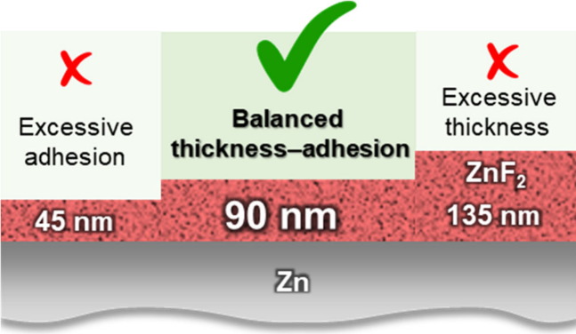
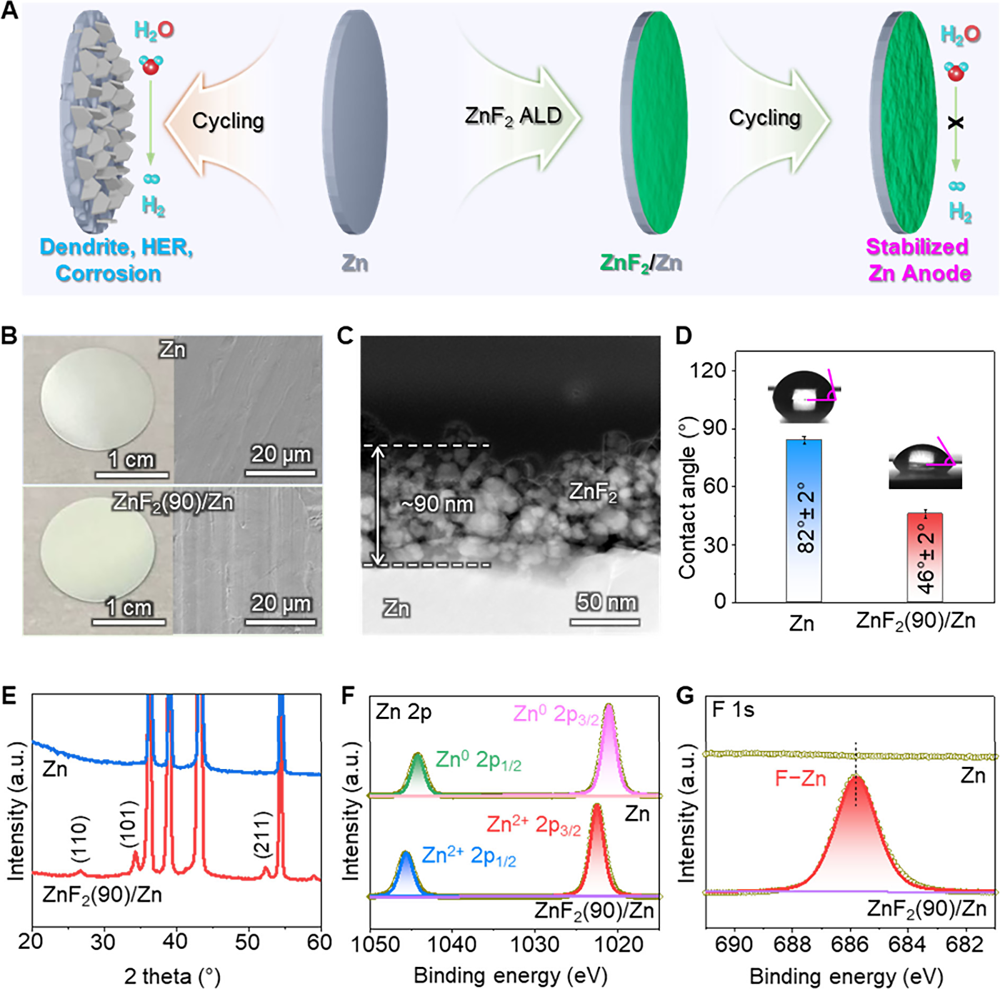
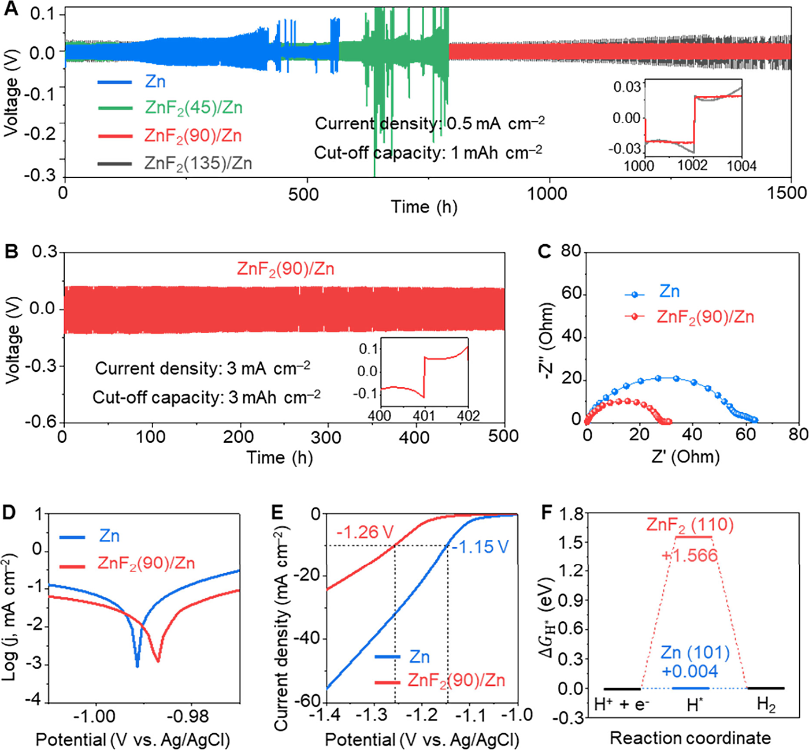
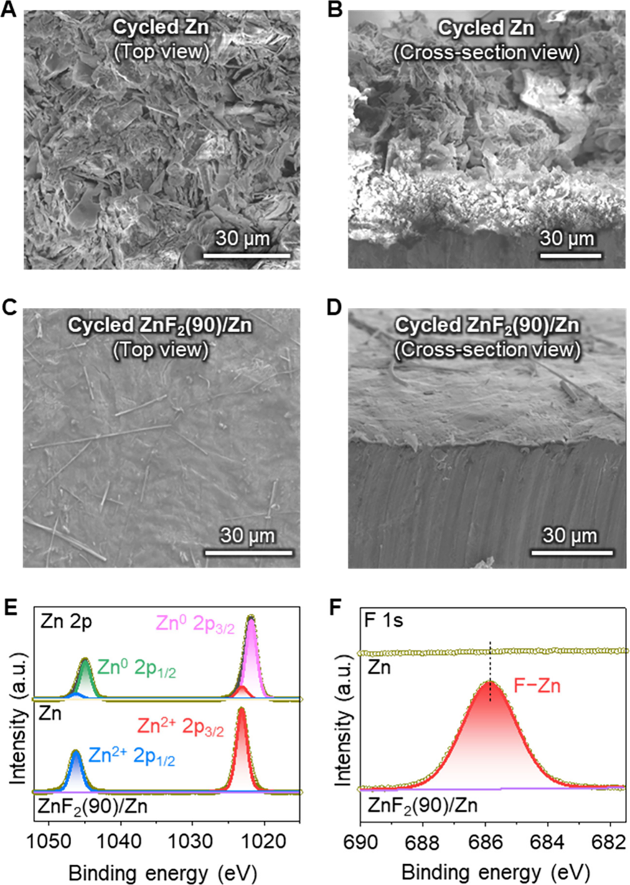
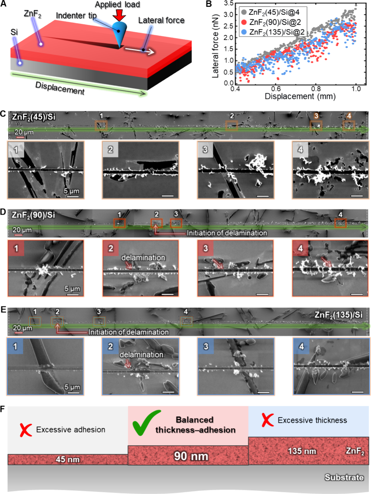
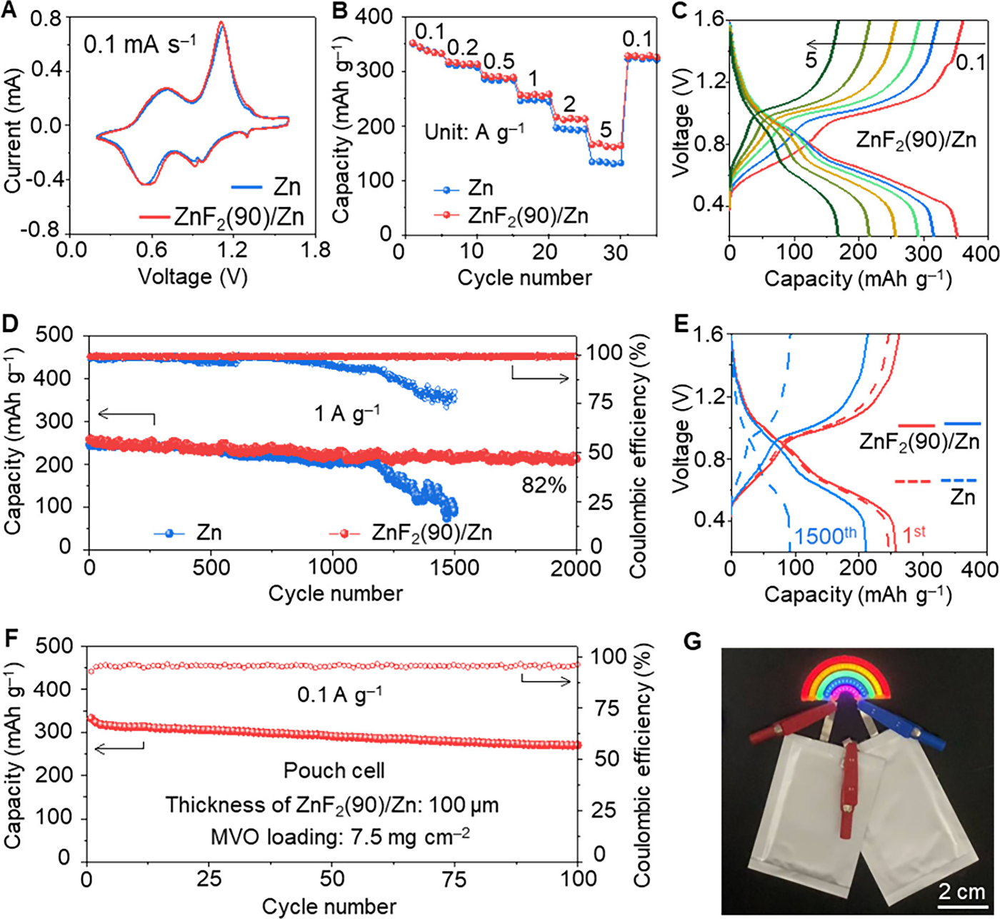

# ACS Energy Letters — Ultrathin Yet Effective

## Letter

http://pubs.acs.org/journal/aelccp

## Ultrathin   Yet   Effective:   90   nm   ZnF 2   Layer   for Stabilizing   Zinc − Metal   Anodes

## Viet   Phuong   Nguyen, *   Minji   Park,   Young-Woon   Byeon,   Suim   Lim,   Kanghoon   Yim,   Minsub   Oh, Seungmin   Hyun,   Eun-chae   Jeon, *   and   Seung-Mo   Lee *

**Table 1**

|  | Cite This: ACS Energy Lett. 2025, 10, 5503−5511 |
| --- | --- |

**Table 2**

|  | Read Online |
| --- | --- |

Downloaded via KOREA INST OF MACHINERY & MATERIALS on July 7, 2026 at 23:39:48 (UTC).
See https://pubs.acs.org/sharingguidelines for options on how to legitimately share published articles.
ACCESS Metrics   &   More Article   Recommendations * sı Supporting   Information

ABSTRACT:   The   practical   use   of   aqueous   zinc-ion   batteries   is   limited   by   dendrite formation   and   interfacial   degradation   at   the   Zn-metal   anode.   Here,   we   demonstrate that an ultrathin ZnF 2  interfacial coating, merely 90 nm thick, significantly enhances anode stability by suppressing side reactions, promoting uniform Zn deposition, and providing   moderate   mechanical   adhesion.   Symmetric   cells   with   ZnF 2 -coated   Zn achieved lifespans of 1500 h at 0.5 mA cm − 2   and 500 h at 3.0 mA cm − 2 . Full cells with Mn x V 2 O 5   cathodes   retained   82%   capacity   after   2000   cycles.   Crucially,   nanoscratch tests   revealed   that   the   optimum   thickness   of   ZnF 2   films   provided   reasonable interfacial   toughness,   offering   new   insights   into   the   mechanical − electrochemical codesign of artificial protective layers, factors that have often been overlooked or insufficiently investigated so far. This study advances   surface   engineering   for   Zn   anodes   and   introduces   interfacial   mechanics   as   a   design   parameter   for   durable   artificial protective   layers   in   aqueous   battery   systems. M
formation   is   difficult   to   control. 16   These   drawbacks   limit adaptability   and   cannot   be   able   to   fully   suppress   dendrite growth   during   cycling.   Therefore,   simply   constructing   a   thin, well-controlled   ZnF 2 -rich   SEI   to   improve   Zn   anode   stability remains   a   challenge.   The   thickness   of   artificial   coatings   has   a significant   impact   on   the   electrochemical   performance   of   Zn- metal   anodes   by   influencing   both   ionic   transport   and mechanical   properties. 20   An   ideal   coating   should   balance ionic   conductivity   and   mechanical   strength,   while   enabling rapid   and   uniform   Zn-ion   permeation. 21 , 22   Therefore,   coating thickness   and   mechanical   strength   are   considered   key   factors when   fabricating   artificial   SEI   layers   on   Zn-metal   anodes. Unfortunately,   the   effects   of   ZnF 2 -coating   thickness   have   not been   thoroughly   investigated   in   previous   research.
etallic   zinc   (Zn)   is   considered   a   promising   anode material   for   aqueous   zinc-ion   batteries   (ZIBs)   due to   its   low   cost,   environmental   benignity,   and   high theoretical   capacity   (5854   mAh   cm − 3   or   820   mAh   g − 1 ). 1 − 3
However,   its   practical   application   is   severely   hindered   by persistent   challenges   such   as   uncontrolled   dendritic   growth and   parasitic   side   reactions,   including   corrosion   and   hydrogen evolution   in   aqueous   electrolytes. 4 − 7   These   issues   result   in poor   reversibility   and   low   Zn   utilization,   ultimately   compro- mising   battery   performance   and   cycle   life.
To   overcome   these   limitations,   various   strategies   have   been explored,   including   anode   structural   design, 8   separator modification, 9   electrolyte   optimization, 3   and   artificial   inter- phase engineering. 10   Among them, the construction of a stable solid − electrolyte   interphase   (SEI)   has   emerged   as   one   of   the most   promising   approaches. 11 − 14   A   well-designed   SEI   can guide   uniform   Zn 2+   deposition   and   mitigate   direct   contact between   the   Zn   anode   and   the   aqueous   electrolyte,   thereby suppressing   dendrite   formation   and   parasitic   reactions. 11 − 14
In   this   study,   we   demonstrate   that   a   precisely   controlled, ultrathin   ZnF 2   layer   ( ∼ 90   nm),   deposited   by   atomic   layer deposition   (ALD),   can   serve   as   an   effective   artificial   SEI   to stabilize   the   Zn-metal   anode.   This   nanoscale   coating simultaneously   suppresses   dendritic   growth,   reduces   side reactions, and promotes highly reversible Zn plating/stripping. Symmetric cells with ZnF 2 -coated Zn anodes exhibits extended cycling stability over 500 h at 3.0 mA cm − 2   and 3.0 mAh cm − 2 ,
Inspired   by   the   success   of   LiF-rich   SEIs   in   lithium − metal batteries,   ZnF 2 -rich   SEIs   have   attracted   growing   interest   for ZIBs. 11 − 14   ZnF 2   is   known   for   exhibiting   high   Zn 2+   ionic conductivity,   excellent   mechanical   hardness,   and   strong chemical/electrochemical   stability,   attributes   that   make   it   a highly   desirable   interphase   material. 15 , 16   Common   approaches to   incorporating   ZnF 2   onto   Zn   surfaces   include   ex   situ ccoatings 17 , 18   and   in   situ   electrolyte   decomposition. 4 , 10

Received: August   12,   2025 Revised: September   26,   2025 Accepted: October   14,   2025 Published:   October   18,   2025
Existing coating methods are often complex and yield relatively thick   ZnF 2   layers   ( ≈ 9.3   μ m 17   or   ≈ 1   μ m 19 ),   while   in   situ   SEI

---

*Figure   1.   Structural   and   interfacial   characterization   of   the   dendrite-free   ZnF 2 (90)/Zn   anode.   (A)   Schematic   illustration   comparing   the   Zn plating/stripping   behavior   of   bare   Zn   and   ALD-coated   ZnF 2 (90)/Zn   anodes.   While   bare   Zn   suffers   from   dendrite   growth   and   parasitic reactions, the ultrathin 90 nm ZnF 2  layer enables uniform Zn deposition and enhanced stability. (B) Optical and SEM images of bare Zn and ZnF 2 (90)/Zn.   (C)   Cross-sectional   STEM-HAADF   image   showing   the   thickness   of   the   ZnF 2   layer   in   ZnF 2 (90)/Zn.   (D)   Contact   angle measurements between 1 M ZnSO 4  electrolyte and the Zn or ZnF 2 (90)/Zn surfaces, revealing improved wettability after ZnF 2  coating. (E) XRD   patterns   confirming   the   presence   of   ZnF 2 .   (F,   G)   High-resolution   XPS   spectra   of   Zn   2p   (F)   and   F   1s   (G),   validating   the   chemical composition   of   the   ZnF 2   interfacial   layer.*

while   full   cells   using   Mn x V 2 O 5   (MVO)   cathodes   retain   82% capacity   after   2000   cycles.
surface   by   a   ZnF 2   layer   (i.e.,   ZnF 2 /Zn)   with   impeccable coverage   and   the   desired   thickness.   To   explore   the   effects   of different   thicknesses   on   the   electrochemical   performance,   we deposited   ultrathin   ZnF 2   layers   with   various   thicknesses   by adjusting   the   number   of   ALD   cycles.   Specifically,   ZnF 2 thicknesses   of   45,   90,   and   135   nm   were   obtained   after   315, 625,   and   935   cycles,   respectively,   with   the   corresponding electrodes   denoted   as   ZnF 2 (45)/Zn,   ZnF 2 (90)/Zn,   and ZnF 2 (135)/Zn. Preliminary electrochemical screening revealed that   ZnF 2 (90)/Zn   delivered   optimal   performance,   balancing protection   and   ionic   transport,   and   was   therefore   selected   for comprehensive   material   characterization.
Crucially,   beyond   electrochemical   testing,   we   incorporated nanoscratch-based   mechanical   analysis   to   investigate   the interfacial   toughness   of   the   ZnF 2   film.   Our   findings   reveal   a strong   correlation   between   film   thickness   and   mechanical adhesion,   where   excessively   thick   coatings   compromise interfacial   integrity.   The   90   nm   ZnF 2   film   achieves   an   optimal balance between ionic accessibility and mechanical robustness, key   criteria   for   long-term   stability.   This   work   not   only introduces   a   scalable   and   controllable   approach   to   SEI engineering,   but   also   emphasizes   critical   yet   underexplored role of interfacial mechanical properties, which directly impact long-term   cycling   stability   in   metal-anode   battery   systems. ■ PREPARATION   AND   CHARACTERIZATION   OF
The   morphological   changes   of   the   Zn   foil   following   ZnF 2 ALD   were   investigated   using   scanning   electron   microscopy (SEM). As depicted in  Figure 1 B, the Zn foil exhibited shinier appearance   after   the   ZnF 2   deposition,   although   its   overall morphology remained largely unchanged. A rough and uneven surface   of   the   bare   Zn   foil,   resulting   from   the   initial manufacturing   process,   was   still   visible   on   the   ZnF 2 (90)/Zn ( Figure   S1 ).   Cross-sectional   scanning   transmission   electron microscopy   with   high-angle   annular   dark-field   (STEM- HAADF)   imaging   confirmed   that   the   ZnF 2   layer   on   the   Zn substrate reaches a thickness of approximately 90 nm after 625 ALD   cycles   ( Figure   1 C).   In   the   high-resolution   TEM

## ZNF 2 /ZN

We   anticipated   that   an   ultrathin   ZnF 2   layer   could   effectively suppress dendrite growth and side reactions while maintaining fast   ion   transport   for   superior   rate   performance   ( Figure   1 A). To achieve precise thickness control with uniform coverage, we paid   attention   to   ALD,   which   is   a   robust   technique   for conformal   thin   film   deposition   in   energy   storage   applica- tions. 23 − 26   Utilizing   ALD   enabled   us   to   modify   the   Zn   foil

---

*Figure 2. Electrochemical stability and suppression of side reactions in ZnF 2 (90)/Zn. (A) Cycling performance of symmetric cells assembled with bare Zn, ZnF 2 (45)/Zn, ZnF 2 (90)/Zn, and ZnF 2 (135)/Zn electrodes at a current density of 0.5 mA cm − 2 . The ZnF 2 (90)/Zn electrode exhibits   superior   long-term   stability.   (B)   Cycling   performance   of   the   symmetric   cell   assembled   with   ZnF 2 (90)/Zn   electrodes   at   a   high current   density   of   3.0   mA   cm − 2 .   (C)   The   EIS   spectra   of   symmetric   cells.   (D)   Tafel   plots   illustrating   the   corrosion   behavior   of   Zn   and ZnF 2 (90)/Zn anodes in aqueous electrolyte. (E) Linear sweep voltammetry curves for evaluating the HER activity of bare Zn and ZnF 2 (90)/ Zn   electrodes.   (F)   Comparison   of   the   Δ G H *   values   for   Zn   (101)   and   ZnF 2   (110).*

## ■ ELECTROCHEMICAL   STABILITY   OF   ZNF 2 /ZN

(HRTEM)   image,   an   interplanar   distance   of   0.24   nm   was observed   and   could   be   attributed   to   the   (200)   plane   of   ZnF 2 ( Figure   S2 ).   Energy-dispersive   X-ray   spectroscopy   (EDX) elemental   mappings   revealed   the   uniform   distribution   of   Zn and   F   on   the   surface   ( Figure   S3 ).   Notably,   the   contact   angle between   ZnF 2 (90)/Zn   and   the   electrolyte   (1   M   ZnSO 4 solution)   decreased   to   ∼ 46 ° ,   markedly   lower   than   that   of bare   Zn   ( ∼ 82 ° )   ( Figure   1 D)   This   suggested   that   the   ZnF 2 layer enhances the uniform wetting of the electrolyte across the anode surface, thereby enabling the homogeneous distribution of   Zn-ion   flux   at   the   interface. 17 , 27   Moreover,   the   ionic conductivity   of   the   ZnF 2   layer   was   roughly   calculated   to   be   as high   as   1.17   ×   10 − 4   S   cm − 1   ( Figure   S4 ),   which   indicates   its strong   ability   to   facilitate   Zn 2+   transport.   The   crystal   structure and   composition   of   the   ZnF 2   layer   were   further   examined   via X-ray diffraction (XRD) and X-ray photoelectron spectroscopy (XPS).   The   emergence   of   ZnF 2   peaks   in   the   XRD   patterns confirmed   the   presence   of   crystalline   ZnF 2   on   the   Zn   foil ( Figure   1 E).   In   the   XPS   spectrum   of   ZnF 2 (90)/Zn,   peaks   at 1022.5   and   1045.6   eV   correspond   to   the   Zn 2+   2p 1/2   and   Zn 2+
The   Zn-metal   anode   achieves   stabilization   when   dendrite growth   and   side   reactions,   such   as   corrosion   and   HER,   are effectively   suppressed.   The   stability   of   ZnF 2 /Zn   was   first investigated   through   long-term   Zn   plating   and   stripping   tests in   symmetric   cells.   We   found   that,   at   a   current   density   of   0.5 mA   cm − 2   and   a   capacity   of   1   mAh   cm − 2 ,   the   cell   using ZnF 2 (90)/Zn   was   capable   of   providing   an   ultralong   cycling lifespan   of   more   than   1500   h,   maintaining   a   small   voltage hysteresis   of   ∼ 20   mV   ( Figure   2 A).   This   performance surpassed   that   of   all   other   tested   configurations.   The   cell with   bare   Zn   showed   a   continuous   increase   in   voltage hysteresis,   followed   by   a   sudden   voltage   drop   at   350   h.   With a   45   nm   ZnF 2   coating   on   the   Zn   foil,   the   cycle   life   of   the   cell using ZnF 2 (45)/Zn extended to about 700 h before failing due to   rapid   voltage   fluctuations.   Although   the   cell   using ZnF 2 (135)/Zn could work for 1500 h, it consistently exhibited high   voltage   polarization.   This   suggested   that   an   excessively thin   ZnF 2   layer   may   be   insufficient   to   suppress   dendrite formation,   while   an   overly   thick   layer   could   hinder   Zn-ion transport, leading to increased voltage hysteresis. The superior performance   of   ZnF 2 (135)/Zn   may   also   be   attributed   to   the adhesion   strength   between   the   ZnF 2   layer   and   the   Zn substrate,   as   discussed   in   the   next   section.   When   the   current density and cutoff capacity increased to 2 mA cm − 2   and 2 mAh cm − 2 ,   respectively,   the   same   phenomena   were   observed ( Figure   S5 ).   Notably,   the   cell   using   ZnF 2 (90)/Zn   was   still
2p 3/2 ,   respectively   ( Figure   1 F). 28   Notably,   no   Zn 0   signal   was detected   in   the   high-resolution   Zn   spectrum,   indicating complete   coverage   by   the   ZnF 2   layer.   In   the   F   1s   spectrum, the   peak   centered   at   685.8   eV   could   be   assigned   to   the   F − Zn bonds   ( Figure   1 G). 29   These   results   confirmed   that   the ultrathin   ZnF 2   layer   was   successfully   deposited   on   the   surface of   Zn   foil.

---

able   to   operate   for   more   than   500   h   at   a   high   current   density and   cutoff   capacity   of   3   mA   cm − 2   and   3   mAh   cm − 2 , respectively   ( Figure   2 B).   Additionally,   the   electrochemical impedance   spectra   (EIS)   measurement   at   the   cycle   10th revealed the smaller charge transfer resistance of the cell using ZnF 2 (90)/Zn   compared   to   that   of   the   cell   using   Zn   ( Figure 2 C).   Density   functional   theory   (DFT)   calculations   showed that   the   diffusion   barrier   of   Zn   ions   on   ZnF 2   is   only   0.19   eV ( Figure   S6 ),   which   is   considerably   lower   than   that   on   ZnO, another   potential   protective   coating   material. 30   This   low diffusion   barrier   facilitates   the   homogeneous   distribution   of Zn 2+ , 31   thereby   promoting   uniform   Zn   deposition.   These findings   demonstrate   that   the   ZnF 2   layer   significantly suppresses   dendrite   formation,   improves   electrochemical stability,   and   enhances   the   cycling   performance   of   the ZnF 2 (90)/Zn   anode.

To   evaluate   the   ability   of   the   ZnF 2   layer   to   inhibit   side reactions,   we   performed   linear   scanning   voltammetry   tests.   As shown in  Figure 2 D, the corrosion potential of the ZnF 2 (90)/ Zn   electrode   ( − 0.98653   V   vs   Ag/AgCl)   was   more   positive than   that   of   the   bare   Zn   foil   electrode   ( − 0.99169   V   vs   Ag/ AgCl). Correspondingly, the ZnF 2  layer reduced the corrosion current from 0.2852 to 0.0922 mA cm − 2 ,   suggesting enhanced corrosion resistance. The HER on the ZnF 2 (90)/Zn electrode was also found to be suppressed. The HER was also effectively suppressed   on   the   ZnF 2 (90)/Zn   electrode,   as   evidenced   by   a more   negative   HER   potential   and   a   higher   Tafel   slope compared   to   the   bare   Zn   electrode   ( Figure   2 E   and   Figure S7 ).   DFT   calculations   revealed   that   Zn   (101)   has   a   hydrogen adsorption   free   energy   ( Δ G H * )   value   close   to   zero   ( Figure 2 F).   This   indicated   efficient   kinetics   of   hydrogen   intermedi- ates,   resulting   in   high   HER   activity. 32   In   contrast,   the extremely   high   Δ G H *   on   ZnF 2   (110)   makes   HER thermodynamically   unfavorable.   In   addition,   the   poor   con- ductivity of ZnF 2  further hinders electron transfer ( Figure S8 ), thereby   suppressing   the   HER.   These   results   confirm   that   the ZnF 2  layer provides significant protection against side reactions on   the   Zn-metal   anode.

*Figure   3.   Morphological   and   chemical   characterization   of   the cycled   Zn   and   ZnF 2 (90)/Zn   electrodes.   (A,   B)   Top-view   (A)   and cross-sectional   (B)   SEM   images   of   the   Zn   electrode   after   cycling, showing   extensive   surface   roughening   and   dendritic   growth.   (C, D)   Top-view   (C)   and   cross-sectional   (D)   SEM   images   of   the ZnF 2 (90)/Zn   electrode   after   cycling,   revealing   a   smooth   and compact   surface   morphology.   (E,   F)   High-resolution   XPS   spectra of   Zn   2p   (E)   and   F   1s   (F)   for   cycled   Zn   and   ZnF 2 (90)/Zn electrodes, confirming the chemical stability of the ZnF 2  layer and the   suppression   of   degradation   byproducts.*

To   gain   further   insight   into   the   above   results,   we disassembled   the   symmetric   cells   after   375   cycles   and conducted   further   analyses.   We   observed   that   the   cycled   bare Zn   anode   exhibited   severe   corrosion   and   was   covered   with sharp   Zn   dendrite   flakes   ( Figure   3 A,B).   Due   to   the   inherently nonuniform   electric   field   distribution,   Zn   deposition   occurred randomly   and   further   evolved   into   flaky   dendrites   oriented   in different   directions.   Over   time,   these   flakes   detached   and   lost electrical contact with the substrate, leading to the formation of “dead”   Zn   and   an   increase   in   charge   transfer   resistance. 33   In sharp   contrast,   the   cycled   ZnF 2 (90)/Zn   anode   possessed   a smooth   surface,   free   of   Zn   dendrites   ( Figures   3 C,D   and   S9 ). This improvement is attributed to ZnF 2 , which was believed to homogenize Zn-ion flux, suppress the “tip effect,” and promote the parallel deposition of Zn. 34   To further investigate the phase evolution, we performed XPS measurements. After cycling, the Zn 2+   signals   were   detected   on   the   bare   Zn   anode,   indicating the   formation   of   byproducts,   such   as   Zn 4 SO 4 (OH) 6 · 5H 2 O. 19
electrode   in   the   symmetric   cell   after   cycling   at   a   higher current density ( Figure S10 ), validating the long-term stability and   integrity   of   the   ZnF 2   layer. ■ INTERFACIAL   MECHANICAL   CHARACTERISTICS
OF   ZNF 2   FILM To   gain   deeper   insight   into   the   origin   of   the   exceptional cycling stability imparted by the ultrathin ZnF 2  interfacial layer, we   examined   its   interfacial   mechanical   characteristics   via nanoscratch   tests.   We   attempted   nanoscratch   tests   of   ZnF 2 films   directly   deposited   on   Zn   foil.   However,   the   inherently high   surface   roughness   and   pronounced   morphological irregularities   of   commercial   Zn   foils   resulted   in   inconsistent penetration   depths   and   irreproducible   data,   which   made reliable analysis nearly impossible. For this reason, we adopted flat   Si   wafers   as   a   practical   alternative.   Their   smooth   surface provided   a   stable   platform   that   enables   reproducible   nano- scratch   testing   and   systematic   evaluation   of   thickness-depend- ent   adhesion   trends.   Although   the   substrate   mismatch   may influence   absolute   values   of   crack   initiation   or   delamination resistance,   it   is   believed   that   the   comparative   results   still   offer
Meanwhile,   no   Zn 0   signal   was   observed   on   the   surface   of   the cycled   ZnF 2 (90)/Zn   anode,   suggesting   that   the   Zn   metal remained   fully   covered   by   ZnF 2 .   Notably,   the   F − signal remained   nearly   unchanged   before   and   after   cycling, demonstrating   that   the   ZnF 2   layer   was   robust   and   effectively protected the Zn anode throughout the cycling process. Similar phenomena   were   also   observed   with   the   ZnF 2 (90)/Zn

---

*Figure   4.   Interfacial   mechanical   characteristics   of   ZnF 2   thin   films   deposited   on   Si   wafer,   examined   via   nanoscratch   testing.   (A)   Schematic illustration   of   the   nanoscratch   test,   where   a   progressive   normal   load   was   applied   to   the   film   surface   while   recording   the   resulting   lateral (frictional) force during lateral displacement. (B) Lateral force versus displacement curves for ZnF 2  films deposited on Si wafer. (C − E) SEM images   of   ZnF 2 (45)/Si,   ZnF 2 (90)/Si,   and   ZnF 2 (135)/Si,   respectively,   after   scratching.   The   results   showed   minimal   film   damage   or   no delamination,   demonstrating   excellent   mechanical   integrity.   In   contrast,   ZnF 2 (90)/Si   and   ZnF 2 (135)/Si   revealed   early   onset   and propagation   of   delamination   during   scratching,   indicating   reduced   adhesion   with   increasing   film   thickness.   These   results   collectively suggested that thinner ZnF 2  layers exhibit more robust interfacial adhesion, while thicker coatings are more susceptible to mechanical failure under   applied   stress.   (F)   Presumable   banlance   between   thickness   and   adhesion   strength.*

meaningful   insights   to   elucidate   general   thickness-dependent trends   in   interfacial   robustness.
exhibited   no   significant   drop,   signifying   superior   interfacial adhesion.   In   comparison,   ZnF 2 (90)/Si   ( ∼ 60   nm)   and ZnF 2 (135)/Si ( ∼ 90 nm) showed significant drops in measured lateral force, indicating diminished mechanical robustness with increasing   thickness.
As illustrated in  Figure 4 A, a progressively increasing normal load   was   applied   via   an   indenter   tip   while   lateral   force   and depth   were   monitored   to   assess   the   film’s   resistance   to delamination.   The   lateral   force − displacement   profiles   ( Figure 4 B)   revealed   a   clear   thickness-dependent   response.   Generally, the   lateral   force   showed   a   significant   drop,   followed   by   a gradual recovery when delamination of a film or brittle fracture of   a   substrate   occurs.   The   ZnF 2 (45)/Si   sample   ( ∼ 30   nm)
These   observations   were   corroborated   by   postscratch   SEM analysis.   The   ZnF 2 (45)/Si   surface   ( Figure   4 C)   remained largely   intact   with   no   delamination,   demonstrating   strong mechanical   cohesion.   In   contrast,   the   ZnF 2 (90)/Si   and ZnF 2 (135)/Si   samples   exhibited   early   signs   of   delamination

---

*Figure 5. Electrochemical performance of Zn and ZnF 2 (90)/Zn anodes in full-cell and pouch-cell configurations. (A, B) CV profiles (A) and rate capabilities (B) of full cells employing bare Zn and ZnF 2 (90)/Zn anodes paired with MVO cathodes. (C) GCD curves of the ZnF 2 (90)/ Zn-based   full   cell   at   various   current   densities,   demonstrating   stable   voltage   profiles   and   high   capacity   retention.   (D)   Long-term   cycling performance   of   full   cells   with   Zn   and   ZnF 2 (90)/Zn   anodes   at   1.0   A   g − 1 ,   showing   superior   durability   for   the   ZnF 2 -protected   electrode.   (E) GCD curves recorded at the first and 1500th cycle of the ZnF 2 (90)/Zn full cell. (F) Cycling performance of a pouch cell incorporating the ZnF 2 (90)/Zn   anode   at   0.1   A   g − 1 .   (G)   Optical   image   of   ZnF 2 (90)/Zn-based   pouch   cells   successfully   powering   3   V   LEDs,   demonstrating practical   applicability.*

and more extensive failure patterns ( Figure 4 D,E), suggesting a decline in interfacial toughness at higher thicknesses. Although the   relationship   between   film   thickness   and   adhesion   strength is   highly   case-specific,   the   stronger   adhesion   observed   for thinner   ZnF 2   films   in   our   study   results   from   a   dominance   of interfacial   (adhesive)   bonding   relative   to   cohesive   failure within the film. Thinner coatings are more effectively governed by   ZnF 2 − substrate   interactions   and   are   less   likely   to accumulate sufficient internal stress to delaminate. By contrast, thicker   films   are   prone   to   stress   build-up,   leading   to   increased probability   of   cohesive   cracking   or   delamination. 35   It   is believed   that   while   thinner   ZnF 2   coatings   may   facilitate   Zn 2+
often been overlooked or insufficiently investigated, for durable artificial SEI design in Zn-ion batteries. Based on our findings, we   believe   that   systematic   evaluation   of   coating − substrate adhesion   will   be   essential   for   further   optimizing   interfacial engineering   strategies,   which   have   already   proven   effective   in stabilizing   Zn-metal   anodes. 36 − 39 ■ FULL-BATTERY   CELL   PERFORMANCE
To highlight the superiority of the ZnF 2 (90)/Zn, we compared the   electrochemical   performance   of   the   full   cells   using   either ZnF 2 (90)/Zn   or   Zn   as   the   anode   and   MVO   ( Figure   S11 )   as the   cathode.   The   cyclic   voltammetry   (CV)   curves   display   two main   cathodic/anodic   peak   couples   at   0.93/1.12   V   and   0.57/ 0.71 V, corresponding to the sequential redox processes of V 5+
diffusion,   excessively   strong   interfacial   adhesion   could   impede the   deposition   and   dissolution   of   Zn   beneath   these   layers.   In contrast,   thicker   ZnF 2   coatings   may   offer   more   moderate adhesion   strength   but   could   suffer   from   mechanical   fragility and   hinder   Zn 2+   transport.   The   observed   behavior   highlighted a   critical   trade-off   between   electrochemical   functionality   and interfacial   adhesion.   In   this   context,   the   ∼ 90   nm   ZnF 2   layer employed   in   this   work   appears   to   achieve   an   optimal   balance between   thickness   and   adhesion   strength   ( Figure   4 F).   The layer   is   thin   enough   to   provide   effective   ionic   modulation   and surface   protection,   yet   sufficiently   adherent   to   preserve interfacial contact throughout extended cycling. These findings underscore the importance of simultaneously engineering both electrochemical   and   mechanical   stability,   factors   that   have
↔ V 4+   and   V 4+   ↔ V 3+   associated   with   Zn 2+   insertion   and extraction. 40   Notably,   the   cell   using   ZnF 2 (90)/Zn   exhibited redox   peaks   with   higher   intensity   and   lower   polarization compared to those of the cell using Zn ( Figure 5 A), indicating enhanced redox kinetics of the ZnF 2 (90)/Zn anode. 41   The cell using   ZnF 2 (90)/Zn   also   demonstrated   superior   rate   capability ( Figure 5 B). Specifically, at a low current density of 0.1 A g − 1 , both   cells   using   ZnF 2 (90)/Zn   and   Zn   delivered   similar capacities of 352   mAh g − 1 . However,   at a high current density of 5 A g − 1 , the capacity of the cell using ZnF 2 (90)/Zn was 166 mAh   g − 1 ,   outperforming   the   cell   using   Zn   (134   mAh   g − 1 ). Furthermore,   all   galvanostatic   charge − discharge   (GCD)

---

profiles   of   the   cell   using   ZnF 2 (90)/Zn   at   various   current densities exhibited relatively similar shapes ( Figure 5 C). These results   demonstrated   that   the   ZnF 2 (90)/Zn   anode   endowed ZIBs with fast charging capability. The excellent stability of the ZnF 2 (90)/Zn   anode   was   evidently   demonstrated   in   the   long term   cycling   test.   The   cell   using   ZnF 2 (90)/Zn   exhibited excellent capacity retention of 82% after 2000 cycles at 1 A g − 1 while   maintaining   consistent   GCD   profiles   ( Figure   5 D,E).   In contrast, the capacity of the cell using Zn quickly reduced after 1200   cycles,   which   may   be   caused   by   dendritic   growth   on   the bare   Zn   anode   ( Figure   S12 ). 40   The   ZnF 2 (90)/Zn   could   still work well when paired with common hydrated vanadium oxide (VOH)   ( Figure   S13 ).   To   assess   the   practical   application potential   of   the   ZnF 2 (90)/Zn   anode,   pouch   cells   with   high mass   loading   of   MVO   (7.5   mg   cm − 2 )   were   assembled.   Their open-circuit voltage was recorded to be 1.342 V ( Figure S14 ). Encouragingly,   the   pouch   cell   using   ZnF 2   (90)/Zn   displayed high   cycling   stability   for   100   cycles,   retaining   80.8%   of   its initial   high   capacity   ( Figure   5 F).   The   high   performance   could be well preserved even when the thickness is reduced to 50  μ m ( Figure S15 ). Two pouch cells connected in series successfully powered   3   V   light-emitting   diodes   (LEDs)   ( Figure   5 G), demonstrating   the   practical   viability   of   the   ZnF 2 (90)/Zn anode.
Science   and   Technology   (UST),   Daejeon   34113,   Republic   of Korea; orcid.org/0000-0003-0732-4473 ; Email:   sm.lee@kimm.re.kr Eun-chae Jeon  − School of Materials Science and Engineering,
University   of   Ulsan,   Ulsan   44776,   Republic   of   Korea ; Email:   jeonec@ulsan.ac.kr
Authors
Minji   Park   − School   of   Materials   Science   and   Engineering,
University   of   Ulsan,   Ulsan   44776,   Republic   of   Korea Young-Woon   Byeon   − Advanced   Analysis   and   Data   Center,
Korea   Institute   of   Science   and   Technology   (KIST),   Seoul 02792,   Republic   of   Korea Suim   Lim   − Energy   AI   and   Computational   Science
Laboratory,   Korea   Institute   of   Energy   Research   (KIER), Daejeon   34129,   Republic   of   Korea;   Department   of Mechanical   Engineering,   Sogang   University,   Seoul   04107, Republic   of   Korea Kanghoon   Yim   − Energy   AI   and   Computational   Science
Laboratory,   Korea   Institute   of   Energy   Research   (KIER), Daejeon   34129,   Republic   of   Korea Minsub   Oh   − Department   of   Nanomechanics,   Korea   Institute
of   Machinery   and   Materials   (KIMM),   Daejeon   34103, Republic   of   Korea Seungmin   Hyun   − Department   of   Nanomechanics,   Korea
In   summary,   we   developed   a   high-performance   zinc − metal anode   by   coating   it   with   an   ultrathin   ZnF 2   layer   via   atomic layer   deposition.   Beyond   demonstrating   excellent   electro- chemical   metrics  including   prolonged   symmetric-cell   life- spans   and   high-rate   full-cell   stability,   we   introduced   nano- scratch-based   mechanical   testing   to   evaluate   the   interfacial toughness   of   the   ZnF 2   layer.   Our   results   indicated   that   the   90 nm   ZnF 2   layer   offers   an   optimal   balance:   sufficiently   thin   to suppress dendrite formation and protect against side reactions, yet   thick   enough   to   maintain   robust   mechanical   adhesion. Importantly,   we   showed   that   increasing   film   thickness   beyond this point leads to a loss of interfacial integrity under stress, as evidenced   by   lower   critical   loads   and   delamination   in   SEM analysis.   This   work   highlights   the   critical   role   of   interfacial mechanics in stabilizing metal anodes and sets a new direction for designing artificial SEIs that   are not   only   electrochemically functional   but   also   mechanically   resilient.   We   hope   that   the methodology   and   insights   presented   herein   can   be   broadly extended   to   other   metal-anode   systems   in   next-generation rechargeable   batteries. ■ ASSOCIATED   CONTENT * sı   Supporting   Information The   Supporting   Information   is   available   free   of   charge   at https://pubs.acs.org/doi/10.1021/acsenergylett.5c02565 .
Institute   of   Machinery   and   Materials   (KIMM),   Daejeon 34103,   Republic   of   Korea;   Nanomechatronics,   University   of Science   and   Technology   (UST),   Daejeon   34113,   Republic   of Korea; orcid.org/0000-0002-7286-9026 Complete   contact   information   is   available   at: https://pubs.acs.org/10.1021/acsenergylett.5c02565
Notes The   authors   declare   no   competing   financial   interest. ■ ACKNOWLEDGMENTS
We   would   like   to   acknowledge   the   financial   support   from   the internal   research   program   of   the   Korea   Institute   of   Machinery and   Materials   (NK255F),   and   the   Nano   and   Material Technology   Development   Program   through   the   National Research   Foundation   of   Korea   (NRF)   grant   funded   by   the Korea   government   (MSIT)   and   ICT   (RS-2021-NR057314). ■ REFERENCES
(1)   Ma,   L.;   Schroeder,   M.   A.;   Borodin,   O.;   Pollard,   T.   P.;   Ding,   M. S.; Wang, C.; Xu, K. Realizing High Zinc Reversibility in Rechargeable Batteries.   Nat.   Energy   2020 ,   5 ,   743 − 749.
(2)   Wang,   F.;   Borodin,   O.;   Gao,   T.;   Fan,   X.;   Sun,   W.;   Han,   F.; Faraone,   A.;   Dura,   J.   A.;   Xu,   K.;   Wang,   C.   Highly   Reversible   Zinc Metal   Anode   for   Aqueous   Batteries.   Nat.   Mater.   2018 ,   17 ,   543 − 549.
Experimental   details;   Supporting   figures   showing   SEM images,   TEM   images,   DFT   data,   cycling   performance; Supporting   table   ( PDF ) ■ AUTHOR   INFORMATION Corresponding   Authors
(3) Jiang, H.; Tang, L.; Fu, Y.; Wang, S.; Sandstrom, S. K.; Scida, A. M.;   Li,   G.;   Hoang,   D.;   Hong,   J.   J.;   Chiu,   N.   C.;   Stylianou,   K.   C.; Stickle,   W.   F.;   Wang,   D.;   Li,   J.;   Greaney,   P.   A.;   Fang,   C.;   Ji,   X. Chloride   Electrolyte   Enabled   Practical   Zinc   Metal   Battery   with   a Near-Unity   Coulombic   Efficiency.   Nat.   Sustain.   2023 ,   6 ,   806 − 815.
(4) Zheng, J.; Zhao, Q.; Tang, T.; Yin, J.; Quilty, C. D.; Renderos, G. D.;   Liu,   X.;   Deng,   Y.;   Wang,   L.;   Bock,   D.   C.;   Jaye,   C.;   Zhang,   D.; Takeuchi,   E.   S.;   Takeuchi,   K.   J.;   Marschilok,   A.   C.;   Archer,   L.   A. Reversible   Epitaxial   Electrodeposition   of   Metals   in   Battery   Anodes. Science   2019 ,   366 ,   645 − 648.
Viet Phuong Nguyen  − Department of Nanomechanics, Korea
Institute   of   Machinery   and   Materials   (KIMM),   Daejeon 34103,   Republic   of   Korea; orcid.org/0000-0002-7727- 2499 ;   Email:   phuongnv9@ust.ac.kr Seung-Mo   Lee   − Department   of   Nanomechanics,   Korea
(5) Cao, L.; Li, D.; Pollard, T.; Deng, T.; Zhang, B.; Yang, C.; Chen, L.;   Vatamanu,   J.;   Hu,   E.;   Hourwitz,   M.   J.;   Ma,   L.;   Ding,   M.;   Li,   Q.; Hou, S.; Gaskell, K.; Fourkas, J. T.; Yang, X. Q.; Xu, K.; Borodin, O.;
Institute   of   Machinery   and   Materials   (KIMM),   Daejeon 34103,   Republic   of   Korea;   Nanomechatronics,   University   of

---

Wang,   C.   Fluorinated   Interphase   Enables   Reversible   Aqueous   Zinc Battery   Chemistries.   Nat.   Nanotechnol.   2021 ,   16 ,   902 − 910.
(22) Yang, J.; Zhao, R.; Wang, Y.; Hu, Z.; Wang, Y.; Zhang, A.; Wu, C.;   Bai,   Y.   Insights   on   Artificial   Interphases   of   Zn   and   Electrolyte: Protection   Mechanisms,   Constructing   Techniques,   Applicability,   and Prospective.   Adv.   Funct.   Mater.   2023 ,   33 ,   No.   2213510.
(6) Xu, D.; Chen, B.; Ren, X.; Han, C.; Chang, Z.; Pan, A.; Zhou, H. Selectively   Etching-off   the   Highly   Reactive   (002)   Zn   Facet   Enables Highly   Efficient   Aqueous   Zinc-Metal   Batteries.   Energy   Environ.   Sci. 2024 ,   17 ,   642 − 654. (7)   Li,   Z.;   Robertson,   A.   W.   Electrolyte   Engineering   Strategies   for Regulation   of   the   Zn   Metal   Anode   in   Aqueous   Zn-Ion   Batteries. Batter.   Energy   2023 ,   2 ,   No.   20220029.
(23) Zhao, Y.; Zhang, L.; Liu, J.; Adair, K.; Zhao, F.; Sun, Y.; Wu, T.; Bi, X.; Amine, K.; Lu, J.; Sun, X. Atomic/Molecular Layer Deposition for Energy Storage and Conversion.  Chem. Soc. Rev.  2021 ,  50 , 3889 − 3956. (24)   Nguyen,   V.   P.;   Kim,   D.;   Kang,   J.;   Jung,   W.;   Lim,   S.;   Yim,   K.; Lee,   S.   Heterostructured   Sn:SnO 2   Nanodots   for   High-Performance Li − S   Batteries   with   Kinetics-Enhanced   Cathode   and   Dendrite-Free Anode.   Adv.   Funct.   Mater.   2025 ,   No.   2507991.
(8)   Zhang,   G.;   Zhang,   X.;   Liu,   H.;   Li,   J.;   Chen,   Y.;   Duan,   H.   3D- Printed   Multi-Channel   Metal   Lattices   Enabling   Localized   Electric- Field Redistribution for Dendrite-Free Aqueous Zn Ion Batteries.  Adv. Energy   Mater.   2021 ,   11 ,   No.   2003927.
(25)   Nguyen,   V.   P.;   Kim,   I.   H.;   Shim,   H.   C.;   Park,   J.   S.;   Yuk,   J.   M.; Kim, J. H.; Kim, D.; Lee, S. M. Porous Carbon Textile Decorated with VC/V 2 O 3 ‑ X   Hybrid   Nanoparticles:   Dual-Functional   Host   for   Flexible Li-S   Full   Batteries.   Energy   Storage   Mater.   2022 ,   46 ,   542 − 552.
(9) Zhu, X.; Xu, Z.; Zhang, T.; Zhang, J.; Guo, Y.; Shan, M.; Wang, K.;   Shi,   T.;   Cui,   G.;   Wang,   F.;   Xu,   G.;   Zhu,   M.   Ultra-Stable   Zinc Anodes   Facilitated   by   Hydrophilic   Polypropylene   Separators   with Large   Scale   Production   Capacity.   Adv.   Funct.   Mater.   2024 ,   34 , No.   2407262.
(26) Chen, K. H.; Sanchez, A. J.; Kazyak, E.; Davis, A. L.; Dasgupta, N.   P.   Synergistic   Effect   of   3D   Current   Collectors   and   ALD   Surface Modification   for   High   Coulombic   Efficiency   Lithium   Metal   Anodes. Adv.   Energy   Mater.   2019 ,   9 ,   No.   1802534.
(10)   Hu,   B.;   Wang,   Y.;   Qian,   X.;   Chen,   W.;   Liang,   G.;   Chen,   J.; Zhao,   J.;   Li,   W.;   Chen,   T.;   Fu,   J.   Colloid   Electrolyte   with   Weakly Solvated   Structure and   Optimized   Electrode/Electrolyte   Interface   for Zinc   Metal   Batteries.   ACS   Nano   2023 ,   17 ,   12734 − 12746.
(27) Wang, J.; Yu, Y.; Chen, R.; Yang, H.; Zhang, W.; Miao, Y.; Liu, T.; Huang, J.; He, G. Induced Anionic Functional Group Orientation- Assisted   Stable   Electrode-Electrolyte   Interphases   for   Highly   Rever- sible   Zinc   Anodes.   Adv.   Sci.   2024 ,   11 ,   No.   2402821.
(11)   Zhang,   Y.;   Shen,   S.;   Xi,   K.;   Li,   P.;   Kang,   Z.;   Zhao,   J.;   Yin,   D.; Su, Y.; Zhao, H.; He, G.; Ding, S. Suppressed Dissolution of Fluorine- Rich   SEI   Enables   Highly   Reversible   Zinc   Metal   Anode   for   Stable Aqueous   Zinc-Ion   Batteries.   Angew.   Chem.,   Int.   Ed.   2024 ,   63 , No.   e202407067.
(28)   Nguyen,   V.   P.;   Shim,   H.   C.;   Byeon,   Y.   W.;   Kim,   J.   H.;   Lee,   S. M. Taming Lithium Nucleation and Growth on Cu Current Collector by   Electrochemical   Activation   of   ZnF 2   Layer.   Adv.   Sci.   2025 ,   12 , No.   2416426.
(12) Huang, C.; Deng, W.; Yuan, X.; Zhou, Y.; Li, C.; Hu, J.; Zhang, M.;   Zhu,   J.;   Li,   R.   Constructing   Acrylic-Bonded   Stationary   Phase   as an Artificial SEI for Highly Stable Zn Metal Anodes.  ACS Appl. Mater. Interfaces   2023 ,   15 ,   2341 − 2350.
(29) Liang, G.; Tang, Z.; Han, B.; Zhu, J.; Chen, A.; Li, Q.; Chen, Z.; Huang, Z.; Li, X.; Yang, Q.; Zhi, C. Regulating Inorganic and Organic Components   to   Build   Amorphous-ZnF x   Enriched   Solid-Electrolyte Interphase   for   Highly   Reversible   Zn   Metal   Chemistry.   Adv.   Mater. 2023 ,   35 ,   No.   2210051. (30) Ren, Q.; Tang, X.; He, K.; Zhang, C.; Wang, W.; Guo, Y.; Zhu, Z.;   Xiao,   X.;   Wang,   S.;   Lu,   J.;   Yuan,   Y.   Long-Cycling   Zinc   Metal Anodes Enabled   by an In Situ Constructed ZnO Coating Layer.  Adv. Funct.   Mater.   2024 ,   34 ,   No.   2312220.
(13)   Qiu,   H.;   Du,   X.;   Zhao,   J.;   Wang,   Y.;   Ju,   J.;   Chen,   Z.;   Hu,   Z.; Yan,   D.;   Zhou,   X.;   Cui,   G.   Zinc   Anode-Compatible   In-Situ   Solid Electrolyte   Interphase   via   Cation   Solvation   Modulation.   Nat. Commun.   2019 ,   10 ,   5374.
(14)   Xu,   X.;   Li,   S.;   Yan,   H.;   Du,   J.;   Yang,   S.;   Li,   B.   A   Universal Superhydrophobic-Ionophilic   Interfacial   Strategy   for   Cycling   Stable Aqueous   Zinc   Metal   Electrodes   under   Low   Current   Density.   Adv. Funct.   Mater.   2024 ,   34 ,   No.   2308661.
(31) Chen, C.; Guo, R.; Ganapathy, S.; Terpstra, B.; Wang, H.; Lei, Z.;   Ooms,   F.;   Boshuizen,   B.;   Wagemaker,   M.;   Bannenberg,   L.   J.; Wang,   X.   Enhancing   Zn   Deposition   Reversibility   on   MXene   Current Collectors   by   Forming   ZnF 2 -Containing   Solid-Electrolyte   Interphase for   Anode-Free   Zinc   Metal   Batteries.   Small   2025 ,   No.   2407226.
(15)   Guo,   W.;   Tian,   F.;   Fu,   D.;   Cui,   H.;   Song,   H.;   Wang,   C.   High- Performance   Aqueous   Calcium   Ion   Batteries   Enabled   by   Zn   Metal Anodes with Stable Ion-Conducting Interphases.  Nano Lett.  2024 ,  24 , 12095 − 12101. (16)   Jian,   Q.;   Wang,   T.;   Sun,   J.;   Wu,   M.;   Zhao,   T.   In-Situ Construction   of   Fluorinated   Solid-Electrolyte   Interphase   for   Highly Reversible   Zinc   Anodes.   Energy   Storage   Mater.   2022 ,   53 ,   559 − 568.
(32) Lai, C. Y.; Liao, Y. S.; Ku, H. Y.; Jao, W. Y.; Gull, S.; Chen, H. Y.; Chou, J. P.; Hu, C. C. Enhancing Zinc Electrode Stability Through Pre-Desolvation   and   Accelerated   Charge   Transfer   via   a   Polyimide Interface   for   Zinc-Ion   Batteries.   Small   2024 ,   20 ,   No.   2401713.
(17) Yang, Y.; Liu, C.; Lv, Z.; Yang, H.; Zhang, Y.; Ye, M.; Chen, L.; Zhao,   J.;   Li,   C.   C.   Synergistic   Manipulation   of   Zn 2+   Ion   Flux   and Desolvation   Effect   Enabled   by   Anodic   Growth   of   a   3D   ZnF 2   Matrix for   Long-Lifespan   and   Dendrite-Free   Zn   Metal   Anodes.   Adv.   Mater. 2021 ,   33 ,   No.   2007388. (18) Ma, L.; Li, Q.; Ying, Y.; Ma, F.; Chen, S.; Li, Y.; Huang, H.; Zhi, C.   Toward   Practical   High-Areal-Capacity   Aqueous   Zinc-Metal Batteries:   Quantifying   Hydrogen   Evolution   and   a   Solid-Ion Conductor   for   Stable   Zinc   Anodes.   Adv.   Mater.   2021 ,   33 , No.   2007406.
(33)   He,   H.;   Tong,   H.;   Song,   X.;   Song,   X.;   Liu,   J.   Highly   Stable   Zn Metal Anodes Enabled by Atomic Layer Deposited Al 2 O 3  Coating for Aqueous   Zinc-Ion   Batteries.   J.   Mater.   Chem.   A   2020 ,   8 ,   7836 − 7846.
(34)   Wang,   H.;   Zhao,   G.;   Li,   W.;   Watanabe,   S.;   Wang,   X.   Fluoride- Based   Artificial   Interface   for   a   Highly   Reversible   Zn   Metal   Anode Interlayer   in   Aqueous   Zinc-Ion   Batteries.   ACS   Sustain.   Chem.   Eng. 2024 ,   12 ,   355 − 364. (35)   Hitch,   T.;   Bube,   K.   Basic   Adhesion   Mechanisms   in   Thick   and Thin   Films.   RCA   Laboratories   Report   for   Naval   Air   Systems Command,   PRRL-77-CR-2 ,   1976.
(19)   Han,   J.;   Euchner,   H.;   Kuenzel,   M.;   Hosseini,   S.   M.;   Groß,   A.; Varzi,   A.;   Passerini,   S.   A   Thin   and   Uniform   Fluoride-Based   Artificial Interphase   for   the   Zinc   Metal   Anode   Enabling   Reversible   Zn/MnO 2 Batteries.   ACS   Energy   Lett.   2021 ,   6 ,   3063 − 3071.
(36)   Dai,   Z.;   Liu,   J.;   Hou,   Q.;   Yang,   C.;   Zhang,   X.;   Okhawilai,   M.; Pattananuwat,   P.;   Zhang,   X.;   Qin,   J.   Design   of   Highly   Stable   Binder- Free   Sn-Al   Sol   Coating   for   Zinc   Metal   Anode.   ACS   Appl.   Mater.   and Interfaces   2025 ,   17 ,   12208 − 12217.
(20)   Huang,   W.;   Yan,   D.;   Li,   Q.;   Lei,   Y.;   Yi,   S.;   Zeng,   Y.;   You,   H.; Liu, Q.; Zhong, L.; Zhong, S.; Ma,   D.; Zhang,   P. A   Chemical Sewing Enabled All-In-One Control Interface for Robust Zinc Metal Anodes. Adv.   Funct.   Mater.   2024 ,   34 ,   No.   2403196.
(37)   Yang,   C.;   Woottapanit,   P.;   Geng,   S.;   Chanajaree,   R.; Lolupiman,   K.;   Limphirat,   W.;   Zhang,   X.;   Qin,   J.   Biomimetic Inorganic-Organic   Protective   Layer   for   Highly   Stable   and   Reversible Zn   Anodes.   ACS   Energy   Lett.   2025 ,   10 ,   337 − 344.
(21)   Yao,   T.;   Wan,   S.;   Liu,   M.;   Liu,   X.;   Niu,   X.;   Wang,   K.;   Li,   H. Artificial   Protective   Interfacial   Layer   Functionalized   by   In   Situ Constructed   Hydrophobic   Polyphosphonitrile-Containing   Polymer for   Dendrite-Free   Zinc   Metal   Anodes.   ACS   Appl.   Mater.   Interfaces 2025 ,   17 ,   44368 − 44379.
(38) Tanapornchinpong, P.; Yang, C. W.; Zhao, Y. H.; Kiatwisarnkij, N.;   Lolupiman,   K.;   Rajendran,   S.;   Lei,   Y.   P.;   Zhang,   X.   Y.;   Wangyao, P.;   Qin,   J.   Q.   Enhanced   Zn   Plating   and   Stripping   Behavior   of   the Utilized   Fly   Ash-Coated   Zn   Anode   for   Zinc-Ion   Batteries.   Rare   Met. 2025 ,   44 ,   4621 − 4630.

---

(39) Woottapanit, P.; Yang, C.; Geng, S.; Lolupiman, K.; Limphirat, W.;   Zhang,   X.;   He,   G.;   Qin,   J.   Electron   Donation   Effect   of   α -Boron Nanosheet   Enables   Highly   Stable   Zinc   Metal   Anode.   Adv.   Funct. Mater.   2025 ,   No.   e2507725.
(40) Nguyen, V. P.; Park, J. S.; Yuk, J. M.; Oh, M.; Kim, J. H.; Lee, S. M.   Boosted   Zn 2+   Storage   Performance   of   Hydrated   Vanadium   Oxide by   Defect   and   Heterostructure.   J.   Mater.   Chem.   A   2022 ,   10 ,   13428 − 13438. (41)   Jiang,   Z.;   Du,   Z.;   Pan,   R.;   Cui,   F.;   Zhang,   G.;   Lei,   S.;   He,   G.; Yin,   K.;   Sun,   L.   Electrosynthesis   of   Metal − Organic   Framework Interlayer   to   Realize   Highly   Stable   and   Kinetics-Enhanced   Zn   Metal Anode.   Adv.   Energy   Mater.   2024 ,   14 ,   No.   2402150. ■ NOTE   ADDED   AFTER   ASAP   PUBLICATION This paper was published ASAP on October 18, 2025, with an error in section 3. Figure S2 in the Supporting Information was also corrected. The corrected version was reposted on October 21,   2025.

---
