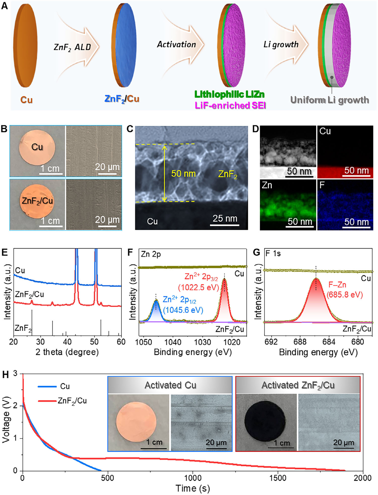
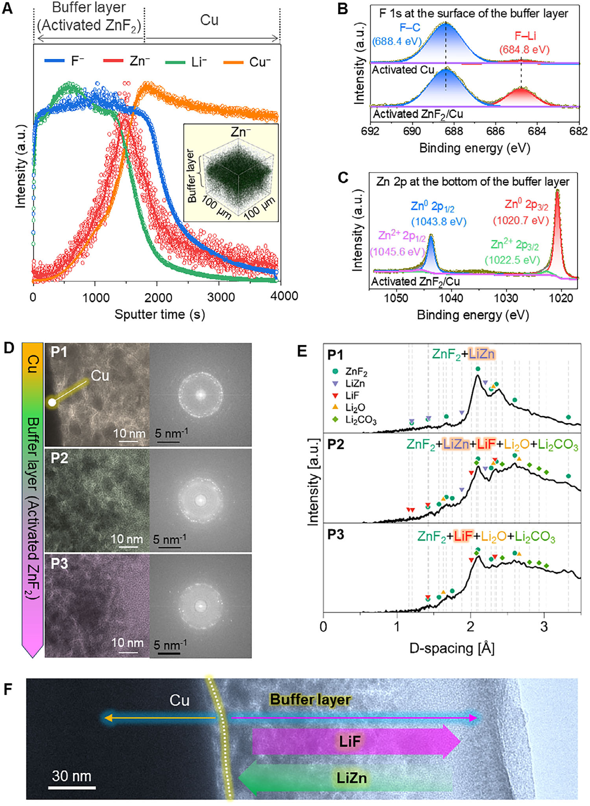
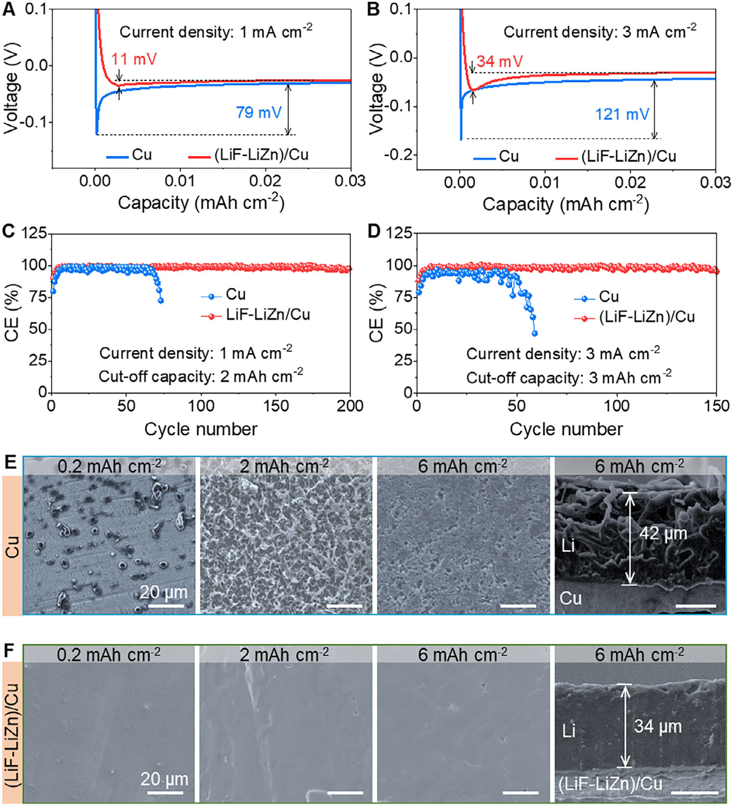
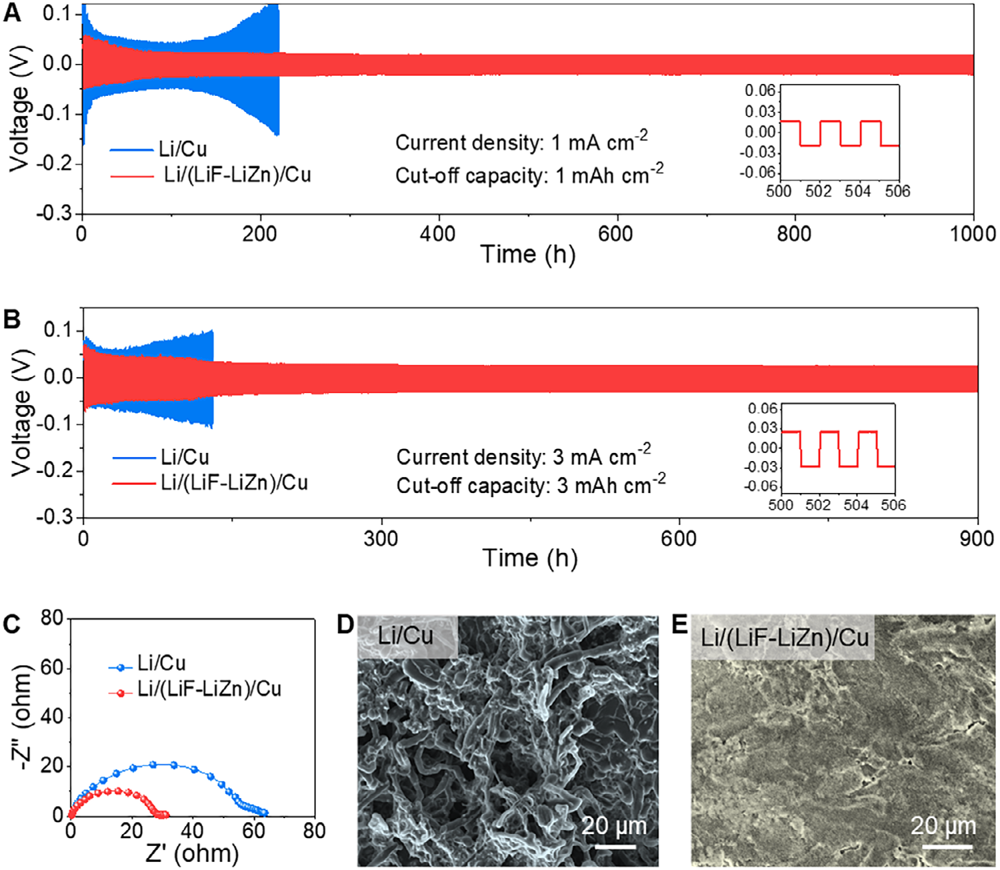
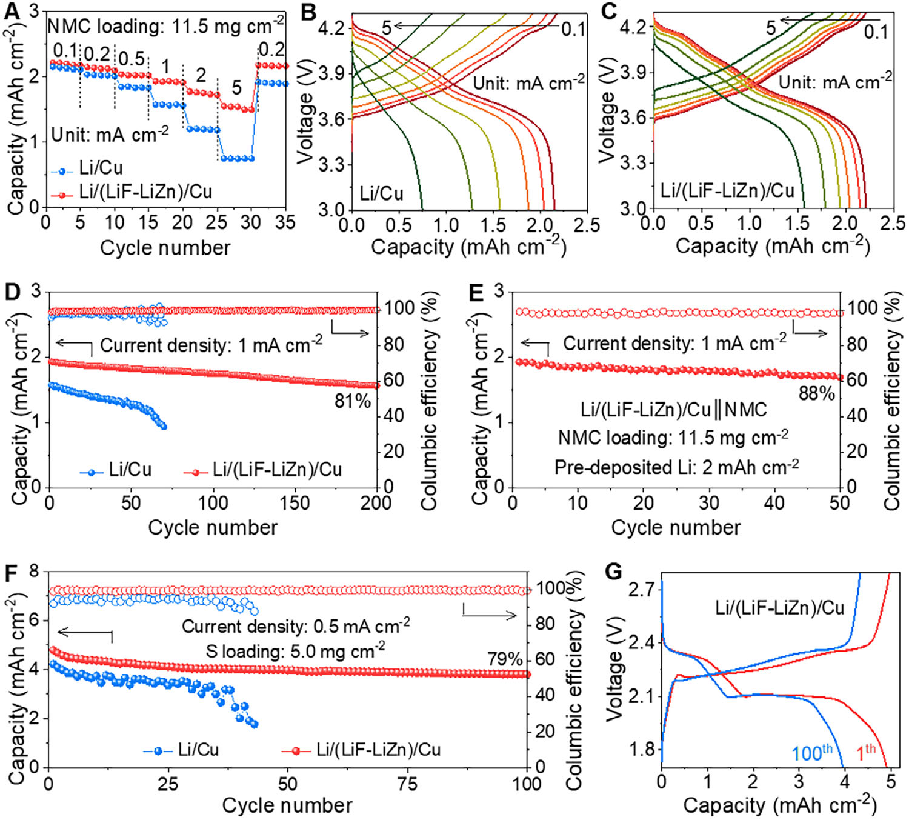

# Advanced Science — Taming Lithium Nucleation

## RESEARCH   ARTICLE

## Taming Lithium Nucleation and Growth on Cu Current Collector by Electrochemical Activation of ZnF 2  Layer

## Viet Phuong Nguyen, Hyung Cheoul Shim, Young-Woon Byeon, Jae-Hyun Kim, and Seung-Mo Lee*

## 1. Introduction

Lithium-metal anodes are essential for the advancement of next-generation batteries. However, their practical use is largely hindered by the uncontrollable growth of dendrites and intricate problems associated with fabricating anodes that meet capacity requirements. Here, it is demonstrated that an ultrathin ZnF 2   layer deposited on the copper foil can produce a novel and efficient current collector to address these challenges. It is observed that ZnF 2   can be transformed into LiZn alloy and LiF salt in one step by simple electrochemical activation. The resulting LiZn alloy exhibits high lithiophilicity, which reduces overpotential and promotes uniform lithium nucleation, while the LiF salt enhances the solid electrolyte interphase, ensuring uniform lithium growth. This synergistic effect led to a dendrite-free, densely packed lithium anode with an extended lifespan, achieving over 900 h in symmetric cells at a high current density of 3 mA cm − 2   and a high cut-offcapacity of 3 mAh cm − 2 . Furthermore, full cells utilizing the lithium anode (Li capacity of 6 mAh cm − 2 ) paired with LiNi 0.8 Mn 0.1 Co 0.1 O 2   cathodes (mass loading of 11.5 mg cm − 2 ) demonstrates drastically improved rate capability and excellent cycling stability. This approach holds great promise for developing safer and more efficient lithium-metal-based batteries for future energy storage solutions.
Lithium   metal   battery   that   uses   metal- lic   lithium   (Li)   as   an   anode   is   likely   to be   the   next   generation   of   energy   storage systems. [ 1 ]   Those   could   include   Li-metal, Li-sulfur,   and   Li-air   batteries.   To   construct these   batteries,   commercial   thick   Li   foil (over   100   μ m,   corresponding   to   a   highly overloaded   capacity   of   more   than   20   mAh cm − 2 )   is   typically   utilized   because   it   is hard   and   expensive   to   reduce   the   thick- ness   of   Li   foil   to   less   than   50   μ m   with current   technology. [ 2–4 ]   This   means   that   a large   excess   amount   of   Li   is   not   utilized, consequently reducing the gravimetric and volumetric   capacities   significantly.   To   pro- duce   thin   Li   anodes,   roll   pressing,   molten Li   process,   and   electrodeposition   methods are   currently   being   developed. [ 5,6 ]   Among these,   electrodeposition   can   control   the thickness of the Li anode more accurately. [ 7 ]
Unfortunately,   this   method   has   faced   criti- cal challenges related to the morphology of deposited   Li   and   the   stability   of   the   solid electrolyte interphase (SEI) layer, [ 7 ]   waiting for an effective tech- nical solution.
V. P. Nguyen, J.-H. Kim, S.-M. Lee Nanomechatronics University of Science and Technology (UST) 217 Gajeong-ro, Daejeon 34113, Republic of Korea E-mail:  sm.lee@kimm.re.kr V.P.Nguyen,H.C.Shim,J.-H.Kim,S.-M.Lee Department of Nanomechanics Korea Instituteof Machinery & Materials (KIMM) 156 Gajeongbuk-ro, Daejeon 34103,Republicof Korea Y.-W.Byeon AdvancedAnalysis andData Center Korea Instituteof ScienceandTechnology (KIST) Seoul 02792, Republic of Korea H.C.Shim School of Materials ScienceandSemiconductorEngineering University of Ulsan,93 Daehak-ro,Nam-gu Ulsan 44610,Republicof Korea
Copper   (Cu)   is   widely   used   as   a   current   collector   (CC)   and host   for   Li   deposition   due   to   its   excellent   electrical   conductiv- ity   and   mechanical   stability. [ 8–11 ]   However,   its   inherent   lithio- phobicity,   characterized   by   a   high   nucleation   barrier,   results   in spatially   inhomogeneous   Li   nucleation   at   the   initial   deposition stage. [ 12–15 ]   This non-uniform nucleation could cause subsequent non-uniform   Li   growth.   Furthermore,   bare   Cu   cannot   facilitate the   uniformity   of   SEI   to   homogenize   the   Li-ion   flux. [ 16 ]   Conse- quently,   Li   tends   to   grow   on   Cu   vertically   rather   than   planarly, leading to uncontrollable dendritic Li growth during cycling, lim- ited cycle life, and fast capacity decay of the Li-metal anode. [ 17–19 ]
The   stability   of   Li-metal   anodes   is   largely   determined   by   two key   factors:   the   Li-attracting   properties   (lithiophilicity)   of   the Cu   CC   and   the   durability   of   the   SEI   layer. [ 20,21 ]   Researchers have   ceaselessly   pursued   various   strategies   to   improve   Li-metal anode performance. [ 10,20–28 ]   These efforts include enhancing the lithiophilicity of Cu CCs, creating artificial SEI layers, modifying electrode/separator interfaces, and developing novel electrolytes and additives. However, these approaches typically address only one   aspect   of   the   problem–either   improving   Cu’s   lithiophilicity or   strengthening   the   SEI   layer–but   rarely   tackle   both   issues
The ORCID identification number(s) for the author(s) of this article can be found under  https://doi.org/10.1002/advs.202416426
© 2025 The Author(s). Advanced Science published by Wiley-VCH GmbH. This is an open access article under the terms of the  Creative Commons Attribution  License, which permits use, distribution and reproduction in any medium, provided the original work is properly cited.
DOI: 10.1002/advs.202416426
Adv. Sci.  2025 ,  12 , 2416426 2416426 (1 of 9) © 2025 The Author(s). Advanced Science published by Wiley-VCH GmbH

---

21983844, 2025, 19, Downloaded from https://advanced.onlinelibrary.wiley.com/doi/10.1002/advs.202416426 by Korea Institute Of Machinery, Wiley Online Library on [07/07/2026]. See the Terms and Conditions (https://onlinelibrary.wiley.com/terms-and-conditions) on Wiley Online Library for rules of use; OA articles are governed by the applicable Creative Commons License

the   XRD   patterns,   and   the   Zn   and   F   peaks   in   the   XPS   spec- tra   confirmed   the   presence   of   a   ZnF 2   layer   on   the   Cu   foil   once more.   (Figure   1E ;   Figure   S4 ,   Supporting   Information).   Notably, the   characteristic   peak   of   Cu   could   not   be   observed   in   the   XPS survey   scan   of   ZnF 2 /Cu,   implying   the   perfect   coverage   of   the ZnF 2 . Moreover, the difference between the binding energies of Zn   2p 3/2   (1022.5   eV)   and   2p 1/2   (1045.6   eV)   was   calculated   to   be 23.1 eV, consistent with the values for Zn 2 +   (Figure  1F ). [ 32 ]   In the F 1s spectrum, the peak centered at 685.8 eV could be assigned to the F ─ Zn bonds (Figure  1G ). [ 33 ]   These results firmly demon- strated   that   the   ultrathin   ZnF 2   layer   was   successfully   deposited on the surface of Cu foil.
simultaneously. As a result, they have fallen short of fully stabi- lizing   Li-metal   anodes.   Therefore,   once   a   method   is   developed to   simultaneously   address   both   the   Li   dendrite   formation   and SEI stability challenges, it would undoubtedly be a technological breakthrough.
Here, we report a facile way to enhance the lithiophilicity of the Cu CC and facilitate the formation of a robust SEI layer in a one- shot. We observed that the ultrathin ZnF 2  layer directly deposited on the Cu foil is in situ converted to LiZn alloy and LiF salt during the   preliminary   discharging   process   (i.e.,   (LiF-LiZn)/Cu).   The resulting   LiZn   alloy   showed   high   lithiophilicity,   thereby   signif- icantly reducing overpotential and homogenizing Li nucleation. Concurrently,   the   LiF   salt   reinforced   the   SEI   to   homogenize   Li- ion flux, thereby ensuring the uniformity of Li growth. Thanks to the synergistic effect, a dendrite-free and dense Li anode with a long lifespan was readily realized. Full cells utilizing our Li anode exhibited significantly enhanced rate capability and cycling stabil- ity,   showcasing   the   promising   potential   of   our   simple   approach in stabilizing the Li anode.
To electrochemically activate this ZnF 2 /Cu, we assembled coin cells using ZnF 2 /Cu paired with Li foil. Then, the coin cells were discharged to 0.01 V and operated 5 cycles between 0.01 and 1.0 V (Figure  S5 , Supporting Information). We observed that unlike the Li ║ Cu cell showing a rapid voltage drop, the Li ║ ZnF 2 /Cu cell ex- hibits a long plateau at 0.4 V, presumably due to the lithiation of ZnF 2   (Figure   1H ).   After   this   operation,   we   disassembled   these cells for further analysis. We observed that the color of the bare Cu electrode remains nearly unchanged, while the ZnF 2 /Cu be- comes black (digital photos in Figure  1H ). This indicated that no- ticeable changes likely occur on the surfaces of the ZnF 2 /Cu dur- ing this electrochemical reaction. As can be seen in the scanning electron   microscope   (SEM)   images,   only   a   few   spots   appeared on   the   activated   bare   Cu   electrode,   likely   due   to   the   decompo- sition   of   the   electrolyte.   In   contrast,   the   surface   of   the   activated ZnF 2 /Cu was fully and uniformly covered by likely the products of   the   in   situ   electrochemical   reactions   between   ZnF 2   and   Li +

## 2. Preparation of ZnF 2 /Cu and Its Electrochemical Activation

We   recognized   that   the   pretreatment   of   the   commercial   Cu   foil before   use   is   highly   needed   because   the   inherent   lithiophobic nature of Cu causes uneven Li nucleation, leading to significant growth of Li dendrites (Figure  S1 , Supporting Information). Mo- tivated   by   this,   we   hypothesized   that   the   Li   hosting   ability   of Cu   foil   could   be   enhanced   by   coating   it   with   a   suitable   mate- rial that   could   simultaneously   reduce the nucleation   overpoten- tial and regulate Li growth. Based on this hypothesis, we turned our attention to ZnF 2  because it contains lithiophilic Zn and use- ful   F   for   LiF   formation. [ 21,29 ]   To   impeccably   deposit   a   thin   and conformal   ZnF 2   layer   on   Cu   foil   (i.e.,   ZnF 2 /Cu),   we   employed atomic   layer   deposition   (ALD). [ 30,31 ]   We   hypothesized   that   elec- trochemical   activation   might   be   able   to   allow   ZnF 2   to   be   trans- formed   into   LiZn   alloy   and   LiF   salt,   respectively,   to   induce   uni- form   Li   nucleation/growth   and   enhance   the   stability   of   the   SEI layer ( Figure  1 A ). In the following sections, we will show that our hypothesis was correct.
ions.
To validate what occurred in the ZnF 2 /Cu during this electro- chemical   activation,   first,   the   time-of-flight   secondary-ion   mass spectrometry   (ToF-SIMS)   analysis   was   performed.   The   results showed   that   F − is   not   only   distributed   in   the   Zn − area   but   also evenly spreads throughout the entire buffer layer on the activated ZnF 2 /Cu   ( Figure   2 A ).   The   F − signals   likely   come   from   the   F- enriched species formed by the reaction between ZnF 2   and Li + , and   from   the   electrolyte.   The   XPS   depth   profiling   further   iden- tified   the   compounds   containing   the   F − .   The   F ─ Li   peaks   were detected,   confirming   the   formation   of   LiF   salt   (Figure   2B ).   The LiF salts on the activated bare Cu electrode appear to have been generated by the electrolyte decomposition. Meanwhile, the reac- tion between ZnF 2  and Li +   seemed to have significantly enriched the LiF content in the buffer layer on the activated ZnF 2 /Cu, as evidenced   by   the   strong   F ─ Li   peak.   The   characteristic   peaks   of Zn 2p were shifted to the lower binding energy compared to the initial values because most Zn 2 +   in ZnF 2   was reduced to Zn 0   in LiZn (Figure  2C ). TEM analysis provided additional information on the substances generated by the electrochemical activation of ZnF 2 /Cu. Figure  2D,E  shows the HRTEM images, selective area electron   diffraction   (SAED)   patterns,   and   the   plot   of   D-spacing against   electron   diffraction   intensity   measured   at   different   po- sitions of the activated ZnF 2 /Cu, respectively. Near the interface between Cu and ZnF 2 , the signal of LiZn was dominant (P1), and in the intermediate region (P2), both LiZn and LiF were detected. At   the   end   region   of   the   buffer   layer   (P3),   the   LiF   signal   was dominant.   These   findings   were   further   corroborated   by   EDX, which detected corresponding Zn and F element signals (Figure S6 , Supporting Information). This additional analysis reinforces
The   ZnF 2 /Cu   samples   with   different   ZnF 2   layer   thicknesses were   prepared   by   adjusting   the   number   of   ALD   cycles.   After thorough   characterizations,   we   determined   the   optimal   thick- ness   of   the   ZnF 2   layer   ( ≈ 50   nm   by   625   ALD   cycles,   see   the   de- tails   in   the   Experimental   Section).   As   shown   in   Figure   1B ,   the reddish-brown   color   of   the   Cu   foil   deepened   after   ZnF 2   ALD, while the morphology of the Cu foil remained nearly unchanged. The   cross-section   transmission   electron   microscope   (TEM)   im- age   exhibited   a   thin   ZnF 2   layer   uniformly   covering   the   Cu   foil (Figure  1C ; Figure  S2 , Supporting Information). An interplanar distance of 0.21 Å observed in the high-resolution TEM (HRTEM) image   could   be   attributed   to   the   (201)   plane   of   ZnF 2 ,   verifying the formation of ZnF 2 . The energy-dispersive X-ray spectroscopy (EDX) analyses indicated a uniform distribution of Zn and F on the Cu surface (Figure  1D ; Figure  S3 , Supporting Information). The crystal structure and the composition of the ZnF 2  layer were then   analyzed   by   X-ray   diffraction   (XRD)   and   X-ray   photoelec- tron   spectroscopy   (XPS).   The   appearance   of   the   ZnF 2   peaks   in
Adv. Sci.  2025 ,  12 , 2416426 2416426 (2 of 9) © 2025 The Author(s). Advanced Science published by Wiley-VCH GmbH

---

21983844, 2025, 19, Downloaded from https://advanced.onlinelibrary.wiley.com/doi/10.1002/advs.202416426 by Korea Institute Of Machinery, Wiley Online Library on [07/07/2026]. See the Terms and Conditions (https://onlinelibrary.wiley.com/terms-and-conditions) on Wiley Online Library for rules of use; OA articles are governed by the applicable Creative Commons License

*Figure 1.   Proposed modification method of Cu current collector. A) Schematic Illustration of uniform Li deposition on Cu current collector triggered by ultrathin ZnF 2   layer prepared by ALD. Electrochemical activation transformed the ZnF 2   layer into LiZn alloy and LiF salt, both promoting favorable Li nucleation and growth (See the text for details). B) Optical and SEM images of raw Cu and ZnF 2  deposited Cu current collector, i.e., ZnF 2 /Cu, respectively. C,D) Bright-field and dark-field TEM images along with corresponding EDX mappings of Cu, Zn, and F elements, respectively. E) XRD pattern. F,G) XPS spectra of Zn 2p and F 1s, respectively. H) Discharging profiles of Li ║ Cu and Li ║ ZnF 2 /Cu cells to lead to electrochemical activation. The digital photos and SEM images of activated bare Cu and ZnF 2 /Cu current collectors are seen in the insets.*

## 3. Li Deposition Behavior on the (LiF-LiZn)/Cu CC

the observed gradient in composition across the interface. These ToF-SIMS,   XPS,   and   TEM   data   indicated   that   in   the   buffer layer,   the   LiF   and   LiZn   are   distributed   rather   unevenly   with regional   selectivity   (Figure   2F ).   Our   analysis   strongly   indicated that   the   ultrathin   ZnF 2   on   the   Cu   CC   undergoes   in   situ   con- version,   forming   a   (LiF-LiZn)/Cu   composite   likely   through   the following   electrochemical   reaction:   ZnF 2   +   3Li +   +   3e − → LiZn +  2LiF.
The   advantages   of   the   in   situ   formed   LiZn   alloy   and   LiF   salt in   regulating   the   Li   nucleation   and   growth   were   evaluated   by electrodeposition   of   Li   at   various   current   densities   and   capaci- ties. As shown in  Figure  3 A , at a current density of 1 mA cm − 2 , the overpotential of Li nucleation on the (LiF-LiZn)/Cu CC was recorded as 11 mV. This value remained nearly unchanged even
Adv. Sci.  2025 ,  12 , 2416426 2416426 (3 of 9) © 2025 The Author(s). Advanced Science published by Wiley-VCH GmbH

---

21983844, 2025, 19, Downloaded from https://advanced.onlinelibrary.wiley.com/doi/10.1002/advs.202416426 by Korea Institute Of Machinery, Wiley Online Library on [07/07/2026]. See the Terms and Conditions (https://onlinelibrary.wiley.com/terms-and-conditions) on Wiley Online Library for rules of use; OA articles are governed by the applicable Creative Commons License

*Figure   2.   Analysis   to   monitor   the   change   of   ZnF 2 /Cu   after   electrochemical   activation.   A)   ToF-SIMS   depth   profile   showing   the   distribution   of   F − and Zn − in the electrochemically activated ZnF 2 /Cu. The inset is a 3D reconstruction of Zn − distribution in activated ZnF 2 /Cu. B,C) High-resolution XPS spectrum of F 1s and Zn 2p after activation, respectively. D) HRTEM images and corresponding SAED patterns measured at different positions (P1, P2, and P3) of the activated ZnF 2 /Cu. E) The plot of D-spacing against electron diffraction intensity at P1, P2, and P3, respectively. F) HRTEM image of the activated ZnF 2 /Cu and presumable distribution of LiF and LiZn in the buffer layer.*

showed   that   the adsorption   energy   of Li   on LiZn alloy   was   con- siderably higher than that on bare Cu (Figure  S8 , Supporting In- formation),   testifying   to   the   high   affinity   between   Li +   ions   and LiZn alloy. [ 35 ]   Furthermore, we observed that on the bare Cu CC, Li   plating/stripping   lasted   only   65   cycles,   likely   due   to   the   for- mation   of   Li   dendrites,   which   eventually   transformed   into   in- active   Li   (Figure   S9 ,   Supporting   Information). [ 36,37 ]   In   contrast,
after   200   cycles   of   Li   plating/stripping   (Figure   S7 ,   Supporting Information)   and   was   significantly   lower   than   that   on   bare   Cu (79 mV). Even when the current density increased to 3 mA cm − 2 , the   (LiF-LiZn)/Cu   CC   electrode   still   exhibited   a   lower   overpo- tential   (Figure   3B ).   The   significant   reduction   of   the   overpoten- tial could be attributed to the improved lithiophilicity of the (LiF- LiZn)/Cu CC. [ 31,34 ]   Indeed, the results of theoretical calculations
Adv. Sci.  2025 ,  12 , 2416426 2416426 (4 of 9) © 2025 The Author(s). Advanced Science published by Wiley-VCH GmbH

---

21983844, 2025, 19, Downloaded from https://advanced.onlinelibrary.wiley.com/doi/10.1002/advs.202416426 by Korea Institute Of Machinery, Wiley Online Library on [07/07/2026]. See the Terms and Conditions (https://onlinelibrary.wiley.com/terms-and-conditions) on Wiley Online Library for rules of use; OA articles are governed by the applicable Creative Commons License

*Figure 3.   Li deposition on bare Cu and ZnF 2 /Cu current collectors. A,B) Voltage profiles of Li plating showing the nucleation overpotentials at current densities of 1 and 3 mA cm − 2   on bare Cu and (LiF-LiZn)/Cu, respectively. C,D) Coulombic efficiency of Li plating/stripping at current densities of 1 and 3 mA cm − 2   and cut-offcapacities of 2 and 3 mAh cm − 2 , respectively. E,F) Morphologies and thicknesses of Li deposited on bare Cu and (LiF-LiZn)/Cu, respectively.*

showed that Li nuclei on the lithiophobic Cu CC surface are un- evenly distributed. Due to the tip effect, Li +   ions likely tended to deposit   at   the   exiting   Li   nuclei. [ 38 ]   Further,   Li   deposition   led   to the formation of elongated and whisker-like dendrites and loose structures with numerous voids. At a capacity of 6 mAh cm − 2 , the thickness of Li deposited on the bare Cu CC was measured to be ≈ 42  μ m. Meanwhile, the morphology of Li deposited on the (LiF- LiZn)/Cu CC was completely different (Figure  3F ). Thanks to the uniform   distribution   of   highly   lithiophilic   LiZn   alloy   that   acted as   preferential   nucleation   seeds,   Li   nuclei   likely   formed   in   the form   of   the   film   without   random   agglomeration.   Subsequently, the LiF-enriched SEI regulated the Li-ion flux, resulting in homo- geneous and dense Li growth. Therefore, at a capacity of 6 mAh cm − 2 ,   Li   deposited   on   the   (LiF-LiZn)/Cu   CC   had   a   thickness   of just  ≈ 34  μ m, which was much smaller than that on the bare Cu CC. Furthermore, upon complete Li stripping, the (LiF-LiZn)/Cu CC surface maintained pristine cleanliness, whereas random Li
the   (LiF-LiZn)/Cu   CC   could   enable   stable   Li   plating/stripping with   the   average   Coulombic   efficiency   (CE)   of   99.2%   for   more than   200   cycles   at   1   mA   cm − 2   with   a   cut-offcapacity   of   2   mAh cm − 2   (Figure   3C ).   The   initial   CE   of   Li   plating/stripping   on   the (LiF-LiZn)/Cu CC was also found to be improved, indicating en- hanced reversibility. When the current density and cut-offcapac- ity increased to 3 mA cm − 2   and 3 mAh cm − 2 , respectively, the CE was as high as 98.4% for more than 150 cycles (Figure  3D ). Even at a higher current density of 5 mA cm − 2 , (LiF-LiZn)/Cu demon- strated excellent reversibility of Li plating/stripping (Figure  S10 , Supporting   Information).   The   voltage   hysteresis   of   the   Li   plat- ing/stripping on the (LiF-LiZn)/Cu CC was found to be greatly re- duced (Figures  S11  and  S12 , Supporting Information). The roles of   the   in   situ   formed   LiZn   alloy   and   LiF-enriched   SEI   in   regu- lating   the   Li   nucleation   and   growth   were   further   disclosed   by the   morphologies   of   Li   deposition   with   different   capacities   at   a current   density   of   1   mA   cm − 2 .   The   SEM   images   in   Figure   3E
Adv. Sci.  2025 ,  12 , 2416426 2416426 (5 of 9) © 2025 The Author(s). Advanced Science published by Wiley-VCH GmbH

---

21983844, 2025, 19, Downloaded from https://advanced.onlinelibrary.wiley.com/doi/10.1002/advs.202416426 by Korea Institute Of Machinery, Wiley Online Library on [07/07/2026]. See the Terms and Conditions (https://onlinelibrary.wiley.com/terms-and-conditions) on Wiley Online Library for rules of use; OA articles are governed by the applicable Creative Commons License

*Figure 4.   Stability of the Li-metal anode. A,B) Long-term cycling performance of symmetric cells at current densities of 1 and 3 mA cm − 2   and cut-off capacities of 1 and 3 mAh cm − 2 , respectively. C) EIS plots of symmetric cells after 10 cycles. D,E) SEM images Li/Cu and Li/(LiF-LiZn)/Cu, respectively, after the cycling test.*

agglomeration persisted on the bare Cu CC (Figure  S13 , Support- ing   Information).   So   far,   we   have   provided   a   clear   mechanistic understanding   of   how   pre-deposited   metal   fluorides   are   trans- formed   and   subsequently   influence   Li   deposition,   offering   new insights into interfacial engineering for next-generation Li-metal anodes.
still   able   to   work   well   at   extremely   high   current   densities   of   5 and 10 mA cm − 2   (Figure  S14 , Supporting Information). The cy- cling stability of the Li/(LiF-LiZn)/Cu electrode was comparable to or even outperformed previously reported data (Table  S1 , Sup- porting   Information).   Electrochemical   impedance   spectroscopy (EIS)   was   conducted   to   examine   the   interface   resistance   of   the electrodes. The cell using Li/(LiF-LiZn)/Cu electrodes displayed a much lower charge transfer resistance than the one using Li/Cu electrodes   (Figure   4C ).   The   largely   reduced   charge   transfer   re- sistance   of   the   cell   using   Li/(LiF-LiZn)/Cu   electrodes   could   be attributed   to   the   LiF-enriched   SEI   layer.   To   better   understand the   electrochemical   stability,   the   morphology   evolution   of   these electrodes was further investigated. As shown in Figure  4D , the Li/Cu electrode presented a rough surface entirely enveloped by irregular, whisker-shaped Li dendrites, accompanied by extensive gaps   that   exposed   a   loose   and   porous   structure.   These   Li   den- drites   substantially   augmented   the   surface   area   of   deposited   Li metal, causing continuous electrolyte consumption to form pas- sivation layers and decayed cyclability. However, in the case of the Li/(LiF-LiZn)/Cu electrode, a clean surface without Li dendrites and dense structure was well preserved (Figure  4E ), explaining its excellent cycling stability. Given the capability of working at high current   densities   and   long-term   cycling   performance,   Li/(LiF- LiZn)/Cu could be regarded as an appealing anode for LMB ap- plications.

## 4. Probing the Cycling Stability

The cycling stability of the Li/(LiF-LiZn)/Cu electrode (Figure  3F , Li   capacity   of   6   mAh   cm − 2 )   was   investigated   using   symmet- ric   cells   and   compared   with   that   of   the   Li/Cu   counterpart (Figure  3E ). The symmetric cells with the Li/(LiF-LiZn)/Cu elec- trodes exhibited steady cyclability over 1000 h with a small volt- age   hysteresis   of   17   mV   at   the   1   mA   cm − 2   and   1   mAh   cm − 2
( Figure  4 A ). In sharp contrast, the symmetric cells with the Li/Cu electrode could work for a short time due to a gradual increase in voltage   hysteresis.   Astonishingly,   when   the   current   density   and the   cut-offcapacity   were   adjusted   up   to   3   mA   cm − 2   and   3   mAh cm − 2 , the excellent stability of the Li/(LiF-LiZn)/Cu electrode was well maintained, showing the promise for the application in fast- charging Li-metal battery. The Li/(LiF-LiZn)/Cu electrode could stably cycle with a voltage hysteresis of  ≈ 25 mV, while the other exhibited   seriously   reduced   cycle   life   (Figure   4B ).   Interestingly, the   symmetric   cells   with   the   Li/(LiF-LiZn)/Cu   electrodes   were
Adv. Sci.  2025 ,  12 , 2416426 2416426 (6 of 9) © 2025 The Author(s). Advanced Science published by Wiley-VCH GmbH

---

21983844, 2025, 19, Downloaded from https://advanced.onlinelibrary.wiley.com/doi/10.1002/advs.202416426 by Korea Institute Of Machinery, Wiley Online Library on [07/07/2026]. See the Terms and Conditions (https://onlinelibrary.wiley.com/terms-and-conditions) on Wiley Online Library for rules of use; OA articles are governed by the applicable Creative Commons License

*Figure   5.   Electrochemical   performance   of   the   Li-metal   full   cells.   A)   Rate   capability   of   different   Li ║ NMC   full   cells.   B,C)   Discharge   and   charge   voltage profiles of Li/Cu ║ NMC and Li/(LiF-LiZn)/Cu ║ NMC full cells, respectively, at various current densities. D) Long-term cycling performance of different Li ║ NMC full cells. E) Cycling performance of the Li/(LiF-LiZn)/Cu ║ NMC “anode-less” cell with the N/P ratio of 0.9. F) Long-term cycling performance of   the   Li/(LiF-LiZn)/Cu ║ S   and   Li/Cu ║ S   full   cells.   G)   Discharge   and   charge   voltage   profiles   of   the   Li/(LiF-LiZn)/Cu ║ S   full   cell   at   the   1st   and   100th cycle.*

## 5. Full Battery Performance

accompanied   by   a   large   hysteresis   voltage   (Figure   5B ).   In   con- trast, the Li/(LiF-LiZn)/Cu ║ NMC cell well maintained the char- acteristic   shape   of   the   charge–discharge   curves   (Figure   5C )   and showed   better   cycling   stability   compared   to   the   Li/Cu ║ NMC cell (Figure  5D ; Figure  S15 , Supporting Information). After 200 cycles   at   1   mA   cm − 2 ,   the   capacity   retention   of   the   Li/(LiF- LiZn)/Cu ║ NMC cell was calculated to be 81%, along with well- maintained   charge–discharge   plateaus   during   repeated   cycling. Conversely,   the   Li/Cu ║ NMC   cell   operated   only   ≈ 60   cycles   be- fore a rapid capacity drop. Even more encouragingly, the “anode- less”   cell   utilizing   the   Li/(LiF-LiZn)/Cu   anode,   with   only   2 mAh   cm − 2   of   pre-deposited   Li   (N/P   ratio   reduced   to   0.9),   oper- ated   stably,   achieving   capacity   retention   of   88%   after   50   cycles (Figure  5E ; Figure  S16 , Supporting Information). This result in- dicated   the   excellent   potential   of   Li/(LiF-LiZn)/Cu   for   enabling high-performance “anode-less” Li batteries.
We   probed   the   electrochemical   performance   of   the   high- voltage   full-cell   composed   of   Li/(LiF-LiZn)/Cu   as   an   anode and   a   LiNi 0.8 Mn 0.1 Co 0.1 O 2   (NMC)   as   a   cathode   (i.e.,   Li/(LiF- LiZn)/Cu ║ NMC   cell).   The   Li/Cu ║ NMC   cell   was   also   assem- bled   for   comparative   study.   The   mass   loading   of   NMC   was 11.5   mg   cm − 2 ,   and   the   capacity   of   pre-deposited   Li   was   6   mAh cm − 2 .   The   negative-to-positive   (N/P)   capacity   ratio   was   calcu- lated   to   be   2.7.   The   rate   capability   of   these   two   cells   is   shown in  Figure  5 A . At a low current density of 0.1 mA cm − 2 , both two cells   delivered   similar   capacities.   However,   as   the   current   den- sity   increases,   the   Li/(LiF-LiZn)/Cu ║ NMC   cell   exhibited   signif- icantly   higher   capacities   than   the   Li/Cu ║ NMC   cell.   At   a   high current   density   of   5   mA   cm − 2 ,   the   Li/(LiF-LiZn)/Cu ║ NMC   cell still   delivered   a   high   discharge   capacity   of   1.55   mAh   cm − 2 , while   the   capacity   of   the   Li/Cu ║ NMC   cell   quickly   dropped   to 0.73   mAh   cm − 2 .   The   enhanced   rate   capability   of   the   Li/(LiF- LiZn)/Cu ║ NMC   cell   could   be   attributed   to   the   superior   kinetic properties of the Li/(LiF-LiZn)/Cu anode, particularly when op- erating   at   high   current   densities.   In   addition,   the   charge   and discharge   plateau   of   the   Li/Cu ║ NMC   cell   almost   disappeared,
The   Li   anode   is   also   known   to   be   a   critical   component   that directly affects the performance of lithium-sulfur batteries. [ 39–41 ]
Therefore, to further verify the applicability of the (LiF-LiZn)/Cu CC, we also assembled a cell using the Li/(LiF-LiZn)/Cu as an an- ode and a high-capacity S as a cathode. To restrain the shuttle ef- fect of lithium polysulfides and promote conversion reactions, we
Adv. Sci.  2025 ,  12 , 2416426 2416426 (7 of 9) © 2025 The Author(s). Advanced Science published by Wiley-VCH GmbH

---

21983844, 2025, 19, Downloaded from https://advanced.onlinelibrary.wiley.com/doi/10.1002/advs.202416426 by Korea Institute Of Machinery, Wiley Online Library on [07/07/2026]. See the Terms and Conditions (https://onlinelibrary.wiley.com/terms-and-conditions) on Wiley Online Library for rules of use; OA articles are governed by the applicable Creative Commons License

employed MXene-driven TiO 2 /TiS 2   as a sulfur host (Figure  S17 , Supporting Information), whose high performance had been al- ready   proven   in   the   previous   study. [ 42 ]   The   mass   loading   of   S was   as   high   as   5.0   mg   cm − 2 ,   and   the   capacity   of   pre-deposited Li was 6 mAh cm − 2 . The lithium-sulfur battery full cell initially reached a high capacity of 4.79 mAh cm − 2 . Because of the high stability   of   both   the   anode   and   cathode,   the   discharge   capacity of the cell using the Li/(LiF-LiZn)/Cu anode was recorded to be up to 3.80 mAh cm − 2   together with a capacity retention of 79% (Figure  5F,G ). These results confirmed that our current collector could enable the enhanced rate capability and cycling stability of not   only   high-voltage   full   cells   using   intercalation   cathodes   but also high-capacity full cells using conversion cathodes.
Received: December 7, 2024
Revised: February 14, 2025 Published online: March 26, 2025
[1]   D. Lin, Y. Liu, Y. Cui,  Nat. Nanotechnol.  2017 ,  12 , 194. [2]   Y.   Gao,   Z.   Yan,   J.   L.   Gray,   X.   He,   D.   Wang,   T.   Chen,   Q.   Huang,   Y.   C.
Li, H. Wang, S. H. Kim, T. E. Mallouk, D. Wang,  Nat. Mater.  2019 ,  18 , 384. [3]   H. Chen, Y. Yang, D. T. Boyle, Y. K. Jeong, R. Xu, L. S. de Vasconcelos,
Z.   Huang,   H.   Wang,   H.   Wang,   W.   Huang,   H.   Li,   J.   Wang,   H.   Gu,   R. Matsumoto, K. Motohashi, Y. Nakayama, K. Zhao, Y. Cui,  Nat. Energy 2021 ,  6 , 790. [4]   J.   I.   Lee,   M.   Shin,   D.   Hong,   S.   Park,   Adv.   Energy   Mater.   2019 ,   9 ,

## 6. Conclusion

1803722. [5]   J. Tao, C. Zhang, X. Li, X. Chen, C. Ji, W. Wan, C. Wang,  J. Mater. Chem.
In summary, we demonstrated that the ultrathin ZnF 2   layer de- posited   on   the   Cu   current   collector   can   be   converted   into   LiZn alloy   and   LiF   salt   in   a   single   step   by   simple   electrochemical   ac- tivation   (ZnF 2   +   3Li +   +   3e − → LiZn   +   2LiF).   From   these   reac- tions,   the   raw   Cu   foil   was   directly   transformed   into   a   new   type of current collector in the form of (LiF-LiZn)/Cu. The LiZn alloy significantly reduced overpotential and promoted uniform Li nu- cleation   due   to   its   remarkable   lipophilicity.   Meanwhile,   the   LiF salt reinforced the SEI, regulating Li +   flux and ensuring uniform Li growth. The synergistic effects created by LiZn and LiF effec- tively   prevented   the   formation   of   unwanted   Li   dendrites   while stabilizing the Li anode structure during electrochemical cycling. Consequently,   the   newly   developed   Li/(LiF-LiZn)/Cu   anode   ex- hibited exceptional rate capability and cycling stability, showcas- ing superior performance in both high-voltage and high-capacity cells. This simple and feasible strategy is expected to offer great potential for the advancement of next-generation Li-metal-based battery systems.
A.  2024 ,  12 , 18127. [6]   Z. Luo, Y. Cao, G. Xu, W. Sun, X. Xiao, H. Liu, S. Wang,  Carbon Neutral.
2024 ,  3 , 647. [7]   P. Shi, X. Q. Zhang, X. Shen, R. Zhang, H. Liu, Q. Zhang,  Adv. Mater.
Technol.  2020 ,  5 , 1900806. [8]   Z.   Ouyang,   S.   Wang,   Y.   Wang,   S.   Muqaddas,   S.   Geng,   Z.   Yao,   X.
Zhang,   B.   Yuan,   X.   Zhao,   Q.   Xu,   S.   Tang,   Q.   Zhang,   J.   Li,   H.   Sun, Adv. Mater.  2024 ,  36 , 2407648. [9]   P.   Molaiyan,   M.   Abdollahifar,   B.   Boz,   A.   Beutl,   M.   Krammer,   N.
Zhang, A. Tron, M. Romio, M. Ricci, R. Adelung, A. Kwade, U. Lassi, A. Paolella,  Adv. Funct. Mater.  2024 ,  34 , 2311301. [10]   D. Li, Y. He, B. Chen, J. Xu, Q. Liu, S. Yang, W. Lai,  EcoEnergy  2024 ,  2 ,
311. [11]   J. Zhou, J. Qin, H. Zhan,  ChemPhysChem  2024 ,  25 , 202400007. [12]   B. Zhou, A. Bonakdarpour, I. Stoševski, B. Fang, D. P. Wilkinson,  Prog.
Mater. Sci.  2022 ,  130 , 100996. [13]   Y. Liu, Y. Li, Z. Du, C. He, J. Bi, S. Li, W. Guan, H. Du, W. Ai,  Adv. Sci.
2023 ,  10 , 2301288. [14]   S. Huang, W. Zhang, H. Ming, G. Cao, L. Z. Fan, H. Zhang,  Nano Lett.
2019 ,  19 , 1832. [15]   S. Cui, P. Zhai, W. Yang, Y. Wei, J. Xiao, L. Deng, Y. Gong,  Small  2020 ,

## Supporting Information

16 , 1905620. [16]   Y.   Gao,   T.   Rojas,   K.   Wang,   S.   Liu,   D.   Wang,   T.   Chen,   H.   Wang,   A.   T.
Supporting Information is available from the Wiley Online Library or from the author.
Ngo, D. Wang,  Nat. Energy  2020 ,  5 , 534. [17]   Y. Yang, D. M. Davies, Y. Yin, O. Borodin, J. Z. Lee, C. Fang, M. Olguin,
Y.   Zhang,   E.   S.   Sablina,   X.   Wang,   C.   S.   Rustomji,   Meng,   Y.   S.   High, Joule  2019 ,  3 , 1986. [18]   F. Ren, Z. Li, Y. Zhu, P. Huguet, S. Deabate, D. Wang, Z. Peng,  Nano

## Acknowledgements

The authors would like to acknowledge the financial support from the Na- tional   Research   Council   of   Science   &   Technology   (NST)   grant   by   the   Ko- rean government (MSIT) (No. 2710024139), and the internal research pro- gram of the Korea Institute of Machinery and Materials (NK255F).
Energy  2020 ,  73 , 104746. [19]   S. Xia, F. Li, X. Zhang, L. Luo, Y. Zhang, T. Yuan, Y. Pang, J. Yang, W.
Liu, Z. Guo, S. Zheng,  ACS Nano  2023 ,  17 , 20689. [20]   Y. Liu, X. Tao, Y. Wang, C. Jiang, C. Ma, O. Sheng, G. Lu, X. W. Lou,
Science  2022 ,  375 , 739. [21]   K. Yan, Z. Lu, H. W. Lee, F. Xiong, P. C. Hsu, Y. Li, J. Zhao, S. Chu, Y.

## Conflict of Interest

Cui,  Nat. Energy  2016 ,  1 , 16010. [22]   D. Li, Y. He, B. Chen, Q. Liu, J. Xu, S. Yang, W. Y. Lai,  EcoMat.  2024 ,
The authors declare no conflicts of interest.
6 , e12478. [23]   S. T. Oyakhire, W. Huang, H. Wang, D. T. Boyle, J. R. Schneider, C. de

## Data Availability Statement

Paula, Y. Wu, Y. Cui, S. F. Bent,  Adv. Energy Mater.  2020 ,  10 , 2002736. [24]   Y.   Sun,   C.   Zhao,   K.   R.   Adair,   Y.   Zhao,   L.   V.   Goncharova,   J.   Liang,   C.
The data that support the findings of this study are available from the cor- responding author upon reasonable request.
Wang, J. Li, R. Li, M. Cai, T. K. Sham, X. Sun,  Energy Environ. Sci.  2021 , 14 , 4085. [25]   S. Abdul Ahad, T. E. Adegoke, K. M. Ryan, H. Geaney,  Small  2023 ,  19 ,
2207902. [26]   L. Xiao, Z. Zeng, X. Liu, Y. Fang, X. Jiang, Y. Shao, L. Zhuang, X. Ai, H.

## Keywords

Yang, Y. Cao, J. Liu,  ACS Energy Lett.  2019 ,  4 , 483.
current collector, dendrite, LiF-rich SEI, lithiophilic, lithium-metal battery
Adv. Sci.  2025 ,  12 , 2416426 2416426 (8 of 9) © 2025 The Author(s). Advanced Science published by Wiley-VCH GmbH

---

21983844, 2025, 19, Downloaded from https://advanced.onlinelibrary.wiley.com/doi/10.1002/advs.202416426 by Korea Institute Of Machinery, Wiley Online Library on [07/07/2026]. See the Terms and Conditions (https://onlinelibrary.wiley.com/terms-and-conditions) on Wiley Online Library for rules of use; OA articles are governed by the applicable Creative Commons License

[35]   Q.   Chen,   H.   Li,   M.   L.   Meyerson,   R.   Rodriguez,   K.   Kawashima,   J.   A.
[27]   Q.   Wang,   J.   Yang,   X.   Huang,   Z.   Zhai,   J.   Tang,   J.   You,   C.   Shi,   W.   Li,
P.   Dai,   W.   Zheng,   L.   Huang,   S.   Sun,   Adv.   Energy   Mater.   2022 ,   12 , 2103972. [28]   D. Li, S. Yang, Z. Zheng, W. Y. Lai,  Research  2023 ,  6 , 0267. [29]   L. Tan, C. Wei, Y. Zhang, Y. An, S. Xiong, J. Feng,  Chem. Eng. J.  2022 ,
Weeks, H. Sun, Q. Xie, J. Lin, G. Henkelman, A. Heller, D. L. Peng, C. B. Li Mullins,  ACS Appl. Mater. Interfaces  2021 ,  13 , 9985. [36]   M. Abdollahifar, A. Paolella,  Batter. Supercaps  2024 , 202400505. [37]   E.   Adhitama,   F.   Demelash,   T.   Brake,   A.   Arifiadi,   M.   Vahnstiege,   A.
Javed,   M.   Winter,   S.   Wiemers-Meyer,   T.   Placke,   Adv.   Energy   Mater. 2024 ,  14 , 2303468. [38]   W. Li, P. Luo, M. Chen, X. Lin, L. Du, H. Song, Y. Lu, Z. Cui,  J. Mater.
442 , 136243. [30]   Y.   Zhao,   L.   Zhang,   J.   Liu,   K.   Adair,   F.   Zhao,   Y.   Sun,   T.   Wu,
X.   Bi,   K.   Amine,   J.   Lu,   X.   Sun,   Chem.   Soc.   Rev.   2021 ,   50 , 3889. [31]   K. H. Chen, A. J. Sanchez, E. Kazyak, A. L. Davis, N. P. Dasgupta,  Adv.
Chem. A  2022 ,  10 , 15161. [39]   V. P. Nguyen, J. S. Park, H. C. Shim, J. M. Yuk, J. H. Kim, D. Kim, S.
M. Lee,  Adv. Funct. Mater.  2023 ,  33 , 2303503. [40]   W. Chen, B. Li, C. Zhao, M. Zhao, T. Yuan, R. Sun, J. Huang, Q. Zhang,
Energy Mater.  2019 ,  9 , 1802534. [32]   Y. Zeng, Z. Pei, Y. Guo, D. Luan, X. Gu, X. W. Lou,  Angew. Chem., Int.
Angew. Chem., Int. Ed.  2020 ,  132 , 10821. [41]   V.   P.   Nguyen,   J.   H.   Kim,   S.   M.   Lee,   Mater.   Today   Energy   2023 ,   38 ,
Ed.  2023 ,  62 , 2312145. [33]   G. Liang, Z. Tang, B. Han, J. Zhu, A. Chen, Q. Li, Z. Chen, Z. Huang,
X. Li, Q. Yang, C. Zhi,  Adv. Mater.  2023 ,  35 , 2210051. [34]   V. P. Nguyen, I. H. Kim, H. C. Shim, J. S. Park, J. M. Yuk, J. H. Kim, D.
101451. [42]   V. P. Nguyen, Y. Qureshi, H. C. Shim, J. M. Yuk, J. H. Kim, S. M. Lee,
Kim, S. M. Lee,  Energy Storage Mater.  2022 ,  46 , 542.
Small Struct.  2024 ,  5 , 2400196.
Adv. Sci.  2025 ,  12 , 2416426 2416426 (9 of 9) © 2025 The Author(s). Advanced Science published by Wiley-VCH GmbH

---
