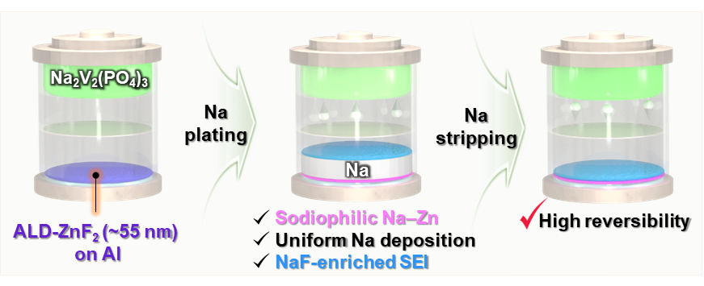
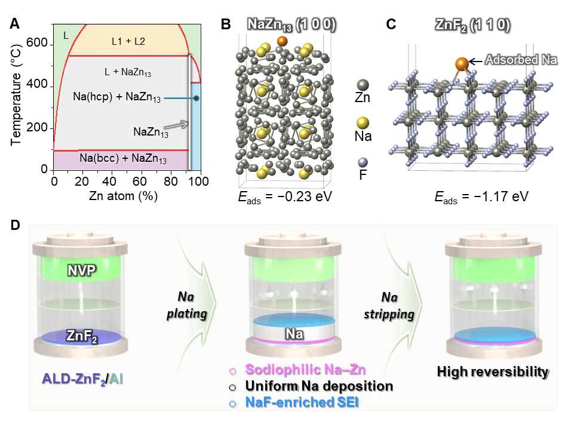
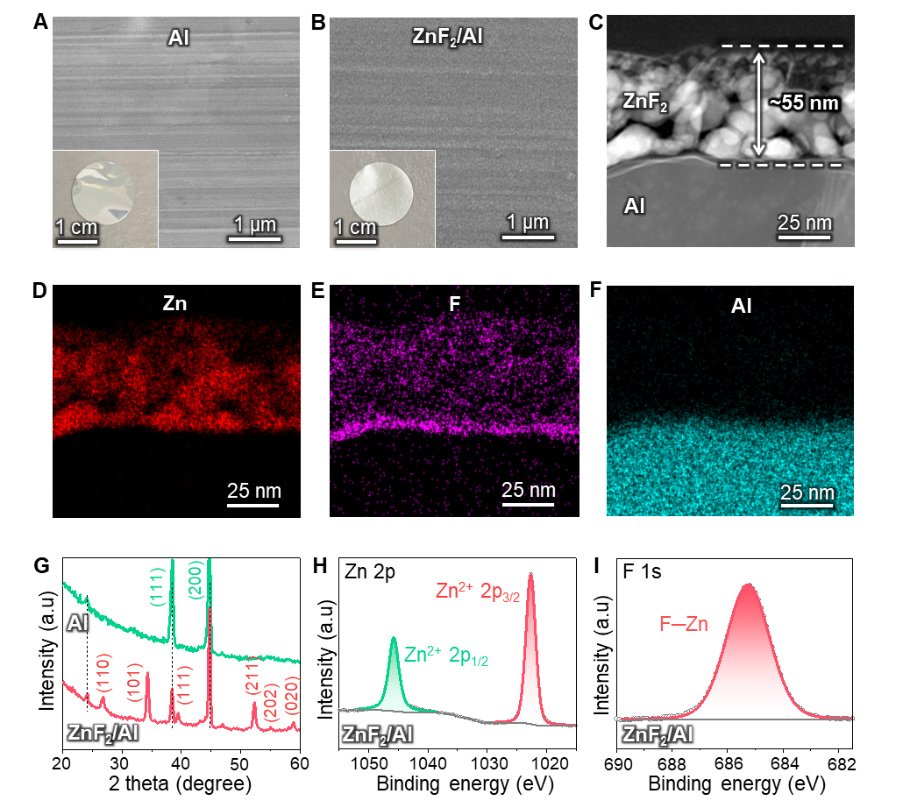
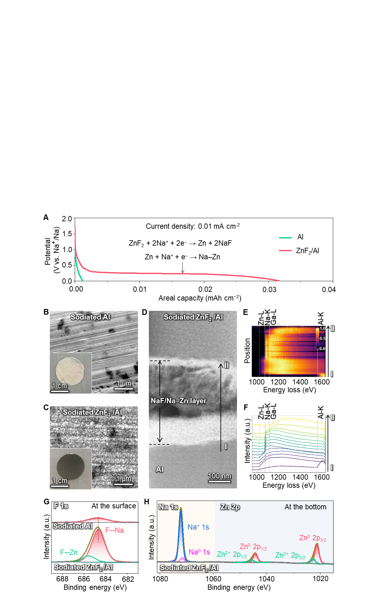
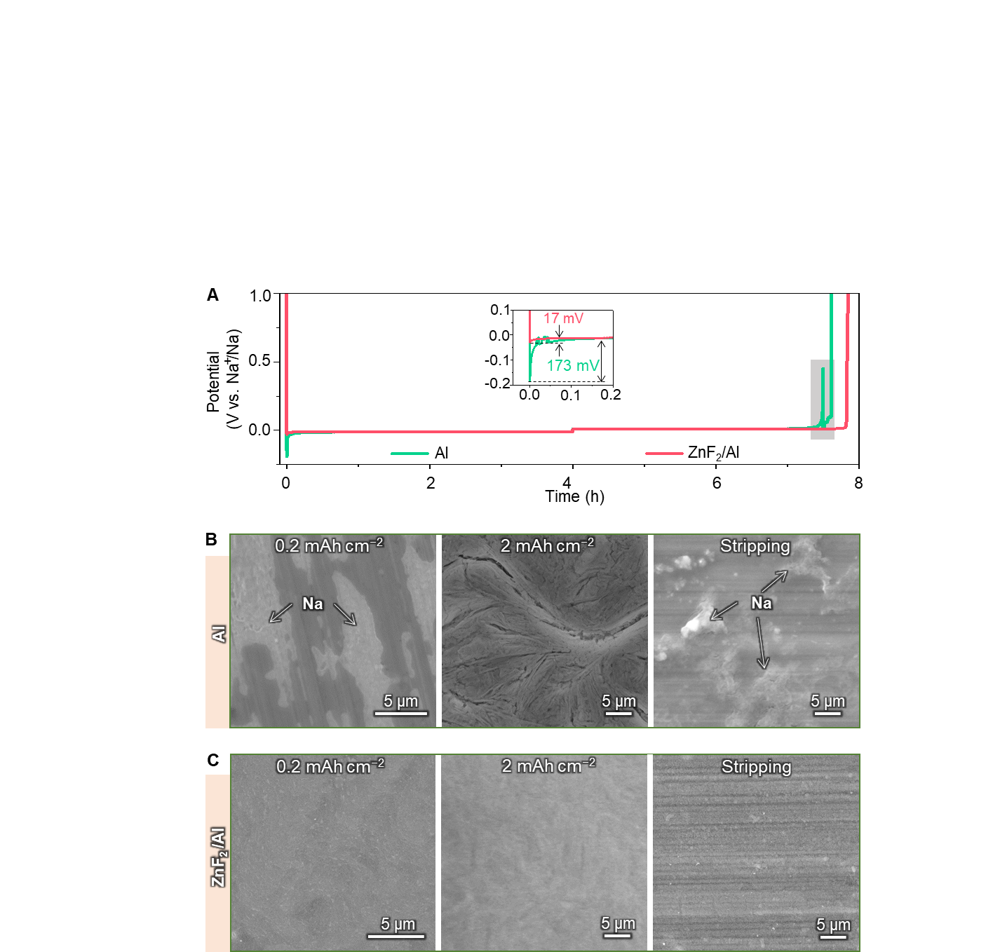
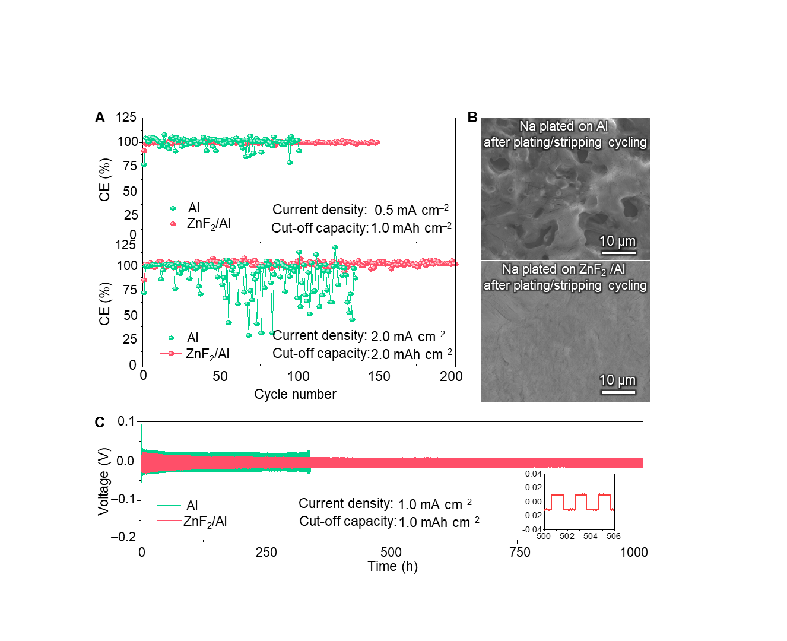
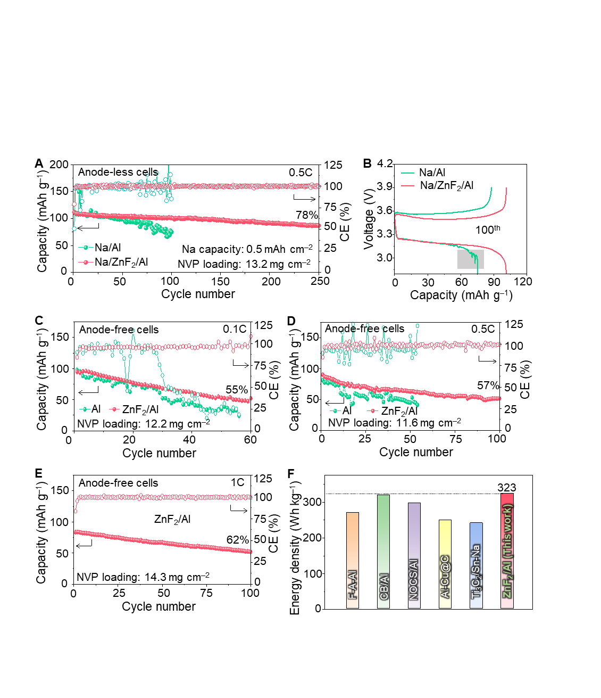

# Clean Revised Manuscript R2

# Atomic-Layer-Deposited ZnF2 on Aluminum Enabling in situ NaF/Na–Zn Interphase for Robust Anode-Free Sodium Batteries

Viet Phuong Nguyen,a,b,* Angelina Sarapulova,b,c Michael Günthel,b  Markus  Knäbbeler-Buß,b Changin Kim,d Young-Woon Byeon,d Moonwon Lee,e,f Kanghoon Yim,e Eric Tröster,b,c Sonia Dsoke,b,c,g,† Seung-Mo Leea,h,‡
a Department of Nanomechanics, Korea Institute of Machinery & Materials (KIMM), 156 Gajeongbuk-ro, Daejeon 34103, Republic of Korea
b Fraunhofer Institute for Solar Energy Systems (ISE), Heidenhofstr. 2, Freiburg 79110, Germany
c Freiburg Materials Research Center (FMF), Stefan-Meier-Straße 21, Freiburg 79104, Germany
d Advanced Analysis and Data Center, Korea Institute of Science and Technology (KIST), 5 Hwarang-ro 14-gil, Seoul 02792, Republic of Korea
e Korea Institute of Energy Research, 152 Gajeong-ro, Daejeon 34129, Republic of Korea
f Graduate School of Energy Science and Technology (GEST), Chungnam National University, 99 Daehak-ro, Daejeon 34134, Republic of Korea
g Department of Sustainable Systems Engineering (INATECH), Albert-Ludwigs University Freiburg, Emmy-Noether-Straße 2, Freiburg 79110, Germany
h Nanomechatronics, University of Science and Technology (UST), 217 Gajeong-ro, Daejeon 34113, Republic of Korea
*,†,‡ Corresponding authors:
Dr. Viet Phuong Nguyen (nvphg9@gmail.com)
Prof. Sonia Dsoke (sonia.dsoke@ise.fraunhofer.de)
Prof.  Seung-Mo Lee (sm.lee@kimm.re.kr)
Table of Contents
“Sodiation of an ultrathin ALD-ZnF2 layer on an Al current collector generates a sodiophilic Na–Zn alloy and a NaF-rich SEI, enabling uniform Na deposition and highly reversible anode-free sodium batteries.”

Abstract
Achieving high-energy-density "anode-free" sodium batteries remains a daunting challenge due to rapid capacity decay caused by poor reversibility and uncontrolled dendritic growth on bare current collectors. To overcome these limitations, we propose a potent interfacial engineering strategy: an aluminum current collector modified with a precisely engineered atomic-layer-deposited ultrathin ZnF2 layer. We demonstrate that the ZnF2 coating undergoes in situ electrochemical transformation during initial sodiation, forming a dense and conformal NaF/Na–Zn interphase. The sodiophilic Na–Zn alloy markedly lowers the nucleation overpotential, promoting highly uniform Na plating across the interface. Working synergistically, the NaF component stabilizes the solid-electrolyte interphase by regulating Na+ flux. Enabled by this dual-functioning framework, the ZnF2-modified aluminum current collector achieves an exceptionally high average Coulombic efficiency of ~99.76% under aggressive plating/stripping conditions (0.5 mA cm−2, 1.0 mAh cm−2). Furthermore, anode-free full cells pairing this modified current collector with high-mass-loading Na3V2(PO4)3 cathodes (11.6–14.3 mg cm−2) exhibit significantly improved cycling stability. This work establishes, to the best of our knowledge, the first example of atomic-layer-deposited ZnF2 on aluminum deliberately converted into a NaF/Na–Zn interphase for anode-free sodium batteries, providing a simple and scalable strategy for high-performance sodium-based energy storage systems.
Keywords: anode-free sodium battery, atomic layer deposition, sodiophilic, NaF-rich SEI, cycling stability, dendritic growth suppression
Introduction
Anode-free sodium batteries (AFSBs) have emerged as a promising architecture for next-generation sodium (Na) storage because they theoretically promise higher energy density, simplified manufacturing, improved process safety, and reduced production costs compared with conventional Na batteries.1,2 In this configuration, no anode-active material is present initially; instead, Na originating from the cathode is directly plated onto the current collector (CC) at the anode side during the first charge.2,3 However, the plated Na often exhibits porous or mossy morphologies, which promote the formation of electrochemically inactive Na and irreversible Na+ consumption via side reactions.4,5 Without supplemental metallic Na to compensate for these losses, the capacity of AFSBs rapidly fades.6
The behavior of Na deposition in such systems is mainly governed by two factors: the sodiophilicity of the CC and the stability of the solid–electrolyte interphase (SEI). Aluminum (Al) foil, the most common anode-side CC, is intrinsically sodiophobic and requires a high nucleation overpotential, leading to inhomogeneous nucleation, locally amplified current densities, and dendritic Na growth.7–9 Although modifying Al with sodiophilic components (Au, Ag, Zn, Sn, etc.) can lower the nucleation barrier,10–13 the resulting SEI often remains fragile, so that cracks formed during repeated plating/stripping expose fresh Na and further accelerate dendrite formation.14–17
SEI engineering, therefore, plays a crucial role in stabilizing Na metal. Among various strategies, enriching the SEI with sodium fluoride (NaF) has proven particularly effective because NaF combines a low Na+ diffusion barrier with excellent mechanical and chemical stability and a high interfacial energy toward Na.18,19 NaF-rich, inorganic SEI layers can suppress parasitic reactions and efficiently mitigate dendritic growth, significantly extending the lifetime of Na metal anodes.20–22
Recent work has shown that integrating Na-alloying metals with fluorinated species is especially beneficial for homogenous Na plating and stripping. A representative example is the study by Wang et al., which identified BiF3-derived interphases - forming Na3Bi and NaF in situ - as particularly effective. This approach achieved an outstanding Coulombic efficiency with high-rate capability retained at both ambient and subzero temperatures.23 This work clarified the synergistic roles of Na-alloying phases and NaF-rich SEI and introduced Na adsorption energy together with a lattice mismatch as quantitative design criteria. However, such approaches rely predominantly on slurry-cast metal-fluoride layers, and there remains a lack of interphases in which an ultrathin metal-fluoride film is grown with atomic-scale precision and then deliberately converted into a Na-alloy phase and NaF for AFSBs.
Here, we address this gap by, to the best of our knowledge, demonstrating the first atomic layer deposition (ALD)-derived ZnF2 coating on Al that in situ forms a NaF/Na–Zn interphase tailored for anode-free sodium batteries. ALD affords Å-level thickness control and excellent conformality,24–27 enabling the formation of a continuous ZnF2 layer over the entire Al surface and a nearly simultaneous, spatially homogeneous phase transformation during the initial sodiation step. We show that this conformal ZnF2 layer is converted into a NaF/Na–Zn interphase, in which a highly sodiophilic Na–Zn phase serves as a uniform nucleation template, and NaF constructs a robust and stable SEI that effectively regulates Na+ flux. Using a cross-sectional transmission electron microscope (TEM), x-ray diffraction (XRD), x-ray photoelectron spectroscopy (XPS) depth profiling, and density functional theory (DFT) calculations, we provide direct structural and chemical evidence for this transformation and quantitatively correlate the interphase architecture with Na nucleation and full-cell performance. As a result, the ZnF2-modified Al current collector enables dense, dendrite-free Na deposition, significantly reduced nucleation overpotential, and highly reversible Na plating/stripping, leading to improved rate capability, prolonged cycle life, and increased energy density in anode-free Na cells with Na3V2(PO4)3 (NVP) cathodes.
Results and Discussion
Design Rationale for the ALD ZnF2 Interphase
We recognized that the inherent sodiophobicity of bare Al foil, along with the formation of an uneven SEI on its surface, poses significant challenges to achieving uniform Na deposition.28 These unfavorable interfacial characteristics lead to poor reversibility of Na plating/stripping and thus limit the direct use of bare Al foil as a CC in AFSBs (Figure S1). To address this issue, we hypothesized that coating Al foil with a suitable interfacial layer could markedly improve the uniformity of Na plating/stripping.
Guided by the Na–Zn phase diagram (Figure 1A),29 we identified NaZn13 as the thermodynamically stable intermetallic at room temperature. DFT calculations revealed that the NaZn13 (100) surface exhibits negative Na adsorption energies (Figure 1B and Figure S2), indicating high sodiophilicity. This suggests that Na–Zn alloying phases are likely to be sodiophilic, lowering the Na nucleation barrier and promoting uniform Na deposition.
An ideal coating material should satisfy two key requirements: (i) it should be highly sodiophilic to facilitate Na nucleation, and (ii) it should promote the formation of a NaF-rich SEI to guide uniform Na growth. Based on these criteria, we focused on ZnF2, which combines sodiophilic Zn with F, a known promoter of NaF formation within the SEI. In addition, ZnF2 itself exhibits strong sodiophilicity, as evidenced by its highly negative adsorption energies (Figure 1C). We therefore hypothesized that electrochemical reactions would in situ convert ZnF2 into Na–Zn and NaF. This process would simultaneously introduce a sodiophilic Na-alloying phase (Na–Zn) and a NaF-rich SEI, both of which are expected to enhance Na nucleation and growth behavior (Figure 1D). To deposit the ZnF2 layer onto Al foil, we employed ALD, a well-established technique in interfacial engineering that offers precise thickness control, excellent uniformity, and conformal coverage, particularly suited for energy storage applications.24–27,30,31 The experimental results presented below strongly support this design hypothesis.
Structural and Chemical Characterization of ALD-ZnF2 on Al
At the initial stage of our study, ZnF2/Al samples with varying ZnF2 thicknesses were fabricated by controlling the number of ALD cycles. After comprehensive characterization, the sample produced using 625 ALD cycles was identified as having the most suitable ZnF2 thickness and was selected for subsequent analyses. As shown in the optical images in Figures 2A–B, the Al foil became noticeably less reflective after ALD treatment, indicating a clear change in surface appearance. The scanning electron microscopy (SEM) images revealed that the bare Al foil possesses a rough and uneven surface morphology originating from the manufacturing process. Such a nonuniform surface requires an advanced coating technique capable of achieving conformal and homogeneous interfacial coverage. Encouragingly, after the ALD treatment, a much more uniform surface texture and smoother morphology were obtained, indicating the excellent conformality and surface coverage of the ALD-grown ZnF2 layer.
The coating thickness was determined to be ≈55 nm from cross-sectional TEM (Figure 2C). Energy-dispersive X-ray spectroscopy (EDX) mapping confirmed a homogeneous distribution of Zn and F across the Al surface (Figures 2D–F and Figure S3), demonstrating that the ALD process produced a conformal and compositionally uniform ZnF2 layer.
To further elucidate the structure and composition of the ZnF2 layer, we employed XRD and XPS. Distinct diffraction peaks corresponding to ZnF2 in the XRD patterns provided clear evidence of ZnF2 formation on the Al substrate (Figure 2G).26,32  Notably, the XPS survey spectrum of ZnF2/Al did not show any characteristic Al peaks, indicating that the ZnF2 layer was sufficiently thick to fully cover the substrate (Figure S4). In addition, the measured doublet separation energy between the Zn 2p3/2 (1022.5 eV) and Zn 2p1/2 (1045.6 eV) peaks was 23.1 eV (Table S1), in agreement with the typical value for Zn2+ species (Figure 2H).33–35 The F 1s spectrum exhibited a main peak at 685.8 eV, attributable to Zn–F bonding (Figure 2I). Collectively, these results confirm the successful deposition of a continuous, conformal, and ultrathin ZnF2 coating on Al by ALD.
Initial Electrochemical Activation and in situ ZnF2 Conversion
To assess the role of ZnF2 in modulating Na plating/stripping behavior, we assembled coin cells using either ZnF2/Al or bare Al as the working electrode, paired with Na foil (denoted Na║ ZnF2/Al and Na║Al, respectively). The cells were first discharged to 0.01 V vs. Na+/Na and then cycled five times between 0.01 and 1.0 V vs. Na+/Na to stabilize the SEI (Figure S5). Notably, while the Na║Al cell exhibited a rapid voltage drop, the Na║ZnF2/Al cell showed a pronounced voltage plateau at around 0.3 V during the initial discharge (Figure 3A). This plateau is attributed to the electrochemical reactions between ZnF2 and Na+, leading to the formation of Na–Zn alloy and NaF according to:

| ZnF2 + 2Na+ + 2e– → Zn + 2NaF Zn + Na+ + e– → Na–Zn | (1) (2) |
| --- | --- |

Using DFT calculations, the enthalpy change for the reaction 13ZnF2 + 27Na → NaZn13 + 26NaF was determined to be −0.833 eV atom−1. This highly negative value indicates that the conversion process is intensely exothermic and thermodynamically favorable.
To gain further insight into the interfacial changes associated with this activation step, we disassembled the cells for post-mortem characterization. Remarkably, the bare Al electrode retained its metallic luster, whereas the ZnF2/Al electrode turned uniformly black (Figures 3B–C), indicating a substantial change in surface chemistry. SEM images of bare Al revealed only minor surface modifications, with a few scattered deposits likely arising from electrolyte decomposition. In contrast, the ZnF2/Al surface was completely and uniformly covered with reaction products generated during sodiation of the ZnF2 layer. The resulting layer appeared expanded relative to the pristine ZnF2 layer.
Evidence for NaF/Na–Zn Interphase Formation
The structural evolution of the ALD-ZnF2 layer upon sodiation was further investigated using cryogenic scanning transmission electron microscopy (cryo-STEM) combined with electron energy-loss spectroscopy (EELS).36–38 The cross-sectional annular dark field scanning transmission electron microscopy (ADF-STEM) image of the sodiated ZnF2/Al (Figure 3D), acquired simultaneously during EELS spectrum imaging, reveals multiple distinct layers above the Al substrate. Note that the ADF-STEM image was recorded under low-angle collection conditions during the EELS acquisition. Therefore, the image contrast arises from a mixture of diffraction and mass-thickness scattering rather than Z-contrast. It should not be directly interpreted as compositional contrast.39 The overall thickness of the reacted zone is significantly larger than that of the as-deposited ZnF2 film (~55 nm), consistent with volume expansion during Na insertion and the conversion reaction.
To identify the compositional origin of each layer, EELS line profiles were acquired across the reaction zone from point I to point II (Figures 3E–F). The characteristic Zn L-edge, Na K-edge, and Al K-edge signals reveal a clear spatial separation of elements within the reacted layer. The Zn signal is concentrated near the Al substrate, while the Na signal extends throughout the reaction layer with its peak intensity in the middle-to-outer surface. Representative EELS spectra from each region, including the F K-edge (~685 eV), Zn L3-edge (~1020 eV), and Na K-edge (~1072 eV), are presented in Figure S6.40 These spectra suggest a layered elemental distribution: a partially reacted ZnF2-rich region near the Al substrate (R1), a conversion zone containing NaF, reduced Zn, and residual ZnF2 (R2), a NaF-rich layer where Zn is no longer detected by EELS (R3), and a Na-rich surface layer (R4). Note that a Ga L3-edge signal (~1115 eV) is also detected near the outer surface (R4), attributable to Ga+ implantation during cryogenic focused ion beam (cryo-FIB) specimen preparation. The coexistence of metallic Zn0 and Na0 species in the lower region (as revealed by XPS, discussed below) suggests a possible Na–Zn alloy layer near the Al substrate, while the upper layers are dominated by NaF and Na-containing surface species. This spatial arrangement is consistent with progressive inward reduction of ZnF2 as Na is incorporated from the electrolyte side, as corroborated by XPS depth profile analysis.
XPS measurements provided complementary chemical-state information that corroborates the EELS spatial analysis. XPS depth profiling was performed by gently sputtering with Ar+ ions and collecting the respective spectra after each sputter step (Figure S7). The F 1s spectrum of the sodiated ZnF2/Al electrode showed that the F–Zn signal became extremely weak, indicating that most ZnF2 had been consumed (Figure 3G and Figure S8A). In contrast, the F–Na signal at 684.7 eV41 was significantly intensified compared with bare Al, confirming substantial in situ formation of NaF from ZnF2. The high intensity of the NaF signal in the surface region indicates that the SEI formed on ZnF2/Al is NaF-rich, which is expected to enhance mechanical robustness and ion transport.
The Zn 2p spectrum of the sodiated ZnF2/Al electrode was dominated by peaks corresponding to metallic Zn0 (Zn0 2p3/2 1021.2 eV),42 confirming electrochemical reduction of Zn2+ in ZnF2 (Figure 3H and Figure S8B). Concurrently,  the Na 1s region exhibited two distinct components of Na+ and Na0. Previous research has demonstrated that sodium atoms can penetrate metallic Zn to form Na–Zn alloy through galvanostatic discharge.43 Considering the low current density (0.01 mA cm–2) and the cut-off potential of 0.01 V, which is above the Na plating potential (0 V vs. Na+/Na), the observed Na0 signal is most likely associated with metallic Na incorporated within a Na–Zn alloy phase. Nevertheless, because the applied potential is near the Na deposition threshold, a minor contribution from metallic Na formed by initial Na plating cannot be completely ruled out. A greater extent of ZnF2 conversion is expected at lower cut-off potentials. To further substantiate the evolution of this alloy, post-sodiation XRD analysis was utilized. The appearance of broad and weak diffraction peaks corresponding to NaZn13​ directly confirms the successful formation of a nanoscale interfacial Na–Zn alloy phase (Figure S9). This distinct nanocrystallinity is intimately linked to the unique confinement effect of the ultrathin, ALD-derived coating. Unlike conventional bulk alloy synthesis, the phase evolves strictly via an interfacial conversion and alloying process within a highly restricted regional landscape. Collectively, these results confirm the in situ transformation of ZnF2 into reduced Zn alloy and NaF, with evidence suggesting Na–Zn alloying in the region proximal to the Al substrate, both of which are expected to play key roles in regulating Na nucleation and ensuring uniform Na deposition.
Impact of NaF/Na–Zn Interphase on Na Nucleation and Growth
The effectiveness of the in situ-generated Na–Zn alloy and NaF in guiding Na nucleation and growth was evaluated by Na electrodeposition tests at different current densities and cut-off capacities. At a current density of 0.5 mA cm−2, the nucleation overpotential for Na on ZnF2/Al was only 17 mV, which is an order of magnitude lower than the 173 mV observed for bare Al (Figure 4A). During stripping, the Na║Al cell exhibited irregular voltage fluctuations (highlighted in Figure 4A), indicative of non-uniform and unstable Na dissolution. In contrast, the Na║ZnF2/Al cell shows smooth stripping profiles. Moreover, across a wide range of current densities (0.1, 1.0, and 2.0 mA cm−2), ZnF2/Al consistently exhibited significantly lower overpotentials than bare Al (Figures S10–S11). This enhanced electrochemical behavior is likely attributable to the improved sodiophilicity imparted by the Na–Zn alloy–containing interphase.
Morphological analysis further highlights the beneficial effect of the NaF/Na–Zn interphase. SEM images taken at an early deposition stage showed that Na nucleates as isolated clusters on bare Al (Figure 4B). This uneven distribution, amplified by “the tip effect”, drives subsequent Na⁺ to deposit preferentially at existing protrusions, ultimately yielding a cracked, porous layer riddled with voids. After deposition to 2.0 mAh cm−2, the Na layer on bare Al exhibited significant thickness variations and exceeded ≈26 µm (Figure S12A). Even after full Na stripping, residual Na clusters remained on the Al surface, underscoring the poor reversibility of Na plating/stripping and the propensity for active Na loss.
In sharp contrast, Na deposition on ZnF2/Al followed a much more uniform pattern (Figure 4C). The finely dispersed Na–Zn alloy and residual ZnF2 likely acted as sodiophilic nucleation sites, promoting film-like Na growth with minimal aggregation. At the same areal capacity of 2.0 mAh cm−2, the Na layer on ZnF₂/Al was only ≈23.6 µm thick and displayed much less thickness variation (Figure S12B). This suggests that the NaF-rich SEI could regulate Na+ flux, resulting in compact and uniform Na deposits. After complete stripping, the ZnF2/Al surface appeared clean and largely free of residual Na, indicating excellent reversibility of Na plating/stripping on this interphase.
The electrochemical impedance spectroscopy (EIS) result showed that Na||ZnF2/Al cell exhibited a significantly lower SEI resistance (RSEI) as well as a lower charge-transfer resistance (Rct) compared with the Na||Al cell (Figure S13). The reduced RSEI indicates that the NaF-rich interphase enables fast Na+ transport across the SEI layer despite the inorganic nature of NaF. Concurrently, the lower Rct suggests more uniform and compact Na deposition. This behavior suppresses local current concentration and yields a denser, less cracked Na morphology, which fundamentally facilitates interfacial charge transfer across the boundary.
Coulombic Efficiency and Long-Term Cycling Stability
Beyond morphological uniformity, the Coulombic efficiency (CE) of Na plating/stripping is a critical metric for reversibility and thus for predicting cycling stability. To quantify the CE, a fixed amount of Na was repeatedly plated onto and stripped from bare Al and ZnF2/Al CCs with a cut-off voltage of 1.0 V. Because the ZnF2 ALD layer is gradually converted into a mixed interphase consisting of NaF and Na–Zn alloy species during the initial sodiation process, the initial coating thickness directly determines the composition, thickness, and transport properties of the evolved interphase. At a current density of 1 mA cm−2, the sample prepared with 625 ALD cycles delivered the highest and most stable CE during repeated Na plating/stripping (Figure S14). An excessively thin ZnF2 layer may lead to the formation of an incomplete artificial SEI with insufficient NaF coverage, whereas an excessively thick ZnF2 layer may generate an overly thick NaF-rich conversion interphase that increases interfacial polarization and impedes coupled Na+/electron transport. In contrast, the intermediate thickness (~55 nm) likely enables the formation of a compact and ionically conductive interphase with an optimized NaF/Na–Zn distribution, thereby promoting homogeneous Na nucleation and stable long-term cycling.
At a lower current density of 0.5 mA cm−2, the Al-based electrode could be cycled for up to ~100 cycles, but the CE fluctuated significantly and frequently dropped in individual cycles, indicating unstable Na plating/stripping behavior. (Figure 5A). In contrast, the ZnF2/Al electrode exhibited a high and stable CE over 150 cycles, averaging 99.76%. At a high current density of 2.0 mA cm−2, the CE of the Al electrode became highly erratic, whereas ZnF2/Al maintained consistently high CE values even after 200 cycles, indicating more reversible Na plating/stripping.
The different CE trends are closely correlated with the Na deposition morphologies (Figure 5B). After the CE tests, Na plated on bare Al exhibits a rough, cracked, and highly porous structure. These surface cracks markedly enlarge the electrochemically active area, accelerate continuous side reactions with the electrolyte, and promote uncontrolled SEI thickening, all of which contribute to Na loss and rapid degradation. In contrast, Na deposited on ZnF2/Al forms a smooth, dense, and nearly crack-free layer. This compact morphology suppresses parasitic reactions and minimizes active Na isolation, which is consistent with the high and stable CE observed for ZnF2/Al. Notably, the cross-sectional morphology of the ZnF2/Al current collector remained clean, dense, and compact even after extended Na plating/stripping cycles (Figure S15). No visible delamination or crack formation was observed, confirming that the structural integrity of the interphase is exceptionally well maintained. Although the ZnF2 layer undergoes volume expansion during the initial sodiation process, the absolute volume change is stringently minimized due to the nanoscale initial thickness of the ALD coating. Consequently, the localized strain energy can be entirely accommodated without exceeding the mechanical toughness threshold of the interphase, thereby suppressing crack propagation. Furthermore, the mechanically robust NaF-rich interphase structurally reinforces the converted layer. This chemophysically stable network efficiently redistributes interfacial stress during repeated Na plating/stripping cycles, guaranteeing long-term mechanical stability.
To further assess long-term stability under more realistic conditions, symmetric cells were assembled using Na-plated Al or Na-plated ZnF2/Al (pre-deposited Na capacity: 2.0 mAh cm−2) as both electrodes. The cells were cycled at 1.0 mA cm−2 with a cut-off capacity of 1.0 mAh cm−2. Symmetric cells with Na/Al electrodes failed after a relatively short time, showing steadily increasing voltage hysteresis indicative of a growing interfacial resistance and unstable Na plating/stripping. In stark contrast, symmetric cells with Na/ZnF2/Al electrodes operated stably for over 1000 h with a small and nearly constant hysteresis of ≈17 mV (Figure 5C). This outstanding durability confirms that the NaF/Na–Zn interphase generated from the ALD-ZnF2 layer enables highly reversible Na cycling, making ZnF2/Al a robust current-collector platform for both anode-less and anode-free sodium battery systems.
It is worth mentioning that previous research has employed blade-coated ZnF2 layers to modify Al current collectors for anode-free sodium batteries;23 however, such coatings showed limited ability to effectively regulate Na deposition. Na nucleation remained highly nonuniform, and the deposited Na exhibited poorly controlled spherical morphologies (Figure S16). What is worse, the Coulombic efficiency fluctuated significantly during cycling, indicating poor reversibility and unstable Na plating/stripping behavior.
In contrast, ALD offers unique and well-documented advantages for electrode interfacial engineering that directly address these limitations. First, ALD deposits ZnF2 as a pure, binder-free, and additive-free thin film, ensuring that the entire coating actively participates in the interfacial reactions without parasitic resistances. Second, the self-limiting, sequential reaction mechanism of ALD enables precise thickness control at the sub-nanometer level, which provides sufficient sodiophilic interphase coverage while minimizing irreversible Na consumption.
Third, and most importantly, ALD establishes a powerful synergy between geometric conformality and chemical anchoring. Mechanically, it inherently produces conformal coatings that follow the exact topography of the underlying Al current collector, ensuring uniform ZnF2 coverage over the entire electrode surface, including grain boundaries, surface asperities, and microscale features. Chemically, the chemisorption-driven growth mechanism forces the formation of robust covalent bonds at the film-substrate interface, yielding an exceptionally high interfacial strength.
This dual-functioning structural integrity ensures that the film is both perfectly conformed and chemically welded to the substrate. Consequently, this tight bonding effectively prevents mechanical delamination while optimizing stable electrochemical charge-transfer pathways under aggressive cycling. This combined geometric and chemical uniformity directly translates to a more homogeneous nucleation overpotential landscape across the electrode. As a result, it successfully suppresses preferential Na nucleation at surface defects.
Therefore, the ability of ALD to deliver a controlled, ultrathin, and chemically anchored conformal ZnF2 interphase is directly responsible for the enhanced electrochemical performance observed in our study. This represents a genuine advantage that cannot be straightforwardly replicated by conventional, non-reactive coating methods.
Full-Cell Performance in Lean-Na and Anode-Free Configurations
Finally, we evaluated the electrochemical performance of ZnF2/Al CCs in both lean-Na and anode-free full-cell configurations with NVP cathodes. In the lean-Na configuration, a small amount of Na (0.5 mAh cm−2) was pre-deposited onto bare Al or ZnF2/Al (denoted Na/Al and Na/ZnF2/Al, respectively). The NVP cathode had a mass loading of 13.2 mg cm−2, corresponding to a negative-to-positive capacity ratio of ≈0.33. Both cells delivered an initial discharge capacity of 111 mAh g−1 at 0.5C (1C = 117 mA g−1; Figure 6A).
However, the cycling behavior of the two cells diverged significantly. The Na/Al║NVP cell exhibited rapid capacity decay to 75 mAh g−1 within 100 cycles, accompanied by pronounced CE fluctuations. In contrast, the Na/ZnF2/Al║NVP cell retained 101 mAh g−1 after 100 cycles and 87 mAh g−1 after 250 cycles, corresponding to capacity retentions of 91% and 78%, respectively. The average CE is close to 99.76% throughout cycling, indicating highly reversible Na plating/stripping. The Na/ZnF2/Al║NVP cell also showed smoother charge–discharge profiles with lower polarization (Figure 6B), whereas the Na/Al║NVP cell exhibited abrupt voltage drops, likely associated with discontinuous Na stripping. Similarly, cyclic voltammetry (CV) curves under various scan rates consistently revealed a higher peak current density and a lower polarization potential of the Na/ZnF2/Al║NVP cell (Figure S17), indicating the better reaction kinetics of the Na/ZnF2/Al anode.
AFSB cells were then assembled using either bare Al or ZnF2/Al CCs directly paired with NVP cathodes (mass loading: 11.6 – 14.3 mg cm−2). At a low rate of 0.1C, the AFSB cell with bare Al suffered from rapid capacity fading and low CE within 30 cycles, indicating highly irreversible Na plating/stripping (Figure 6C). By contrast, the ZnF2/Al-based AFSB cell showed much improved stability, retaining 55% of its initial capacity after 60 cycles with significantly higher CE under the same conditions. When the current density was increased to 0.5C, the ZnF2/Al║NVP AFSB cells maintained a capacity retention of 57% after 100 cycles (Figure 6D). In addition, the ZnF2/Al║NVP cell exhibited smooth charge–discharge curves without visible voltage drops throughout cycling (Figures S18–S19). Even under harsher operating conditions, including a higher cathode mass loading of 14.3 mg cm−2 and a higher current density of 1C, the ZnF2/Al║NVP cell still exhibited a reasonable capacity retention of 62% after 100 cycles (Figure 6E and Figure S20). This remarkable cycling stability can be attributed to the excellent tolerance of the ZnF2/Al current collector toward high-current-density operation, which promotes highly reversible metal plating/stripping. Consequently, the cycling performance of the ZnF2/Al║NVP cell is comparable to, or even surpasses, that of previously reported systems, underscoring the effectiveness of the ZnF2/Al CC (Table S1). The ZnF2/Al-based AFSB cells achieve a high energy density of 323 Wh kg−1 based on the total mass of active materials, surpassing those of several previously reported AFSBs in the literature (Figure 6F).9,44–47 To verify the practical applicability of our strategy, an anode-free ZnF2/Al║NVP pouch cell was assembled and evaluated. Encouragingly, the pouch cell exhibited stable electrochemical operation (Figure S21). This operational stability further demonstrates the practical feasibility of the ALD-engineered ZnF2 interphase for commercial-scale anode-free sodium batteries.
Taken together, these results strongly support our hypothesis. In contrast to the poor reversibility of Na plating/stripping on bare Al, the ALD-engineered ZnF2/Al current collector undergoes an in situ transformation into a NaF/Na–Zn interphase that facilitates uniform Na nucleation, regulates Na-ion flux, suppresses dendritic growth, and significantly improves the reversibility of Na plating and stripping (Figure S22). As a result, enhanced electrochemical performance is achieved in both lean-Na and anode-free full-cell configurations. More broadly, these findings highlight the considerable potential of ALD for current collector engineering. Its unique capability to produce uniform, conformal, and pinhole-free coatings is tightly coupled with the formation of robust interfacial covalent bonds. This combined geometric and chemical uniformity ensures excellent structural integrity under aggressive cycling. Nevertheless, further development toward high-throughput, large-scale ALD processing will still be necessary to facilitate practical commercialization.
Conclusions
In summary, we have demonstrated that a sub-nanometer-controlled, ultrathin ZnF2​ coating via ALD on Al foil is a highly efficacious strategy for engineering a high-performance, resilient current collector for stable AFSBs. During initial sodiation, the ZnF2 layer is converted in situ into a conformal NaF/Na–Zn interphase. The highly sodiophilic Na–Zn alloy markedly reduces the nucleation overpotential and promotes uniform Na deposition, while the NaF component stabilizes the SEI and likely regulates Na+ flux to sustain even Na growth. The synergy between these two phases enables highly reversible plating/stripping, which beneficially impacts cycling stability and energy density. Therefore, both lean-Na and anode-free full cells exhibit markedly prolonged cycle life. To the best of our knowledge, this work provides the first deliberate realization and mechanistic elucidation of a NaF/Na–Zn interphase generated from an ALD-ZnF2 coating on Al for anode-free sodium batteries. Given its conceptual simplicity, scalability, and compatibility with foil-based electrode architectures, this ZnF2/Al platform offers a practical and versatile route toward next-generation, high-performance sodium-based energy storage systems.
Acknowledgments
The authors would like to acknowledge the financial support from the internal research program of the Korea Institute of Machinery & Materials (NK263D), the National Research Council of Science & Technology (NST) grant by the Korea government (MSIT) (No. GTL24013-000), and the Korea Institute of Energy Technology Evaluation and Planning (KETEP) and the Ministry of Trade, Industry & Energy (MOTIE) of the Republic of Korea (No. 20212050100010). This work was also supported by the 2024 UST Overseas Training Program funded by the University of Science and Technology (UST). V.P.N. would like to sincerely thank all members of the Department of Electrical Energy Storage, Fraunhofer ISE, for their support and the memorable moments shared during his internship. S.D. would also like to thank the support of the Fraunhofer-Max Planck cooperation program via the project GENIUS. Y.-W.B would also appreciate Dr. Hoyoung Suh and Mrs. Yanghee Kim of the Advanced Analysis and Data Center, Korea Institute of Science and Technology, for their technical assistance.
Conflict of Interest
The authors declare no conflicts of interest.
Supporting Information
The Supporting Information is available at …
References
(1) 	Li, Y.; Zhou, Q.; Weng, S.; Ding, F.; Qi, X.; Lu, J.; Li, Y.; Zhang, X.; Rong, X.; Lu, Y.; Wang, X.; Xiao, R.; Li, H.; Huang, X.; Chen, L.; Hu, Y. S. Interfacial Engineering to Achieve an Energy Density of over 200 Wh Kg−1 in Sodium Batteries. Nat. Energy 2022, 7,  511–519.
(2) 	Ruan, J.; Hu, J.; Li, Q.; Luo, S.; Yang, J.; Liu, Y.; Song, Y.; Zheng, S.; Sun, D.; Fang, F.; Wang, F. Current Collector Interphase Design for High-Energy and Stable Anode-Less Sodium Batteries. Nat. Sustain. 2025, 8, 530–541.
(3) 	Deysher, G.; Oh, J. A. S.; Chen, Y. T.; Sayahpour, B.; Ham, S. Y.; Cheng, D.; Ridley, P.; Cronk, A.; Lin, S. W. H.; Qian, K.; Nguyen, L. H. B.; Jang, J.; Meng, Y. S. Design Principles for Enabling an Anode-Free Sodium All-Solid-State Battery. Nat. Energy 2024, 9, 1161–1172.
(4) 	Li, H.; Wu, F.; Wang, J.; Wang, J.; Qu, H.; Chen, M.; Zhang, H.; Passerini, S. Anode-Free Sodium Metal Batteries: Optimisation of Electrolytes and Interphases. Energy Environ. Sci. 2025, 18, 3887–3916.
(5) 	Xie, C.; Liang, K.; Wu, H.; Xie, Z.; Ren, Y.; Dai, J.; Lu, J.; Tang, Y.; Wang, H. Revealing the Formation Mechanism of Inactive Sodium in Anode‐Free Sodium Batteries: Crystal Mismatch and Weak Lattice Force. Adv. Energy Mater. 2025, 15, 2500351.
(6) 	Tang, F.; Yang, Y.; Liu, C.; Yang, S.; Xu, S.; Yao, Y.; Yang, H.; Yang, Y.; He, S.; Pan, H.; Rui, X.; Yu, Y. Initially Anode-Free Sodium Metal Battery Enabled by Strain-Engineered Single-Crystal Aluminum Substrate with (100)-Preferred Orientation. Nat. Commun.  2025, 16, 2280.
(7) 	Liu, L.; Cai, Z.; Yang, S.; Yang, Y.; Yao, Y.; He, S.; Xu, S.; Wu, Z.; Pan, H.; Rui, X.; Yu, Y. Multifunctional High-Entropy Alloy Nanolayer Toward Long-Life Anode-Free Sodium Metal Battery. Adv. Mater. 2025, 37, 2413331.
(8) 	An, Y.; Pei, Z.; Luan, D.; Lou, X. W. A Functionalized Porous Al Current Collector Enables High-Energy Density Anode-Free Na Batteries. Sci. Adv.  2025, 11, eadx7124.
(9) 	Wu, S.; Hwang, J.; Matsumoto, K.; Hagiwara, R. The Rational Design of Low‐Barrier Fluorinated Aluminum Substrates for Anode-Free Sodium Metal Battery. Adv. Energy Mater. 2023, 13, 2302468.
(10) 	Tang, S.; Zhang, Y. Y.; Zhang, X. G.; Li, J. T.; Wang, X. Y.; Yan, J. W.; Wu, D. Y.; Zheng, M. Sen; Dong, Q. F.; Mao, B. W. Stable Na Plating and Stripping Electrochemistry Promoted by In Situ Construction of an Alloy-Based Sodiophilic Interphase. Adv. Mater. 2019, 31, 1807495.
(11) 	Kim, S.; Ryoo, G.; Lee, J. H.; Kim, J.; Park, J. H.; Cho, K. Horizontal Sodium Growth via the Sodiophilicity-Driven Structural Design of Current Collectors for Anode-Free Sodium Metal Batteries. ACS Nano 2025, 19, 25455–25465.
(12) 	Cai, Z.; Tang, F.; Yang, Y.; Xu, S.; Xu, C.; Liu, L.; Rui, X. A Multifunctional Super‐sodiophilic Coating on Aluminum Current Collector for High-Performance Anode-Free Na-Metal Batteries. Nano Energy 2023, 116, 108814.
(13) 	Wasnik, K.; Yadav, P.; Ahuja, M.; Mirzapure, V.; Johari, P.; Shelke, M. V. Investigations into the Nucleation Dynamics of the Stable Na-Metal Anode: Revealing the Role of a Tin-Infused Carbon Nanofiber Interlayer. ACS Appl. Mater. Interfaces 2025, 17, 12281–12290.
(14) 	Gao, L.; Chen, J.; Chen, Q.; Kong, X. The Chemical Evolution of Solid Electrolyte Interface in Sodium Metal Batteries. Sci. Adv. 2022, 8, eabm4606.
(15) 	Liu, P.; Miao, L.; Sun, Z.; Chen, X.; Si, Y.; Wang, Q.; Jiao, L. Inorganic–Organic Hybrid Multifunctional Solid Electrolyte Interphase Layers for Dendrite-Free Sodium Metal Anodes.  Angew. Chem., Int. Ed. 2023, 62, e202312413.
(16) 	Kim, J.; Kim, J.; Jeong, J.; Park, J.; Park, C. Y.; Park, S.; Lim, S. G.; Lee, K. T.; Choi, N. S.; Byon, H. R.; Jo, C.; Lee, J. Designing Fluorine-Free Electrolytes for Stable Sodium Metal Anodes and High-Power Seawater Batteries via SEI Reconstruction. Energy Environ. Sci. 2022, 15 , 4109–4118.
(17) 	Ma, B.; Lee, Y.; Bai, P. Dynamic Interfacial Stability Confirmed by Microscopic Optical Operando Experiments Enables High-Retention-Rate Anode-Free Na Metal Full Cells. Adv. Sci. 2021, 8 , 2005006.
(18) 	Liu, P.; Miao, L.; Sun, Z.; Chen, X.; Jiao, L. Sodiophilic Substrate Induces NaF-Rich Solid Electrolyte Interface for Dendrite-Free Sodium Metal Anode. Adv. Mater. 2024, 36, 2406058.
(19) 	Zhu, C.; Wu, D.; Wang, Z.; Wang, H.; Liu, J.; Guo, K.; Liu, Q.; Ma, J. Optimizing NaF-Rich Solid Electrolyte Interphase for Stabilizing Sodium Metal Batteries by Electrolyte Additive. Adv. Funct. Mater. 2024, 34, 2214195.
(20) 	Kang, T.; Sun, C.; Li, Y.; Song, T.; Guan, Z.; Tong, Z.; Nan, J.; Lee, C. S. Dendrite-Free Sodium Metal Anodes Via Solid Electrolyte Interphase Engineering With a Covalent Organic Framework Separator. Adv. Energy Mater. 2023, 13, 2204083.
(21) 	Wang, Q.; Zhao, C.; Lv, X.; Lu, Y.; Lin, K.; Zhang, S.; Kang, F.; Hu, Y. S.; Li, B. Stabilizing a Sodium-Metal Battery with the Synergy Effects of a Sodiophilic Matrix and Fluorine-Rich Interface. J. Mater. Chem. A 2019, 7, 24857–24867.
(22) 	Guo, J.; Li, Y.; Xu, K.; Huang, Z.; Hu, W.; Tan, Y.; Sun, C.; Yang, J.; Geng, H. Manipulating Interfacial Renovation via In Situ Formed Metal Fluoride Heterogeneous Protective Layer toward Exceptional Durable Sodium Metal Anodes. Adv. Funct. Mater. 2024, 34, 2411760.
(23) 	Wang, M.; Yang, J.; Ji, H.; Li, Z.; Wang, F.; Fang, F.; Ruan, J.; Sun, D.; Wang, F. Fluorinated Sodiophilic Interphase for High-Rate and Low-Temperature Initially Anode-Free Sodium Battery. Nat. Commun.  2026, 17, 264.
(24) 	Zhao, Y.; Zhang, L.; Liu, J.; Adair, K.; Zhao, F.; Sun, Y.; Wu, T.; Bi, X.; Amine, K.; Lu, J.; Sun, X. Atomic/Molecular Layer Deposition for Energy Storage and Conversion. Chem. Soc. Rev. 2021, 50, 3889–3956.
(25) 	Zhang, T.; Wang, T.; Zheng, Y.; Qian, L.; Liu, X.; Yan, W.; Zhang, J. Atomic Layer Deposition for Sodium-Ion Batteries. Adv. Energy Mater. 2025, 15, 2501760.
(26) 	Nguyen, V. P.; Park, M.; Byeon, Y.-W.; Lim, S.; Yim, K.; Oh, M.; Hyun, S.; Jeon, E.; Lee, S. Ultrathin Yet Effective: 90 Nm ZnF2 Layer for Stabilizing Zinc–Metal Anodes. ACS Energy Lett. 2025, 10, 5503–5511.
(27) 	Nguyen, V. P.; Kim, I. H.; Shim, H. C.; Park, J. S.; Yuk, J. M.; Kim, J. H.; Kim, D.; Lee, S. M. Porous Carbon Textile Decorated with VC/V2O3-X Hybrid Nanoparticles: Dual-Functional Host for Flexible Li-S Full Batteries. Energy Storage Mater. 2022, 46, 542–552.
(28) 	Shi, J.; Wang, D.; Liu, Q.; Yu, Z.; Huang, J. Q.; Zhang, B. Intermetallic Layers with Tuned Na Nucleation and Transport for Anode-Free Sodium Metal Batteries. Nano Lett. 2025, 25, 1800–1807.
(29) 	Pelton, A. D. The Na-Zn (Sodium-Zinc) System. Bull. Alloy Phase Diagrams 1987, 8, 550–553.
(30) 	Nguyen, V. P.; Kim, D.; Kang, J.; Jung, W.; Lim, S.; Yim, K.; Lee, S. Heterostructured Sn:SnO2 Nanodots for High-Performance Li–S Batteries with Kinetics-Enhanced Cathode and Dendrite-Free Anode. Adv. Funct. Mater. 2025, 35, 2507991.
(31) 	Nguyen, V. P.; Park, J. S.; Yuk, J. M.; Oh, M.; Kim, J. H.; Lee, S. M. Boosted Zn2+ Storage Performance of Hydrated Vanadium Oxide by Defect and Heterostructure. J. Mater. Chem. A 2022, 10, 13428–13438.
(32) 	Wang, D.; Lv, D.; Peng, H.; Wang, N.; Liu, H.; Yang, J.; Qian, Y. Site-Selective Adsorption on ZnF2/Ag Coated Zn for Advanced Aqueous Zinc-Metal Batteries at Low Temperature. Nano Lett. 2022, 22, 1750–1758.
(33) 	Azaceta, E.; Marcilla, R.; Mecerreyes, D.; Ungureanu, M.; Dev, A.; Voss, T.; Fantini, S.; Grande, H. J.; Cabañero, G.; Tena-Zaera, R. Electrochemical Reduction of O2 in 1-Butyl-1-Methylpyrrolidinium Bis(Trifluoromethanesulfonyl)Imide Ionic Liquid Containing Zn2+ Cations: Deposition of Non-Polar Oriented ZnO Nanocrystalline Films. Phys. Chem. Chem. Phys. 2011, 13, 13433–13440.
(34) 	Li, G.; Wang, X.; Lv, S.; Wang, J.; Yu, W.; Dong, X.; Liu, D. In Situ Constructing a Film-Coated 3D Porous Zn Anode by Iodine Etching Strategy Toward Horizontally Arranged Dendrite-Free Zn Deposition. Adv. Funct. Mater. 2023, 33, 2208288.
(35) 	Nguyen, V. P.; Shim, H. C.; Byeon, Y. W.; Kim, J. H.; Lee, S. M. Taming Lithium Nucleation and Growth on Cu Current Collector by Electrochemical Activation of ZnF2 Layer. Adv. Sci. 2025, 12, 2416426.
(36) 	Byeon, Y. W.; Ahn, J. P.; Lee, J. C. Diffusion Along Dislocations Mitigates Self-Limiting Na Diffusion in Crystalline Sn. Small 2020, 16, 2004868.
(37) 	Li, Y.; Li, Y.; Pei, A.; Yan, K.; Sun, Y.; Wu, C. L.; Joubert, L. M.; Chin, R.; Koh, A. L.; Yu, Y.; Perrino, J.; Butz, B.; Chu, S.; Cui, Y. Atomic Structure of Sensitive Battery Materials and Interfaces Revealed by Cryo–Electron Microscopy. Science 2017, 358, 506–510.
(38) 	Cheng, D.; Wynn, T. A.; Wang, X.; Wang, S.; Zhang, M.; Shimizu, R.; Bai, S.; Nguyen, H.; Fang, C.; Kim, M. cheol; Li, W.; Lu, B.; Kim, S. J.; Meng, Y. S. Unveiling the Stable Nature of the Solid Electrolyte Interphase between Lithium Metal and LiPON via Cryogenic Electron Microscopy. Joule 2020, 4, 2484–2500.
(39) 	Phillips, P. J.; De Graef, M.; Kovarik, L.; Agrawal, A.; Windl, W.; Mills, M. J. Atomic-Resolution Defect Contrast in Low Angle Annular Dark-Field STEM. Ultramicroscopy 2012, 116, 47–55.
(40) 	Egerton, R. F. Electron Energy-Loss Spectroscopy in the Electron Microscope; 3rd ed.; Egerton, R. F., Ed.; Springer, 2011.
(41) 	Morgan, W. E.; Wazer, J. R. Van; Stec, W. J. Inner-Orbital Photoelectron Spectroscopy of the Alkali. J. Am. Chem. Soc. 1972, 25, 751–755.
(42) 	Henderson, J. D.; Buchanan, S. D. C.; Grey, L. H.; Biesinger, M. C. Zinc and Cadmium: XPS Chemical State Determination and Auger Peak Curve-Fitting Procedures. Appl. Surf. Sci. 2026, 730, 166284.
(43) 	Hu, C.; Yang, Z.; Zhang, Q.; Zhang, M.; Wu, T.; Xie, C.; Wang, H.; Tang, Y.; Wang, H. Lithiation Induced Hetero-Superlattice Zn/ZnLi as Stable Anode for Aqueous Zinc-Ion Batteries. Angew. Chem. Int. Ed. 2024, 63, e202409096.
(44) 	Cohn, A. P.; Metke, T.; Donohue, J.; Muralidharan, N.; Share, K.; Pint, C. L. Rethinking Sodium-Ion Anodes as Nucleation Layers for Anode-Free Batteries. J. Mater. Chem. A 2018, 6, 23875–23884.
(45) 	Zhang, R.; Zhu, X.; Xie, T.; Jiang, C.; Ma, J.; Xie, C.; Ji, H.; Wang, J.; Li, H.; Wang, H. N, O Co-Doped Carbon Spheres Enable Stable Anode-Less Sodium Metal Batteries. Small Methods 2025, 9, 2401884.
(46) 	Li, H.; Zhang, H.; Wu, F.; Zarrabeitia, M.; Geiger, D.; Kaiser, U.; Varzi, A.; Passerini, S. Sodiophilic Current Collectors Based on MOF-Derived Nanocomposites for Anode-Less Na-Metal Batteries. Adv. Energy Mater. 2022, 12, 2202293.
(47) 	Huang, P.; Ying, H.; Zhang, Z.; Xu, Z.; Zhang, S.; Han, W. Q. One-Step and Universal Fabrication of MXene/Metal Sodiophilic Frameworks via Lewis Acidic Etching toward Dendrite-Free Sodium Metal Anodes. Chem. Eng. J. 2024, 495, 153490.
Figures

Figure 1. Schematic design of the ZnF2/Al host for stable AFSBs. A) Na–Zn phase diagram.29 B–C) DFT-optimized configurations and adsorption energies of Na on NaZn13 (100)  and ZnF2 (110) surfaces, respectively. D) AFSB configuration using ZnF2/Al as the current collector. An ultrathin ZnF2 layer deposited by ALD is converted during the first Na plating (sodiation) into a NaF/Na–Zn interphase; the sodiophilic Na–Zn promotes uniform Na nucleation and growth, while the NaF-enriched SEI stabilizes the interface, enabling dense Na deposits and highly reversible cycling.

Figure 2. Structural and chemical characterization of the ALD-ZnF2 coating on Al foil.
A–B) SEM images of bare Al and ZnF2/Al CCs, respectively (insets: corresponding optical photographs. C) Cross-sectional STEM-HAADF image showing an ultrathin ZnF2 layer with a thickness of ~55 nm uniformly covering the Al substrate. D–F) STEM-EDX elemental maps of Zn, F, and Al, respectively. G) XRD patterns of bare Al and ZnF2/Al. H–I) Fitted XPS spectra of Zn 2p and F 1s for ZnF2/Al.

Figure 3. Electrochemical activation of the ALD-ZnF2 layer and formation of the NaF/Na–Zn interphase. A) First-discharge profiles of Na║Al and Na║ZnF2/Al cells. B–C) SEM images of sodiated Al and sodiated ZnF2/Al current collectors (insets: optical photographs). D) Cross-sectional ADF-STEM image of sodiated ZnF2/Al. E) Two-dimensional EELS intensity map acquired along the line from point I to point II, showing the spatial distribution of core-loss edges across the reaction layer. F) EELS line-profile spectra (5-spectrum binned averages with LOESS smoothing). Dashed lines indicate the onset energies of Zn L3 (~1020 eV), Na K (~1072 eV), Ga L3 (~1115 eV, FIB artifact), and Al K (~1560 eV). G–H) Fitted XPS spectra of F 1s at the surface of the NaF/Na–Zn layer and both Na 1s and Zn 2p at the bottom of the NaF/Na–Zn layer.

Figure 4. Effect of the NaF/Na–Zn interphase on Na plating/stripping behavior.
A) Voltage profiles of Na plating/stripping on bare Al and ZnF2/Al at 0.5 mA cm−2. The inset shows the Na nucleation overpotentials. The grey region highlights irregular voltage fluctuations of the Na║Al cell. B) SEM images of Na deposited on bare Al at 0.2 and 2.0 mAh cm−2, and after subsequent stripping. C) Corresponding SEM images for ZnF2/Al.

Figure 5. Coulombic efficiency, morphology, and long-term stability of Na plating/stripping. A) Coulombic efficiencies of Na plating/stripping on bare Al and ZnF2/Al at current densities of 0.5 mA cm−2 (cut-off capacity: 1.0 mAh cm−2, top) and 2.0 mA cm−2 (cut-off capacity: 2.0 mAh cm−2, bottom). B) SEM images of Na deposits on Al (top) and ZnF2/Al (bottom) after prolonged plating/stripping at 2.0 mA cm−2. C) Galvanostatic cycling of symmetric Na/Al and Na/ZnF2/Al cells at 1.0 mA cm−2 with a cut-off capacity of 1.0 mAh cm−2.

Figure 6. Full-cell performance of ZnF2/Al current collectors in lean-Na and anode-free configurations. A) Cycling performance of Na/Al║NVP and Na/ZnF2/Al║NVP lean-Na cells with a low N/P ratio at 0.5 C. B) Charge–discharge voltage profiles of Na/Al║NVP and Na/ZnF2/Al║NVP cells at the 100th cycle. The grey region highlights irregular voltage fluctuations of the Na/Al║NVP cell. C–E) Cycling performance of Al║NVP and ZnF2/Al║NVP anode-free cells at 0.1C (C), 0.5C (D), and 1C (E). F) Comparison of the energy densities of AFSBs calculated based on the total mass of positive and negative electrode active materials, using different anode-side hosts: fluorinated Al (F-A-Al),9 carbon-black-coated Al (CB/Al),44 N, O-co-doped carbon-sphere-coated Al (NOCS/Al),45 Cu–C-coated Al (Al-Cu@C),46 MXene/Tin–Na (Ti3C2/Sn-Na),47 and the present ZnF2/Al.