# Supporting Information

SUPPORTING INFORMATION

# Atomic-Layer-Deposited ZnF2 on Aluminum Enabling in situ NaF/Na–Zn Interphase for Robust Anode-Free Sodium Batteries

Viet Phuong Nguyen,a,b,* Angelina Sarapulova,b,c Michael Günthel,b  Markus  Knäbbeler-Buß,b Changin Kim,d Young-Woon Byeon,d Moonwon Lee,e,f Kanghoon Yim,e Eric Tröster,b,c Sonia Dsoke,b,c,g,† Seung-Mo Leea,h,‡
a Department of Nanomechanics, Korea Institute of Machinery & Materials (KIMM), 156 Gajeongbuk-ro, Daejeon 34103, Republic of Korea
b Fraunhofer Institute for Solar Energy Systems (ISE), Heidenhofstr. 2, Freiburg 79110, Germany
c Freiburg Materials Research Center (FMF), Stefan-Meier-Straße 21, Freiburg 79104, Germany
d Advanced Analysis and Data Center, Korea Institute of Science and Technology (KIST), 5 Hwarang-ro 14-gil, Seoul 02792, Republic of Korea
e Korea Institute of Energy Research, 152 Gajeong-ro, Daejeon 34129, Republic of Korea
f Graduate School of Energy Science and Technology (GEST), Chungnam National University, 99 Daehak-ro, Daejeon 34134, Republic of Korea
g Department of Sustainable Systems Engineering (INATECH), Albert-Ludwigs University Freiburg, Emmy-Noether-Straße 2, Freiburg 79110, Germany
h Nanomechatronics, University of Science and Technology (UST), 217 Gajeong-ro, Daejeon 34113, Republic of Korea
*,†,‡ Corresponding authors:
Viet Phuong Nguyen (nvphg9@gmail.com)
Sonia Dsoke (sonia.dsoke@ise.fraunhofer.de)
Seung-Mo Lee (sm.lee@kimm.re.kr)
1. Experimental Section
Preparation of ZnF2/Al
An ultrathin ZnF2 layer was deposited onto Al foil by atomic layer deposition (ALD). Prior to deposition, commercial Al foil was cleaned with ethanol, dried, and then loaded into an ALD reactor (Savannah S200, Cambridge NanoTech Inc.). ZnF2 was grown using diethylzinc (DEZ, Zn(C2H5)2, Sigma-Aldrich) and an HF–pyridine solution (70 wt% HF, Sigma-Aldrich) as the Zn and F precursors, respectively. The ALD process was conducted in exposure mode under an N2 carrier flow of 20 sccm at 150 °C and a pressure of ~0.1 Torr. Each ALD cycle consisted of a 0.01 s DEZ pulse, 20 s exposure, and 30 s purge, followed by a 0.5 s HF–pyridine pulse, 20 s exposure, and 30 s purge. A total of 625 cycles was applied, corresponding to a ZnF2 growth rate of ~0.8 Å per cycle on a reference Si substrate.
Material characterization
The surface morphology was examined by field-emission scanning electron microscopy (FE-SEM) using JSM-7800F and IT-800, JEOL. Elemental distributions were analyzed using an energy-dispersive X-ray spectroscopy (EDX) system (AZtec®, Oxford Instruments) coupled to the SEM or STEM. X-ray diffraction (XRD) patterns were recorded on an Empyrean diffractometer (PANalytical) equipped with Cu Kα radiation (λ = 1.5418 Å).
X-ray photoelectron spectroscopy (XPS) measurements were carried out using an EnviroESCA spectrometer from Specs GmbH – Phoibos 150 analyzer suitable for near-ambient pressure, 1D Delay-Line Detector, monochromatic Al Kα radiation at 1486.6 eV, incident angle 55°,100 µm x 200 µm measurement spot size. Cross section profiling was done with an Ionoptika GCIB 10S (10 kV, Ar+ ion sputtering, 3 × 3 mm2, 280 pA ion current, 45° sputter angle). The samples were prepared in a glovebox and transferred under argon into the measurement system. To prevent from unwanted surface charging, the sample’s back side and its surface were connected to the ground sample carrier by using conductive carbon tape and a molybdenum clamp. The measurements were conducted at room temperature and under high vacuum (p ≤ 7 × 10−7 mbar).
Survey spectra were measured utilizing a pass energy of 100 eV (10 scans), high-resolution spectra for all elemental regions were obtained at a pass energy of 30 eV (30 scans). The C 1s signal was used as binding energy reference (284.8 eV), for the spectra of the depth profile without carbon, the Zn2+ 2p3/2 (1022.5 eV) signal was used as reference. The calibration of the energy scale was performed using the Au 4f7/2 (83.96 eV) and Ag 3d5/2 (368.21 eV) photoelectron peaks.
The XPS data was processed with XPSPEAK41 by applying the following peak fitting settings: A Shirley background and a Gaussian-Lorentzian line shape GL(20) were utilized to fit all signals; a doublet separation energy for the Zn 2p region of 23.1 eV was measured. For semi-quantitative investigations relative sensitivity factors from XPSPEAK41 were used.
Cross-sectional TEM specimens were prepared by cryo-FIB milling. The detailed cryo-FIB specimen preparation and cryogenic transfer procedures are described elsewhere (S1). The relative specimen thickness was evaluated from the simultaneously acquired low-loss EELS spectra using the log-ratio method (t/λ = ln(Iₜ/I₀)), yielding t/λ ≈ 0.1–0.5 across the reaction layer, confirming that the specimen was sufficiently thin for reliable core-loss EELS analysis.
STEM imaging and EELS analysis were performed on a probe-Cs-corrected transmission electron microscope (Titan G1 with X-FEG, Thermo-Fisher) operated at 300 kV. Cross-sectional ADF-STEM images were acquired using a Gatan ADF detector (Model 806) at a camera length of 60 mm. The convergence semi-angle of the STEM probe was 20 mrad.
EELS data were acquired in dual-EELS mode using a Gatan GIF Quantum ERS spectrometer with an energy dispersion of 0.5 eV/channel, a convergence semi-angle of 20 mrad, and a 5 mm entrance aperture corresponding to a collection semi-angle of 100 mrad. Line profiles of 100 pixels were recorded across the reaction layer with a pixel spacing of ~5.5 nm and a dwell time of 0.4 s per pixel for the high-loss region. The F K-edge (~685 eV), Zn L2,3-edge (~1020 eV), Na K-edge (~1072 eV), and Al K-edge (~1560 eV) were used to determine the spatial distribution of each element. A Ga L3 edge (~1115 eV), originating from Ga+ implantation during cryo-FIB specimen preparation, was also identified near the specimen surface.
The Cryo-STEM experiments were conducted to minimize beam-induced degradation of the Na-containing reaction layer. Specimens were transferred from an Ar-filled glovebox to the TEM at room temperature using a Melbuild Cryo-DT Atmos vacuum transfer holder. Once loaded into the TEM, the specimen was cooled to −170 °C for imaging and EELS analysis.
Na║Al and Na║ ZnF2/Al cell assembly and electrochemical measurements
Half cells were assembled in 2032-type coin cells using bare Al or ZnF2/Al as the working electrode and Na metal discs as the counter/reference electrode (denoted Na‖Al and Na‖ZnF2/Al, respectively). The electrolyte was 1.0 M NaPF6 dissolved in diglyme, and a Celgard 2500 membrane was used as the separator. All cells were first discharged to 0.01 V vs Na+/Na to activate the ZnF2 layer, and then cycled five times between 0.01 and 1.0 V at 0.01 mA cm−2 to stabilize the SEI before Na deposition tests. Subsequently, galvanostatic Na plating/stripping was performed at constant current densities of 0.5 and 2.0 mA cm−2 to evaluate nucleation overpotentials, Coulombic efficiencies, and morphological evolution. EIS measurements were recorded over a frequency range of 100 kHz to 100 mHz at a deposited Na capacity of 2 mAh cm−2.
Symmetric cell assembly and electrochemical measurements
For symmetric-cell tests, Na/ZnF2/Al discs with a pre-deposited Na areal capacity of 2.0 mAh cm−2 were used as both electrodes. The electrolyte and separator were the same as in the half-cell tests (1.0 M NaPF6 in diglyme and Celgard 2500). Symmetric cells were cycled galvanostatically at 1.0 mA cm−2 with a cut-off capacity of 1.0 mAh cm−2 per half-cycle to assess long-term Na plating/stripping stability and voltage hysteresis.
Na║NVP full cell assembly and electrochemical measurements
The Na3V2(PO4)3/C material was synthesized by ball-milling and carbothermal reduction method, as described elsewhere (S2). Poly(acrylic acid) (PAA) and d-(+)-glucose act as carbon sources and reducing agents. In detail, the starting materials from Sigma Aldrich: Na2CO3(3.675 mmol), NH4VO3 (4.90 mmol), and NH4H2PO4 (7.35 mmol) with a molar ratio of (Na:V:P = (3:2:3), were added to 5 mL of ethanol together with PVA (3.5mg) and d-(+)-glucose (101 mg). The mixture was ball-milled using PULVERISETTE 7 with 60 ZrO2 spheres of 5 mm (per 20 ml cup) for 8 h at 350 rpm. Ball-milling was interrupted every 5 min, and the system was let to rest for 7 min, in order to avoid the heating of the solution. The solvent was evaporated under N2 atmosphere at 60 °C for 12 h and the remaining powder was ground for 1 h, followed by an annealing in two steps in Ar:H2 atmosphere (5% H2): the powder was first heated at 350 °C for 5 h with a heating rate of 5 °C min−1 and then was kept at 800 °C for 8 h with a heating rate of 3 °C min−1. Finally, the obtained black powder was ground with a mortar and pestle for 1 h.
NVP was used as the positive electrode material. NVP powder, Super P conductive carbon, and polyacrylic acid (PAA) binder were mixed in deionized water at a mass ratio of 8:1:1 to form a homogeneous slurry. The slurry was cast onto Al foil and dried at 80 °C overnight, yielding a cathode with an active-material loading of ~11.6-13.2 mg cm−2. The dried composite electrodes were punched into 14 mm-diameter disks and used as cathodes. For lean-Na cells, Na was pre-deposited onto bare Al or ZnF2/Al (Na/Al and Na/ZnF2/Al) to an areal capacity of 2.0 mAh cm−2, and these Na-plated foils were paired with NVP cathodes. For anode-free cells, bare Al or ZnF2/Al foils without pre-deposited Na were used directly as anode-side current collectors and coupled with NVP cathodes. In all full cells, the electrolyte was 1.0 M NaPF6 in diglyme, and a stack of Celgard 2500 plus a glass-fiber membrane was used as the separator. Galvanostatic cycling was performed on a battery cycler (Wonatech) between 2.8 and 3.9 V at room temperature at various C-rates as specified in the main text.
Calculations of energy density
The gravimetric density is calculated by the following equation:
where Eg is the gravimetric energy density (Wh kg–1), U is the average voltage (3.36 V), C is the cell capacity (Ah), and  is the total weight of the active materials at the anode and cathode (kg). In our anode-free cells, the mass of ultrathin ZnF2 is negligible. Therefore,  is the weight of the active material at the cathode.
Computational calculations
Density functional theory (DFT) calculations were performed using the Vienna ab initio Simulation Package (VASP) (S3) to compare the sodium adsorption preferences on the ZnF2, NaF, and NaZn13 surfaces. The Perdew–Burke–Ernzerhof (PBE) form of the generalized gradient approximation (GGA) (S4) was employed for the exchange–correlation functional, and the k-point sampling and plane-wave cut-off energy were determined to satisfy convergence criteria of free energy within 10 meV/atom and pressure within 10 kBar for all structures. The surface energy (γ) was calculated by the following equation:
where the  is the total energy of the relaxed slab model, ​ represents the energy of  formula units of the corresponding bulk structure, is the number of excess (or deficient) atoms of species 𝑥 relative to the stoichiometric bulk,  is the chemical potential of species 𝑥, and 𝐴 is the surface area. The factor of 2 accounts for the two equivalent surfaces present in the symmetric slab model. The adsorption energy (Eads) of Na was calculated by following equation:
where ENa+slab represents the total energy of Na-adsorbed slab structure and ENa is the chemical potential of Na bcc metal phase.
2. Supporting Figures

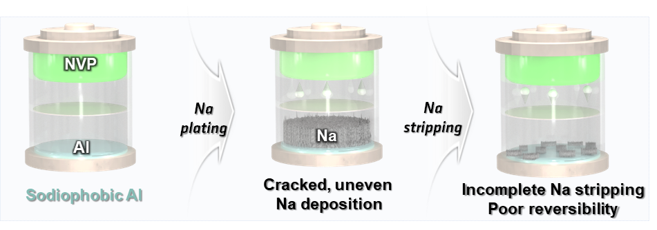

Figure S1. Schematic illustration of an anode-free sodium battery using bare Al as the anode-side current collector. During charging, Na⁺ supplied from the NVP cathode is plated onto the Al surface, forming non-uniform Na deposits. Upon discharge, incomplete stripping of the deposited Na leads to residual Na and poor reversibility.

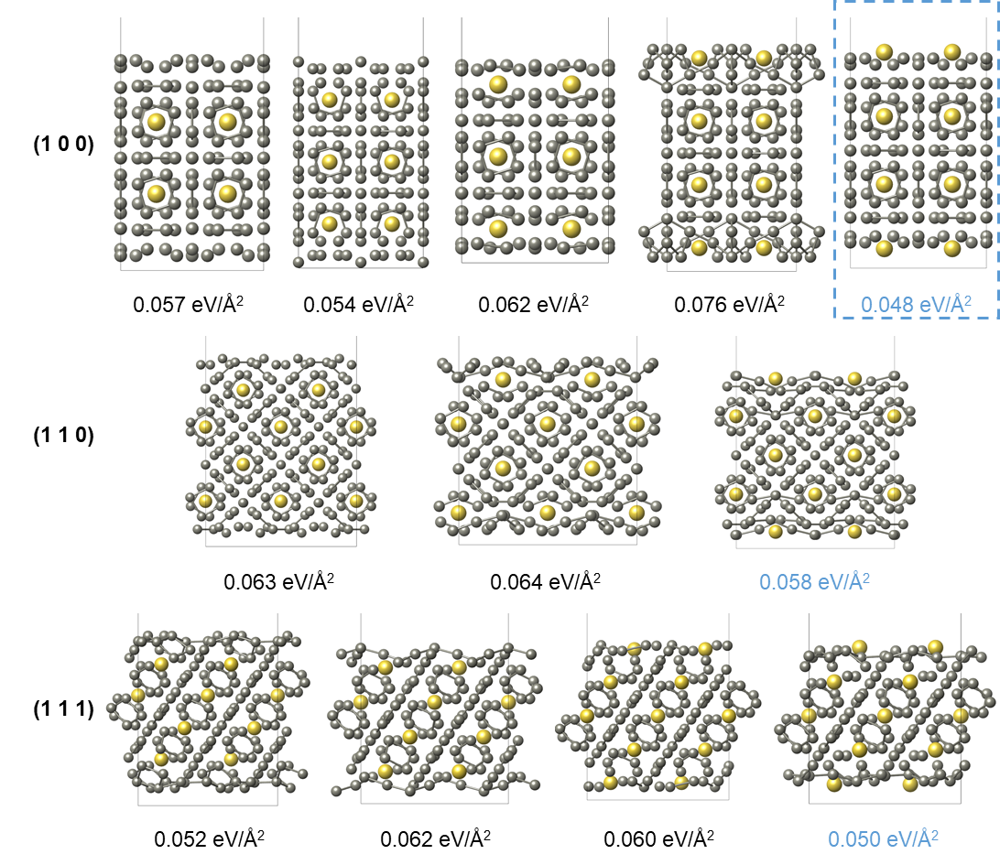

Figure S2. Identification of the most stable surface among various NaZn13 facets under Zn-rich conditions. DFT-optimized surface structures of NaZn13 for the (100), (110), and (111) facets with different outermost layer terminations, together with their corresponding surface energies (eV Å−2). The lowest-energy configurations (highlighted for the (100), (110), and (111) planes) are used as the representative surfaces for subsequent Na adsorption calculations.

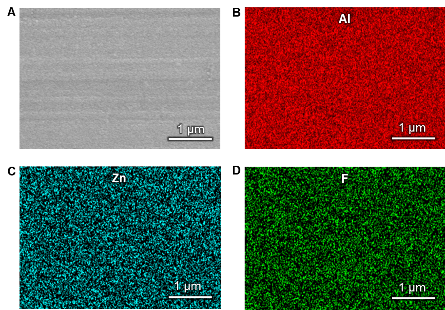

Figure S3. Surface morphology and elemental distribution of the ALD-ZnF2 coating on Al. A) SEM image of the ZnF2/Al surface. B–D) Corresponding EDX elemental maps of Al, Zn, and F, respectively.

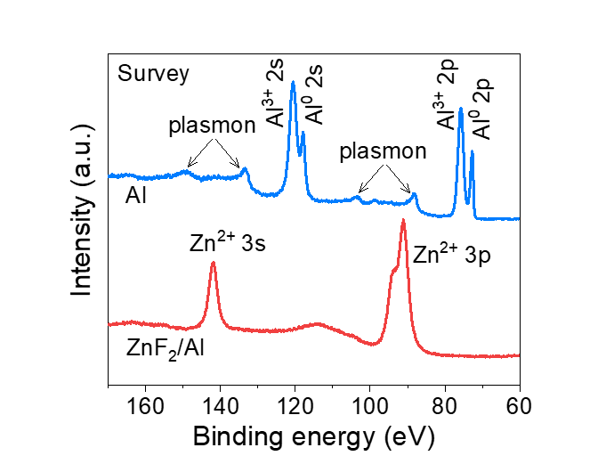

Figure S4. Photoelectron survey spectra of bare Al and ZnF2/Al. The bare Al sample shows prominent Al 2s and Al 2p peaks of oxidic and metallic species, and additionally plasmon peaks from the metallic Al, whereas the ZnF2/Al sample exhibits Zn 3s and Zn 3p signals and no detectable Al peaks.

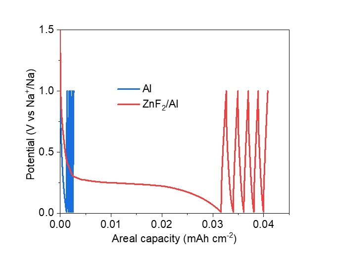

Figure S5. Potential profiles of the cells in the initial sodiation process. The cells were first discharged to 0.01 V and then cycled five times between 0.01 and 1.0 V to form and stabilize the SEI.

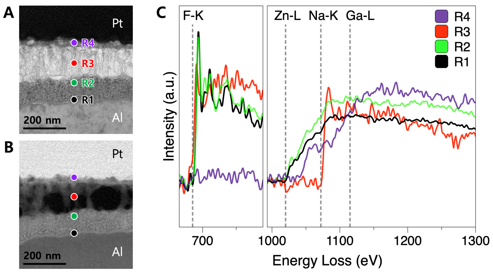

Figure S6. Cross-sectional STEM/TEM images and representative EELS spectra of the sodiated ZnF₂/Al interphase. A) ADF-STEM image acquired during EELS spectrum imaging, with labeled extraction points (R1–R4). B) BF-TEM image of the same region, showing complementary contrast to (A). C) EELS spectra from R1–R4 showing the F K-edge (~685 eV), Zn L3-edge (~1020 eV), Na K-edge (~1072 eV), and Ga L3-edge (~1115 eV). Dashed lines indicate the respective onset energies. The relative edge intensities indicate a layered elemental distribution from the Al substrate outward: (R1) a partially reacted ZnF2-rich region, (R2) a conversion zone containing NaF, Zn, and residual ZnF2, (R3) a NaF-rich layer where Zn is no longer detected, and (R4) a Na-rich surface layer. The Ga signal observed near the surface (R4) originates from Ga+ implantation during cryo-FIB specimen preparation and is not intrinsic to the sample.

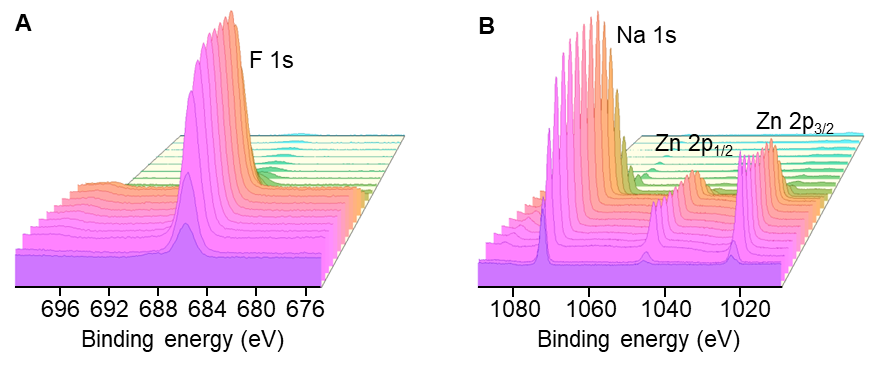

Figure S7. Photoelectron depth profiling of sodiated ZnF2/Al. A) F 1s spectra. B) Na 1s and Zn 2p spectra.

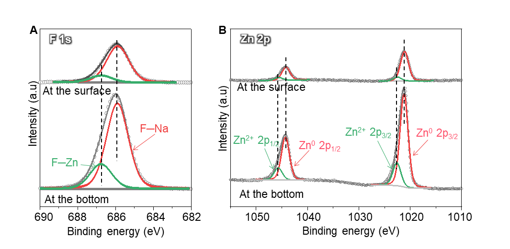

Figure S8. High-resolution photoelectron spectra of sodiated ZnF2/Al obtained at the surface and bottom of the NaF/Na–Zn layer. A) Fitted F 1s spectra. B) Fitted Zn 2p spectra.

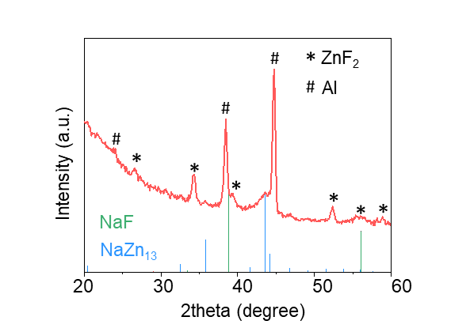

Figure S9. XRD pattern of the sodiated ZnF2/Al with 2500 ALD cycles. To improve the detectability of the Na–Zn alloy phase, a thicker ZnF2 coating was deposited on Al by increasing the ALD cycle number to 2500 cycles (corresponding to ~220 nm). The resulting ZnF2/Al-2500 electrode subsequently underwent the sodiation process under the same conditions used for the 625-cycle sample.

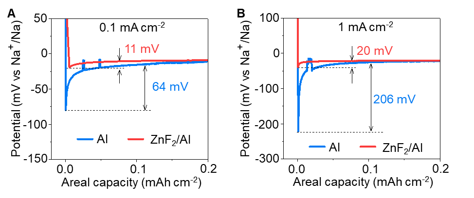

Figure S10. Overpotential of Na nucleation on bare Al and ZnF2/Al. A) At a current density of 0.1 mA cm−2. B) At a current density of 1.0 mA cm−2.

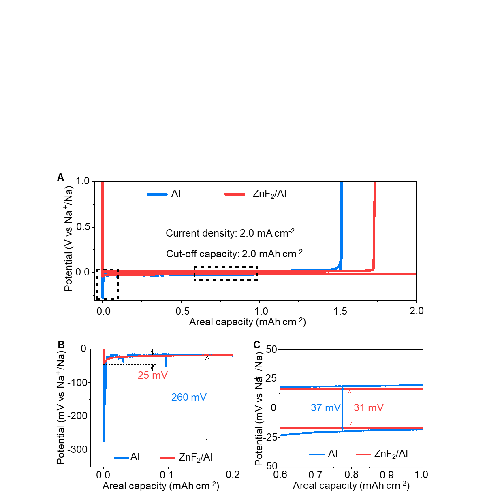

Figure S11. Na plating/stripping behavior on bare Al and ZnF2/Al at high current density. A) Voltage profiles of Na plating and stripping on bare Al and ZnF2/Al at 2.0 mA cm−2 with a cut-off capacity of 2.0 mAh cm−2. B) Enlarged views of the initial nucleation region and the subsequent stripping plateau. C) Enlarged voltage–capacity profiles in the boxed region of (A), comparing the steady-state plating/stripping hysteresis of Na on bare Al and ZnF2/Al at 2.0 mA cm−2.

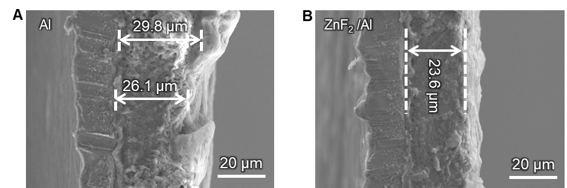

Figure S12. Cross-sectional SEM analysis of Na layer thickness on different current collectors. A) Na deposited on bare Al to 2.0 mAh cm−2, showing a thick and highly non-uniform Na layer with local thicknesses of ~26 – 30 µm. B) Na deposited on ZnF2/Al at the same areal capacity.

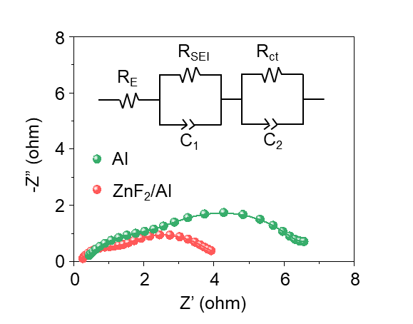

Figure S13. Nyquist plots of Na||Al and Na||ZnF2/Al cells measured at a deposited Na capacity of 2 mAh cm−2. The insets show the corresponding equivalent circuit models used for fitting. The calculated RSEI and Rct values for the reference Na||Al cell are 1.7 Ω and 3.8 Ω, respectively. In sharp contrast, the Na||ZnF2/Al cell delivers significantly lower resistance values of 0.9 Ω (RSEI) and 2.7 Ω (Rct), demonstrating markedly enhanced interfacial kinetics.

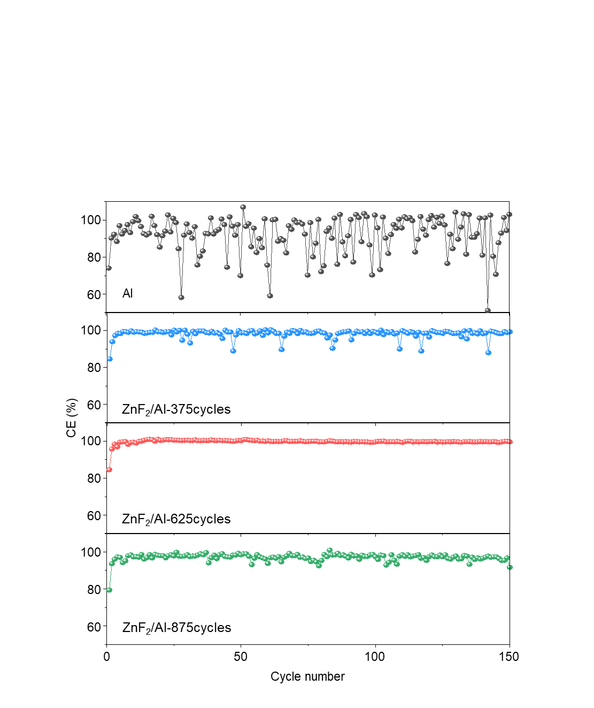

Figure S14. Coulombic efficiency of Na plating/stripping on ZnF2/Al prepared by various ALD cycles. The thicknesses of ZnF2 after 375, 625, and 875 cycles were roughly measured to be 33, 55, and 77 nm, respectively.
Supplementary note:
We systematically investigated the effect of ZnF2 coating thickness on Na plating/stripping behavior by varying the ALD cycle number. ZnF2 layers were deposited on the Al current collector using 375, 625, and 875 ALD cycles, corresponding to thicknesses of approximately ~33, ~55, and ~77 nm, respectively. The growth rate of ZnF2 on the Al collector was measured to be around ~0.88 Å/cycle. The electrochemical performance evaluation results revealed that the sample prepared with 625 ALD cycles exhibited the highest and most stable Coulombic efficiency during repeated Na plating/stripping (Figure S14).
The superior performance of the ~55 nm ZnF2 layer appeared to be due to an optimal balance between interphase stability and Na+ transport kinetics. For the thinner coating deposited by 375 cycles (~33 nm), the amount of ZnF2 appeared insufficient to form a completely continuous and functionally superior NaF-rich interphase after sodiation. Consequently, less effective regulation of the Na⁺ flux and homogenization of Na nucleation were observed, leading to localized Na deposition and poor cycle stability.
In contrast, the thicker coating deposited by 875 cycles (~77 nm) formed a substantially thick interphase composed of NaF and Na–Zn alloy phases. Although this thicker interphase could provide stronger passivation, the excessive NaF accumulation and the increased ion transport distance probably hindered coupled Na+ transfer, which appears to have increased interfacial polarization and slowed the Na plating/stripping reaction rate. Furthermore, as the conversion layer thickened and absolute volume expansion increased, it appeared that higher internal stresses were likely to develop during repeated cycling.
Therefore, it was confirmed that the ZnF2 coating (approximately 55 nm) deposited over 625 ALD cycles provides the optimal interfacial structure. Specifically, this coating was found to be thick enough to form a continuous and robust NaF-rich interfacial layer capable of homogenizing the Na+ flow and suppressing unstable Na growth, yet thin enough to maintain rapid ion/electron transport and low interfacial resistance. For this reason, this balanced combination appears to have led to the most stable and reversible Na plating/stripping behavior, as evidenced by the highest average Coulombic efficiency among the samples investigated.

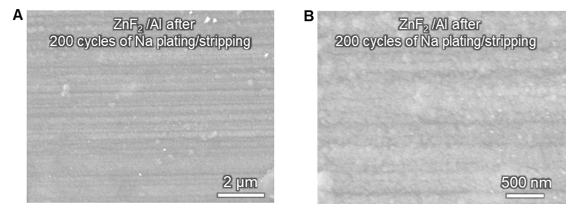

Figure S15. SEM images demonstrating the structural integrity of the ZnF2/Al current collector after extended cycling. A) At low magnification. B) At high magnification. The morphologies were recorded after 200 cycles of rigorous Na plating/stripping at a current density of 2.0 mA cm–2.

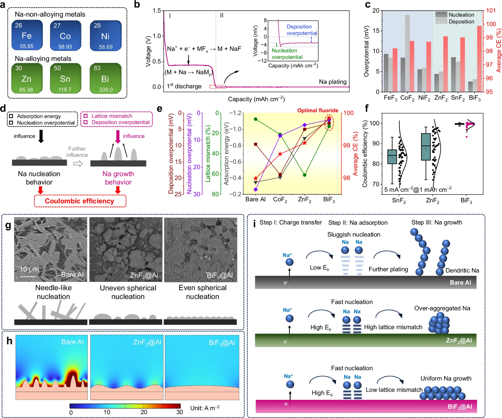

Figure S16. Representative SEM images demonstrating the nonuniform Na deposition behavior on a blade-coated ZnF2/Al current collector. The images illustrate the morphology of Na deposited via conventional coating methods for comparative analysis. Reproduced with permission [S4]. Copyright 2023, Springer Nature.

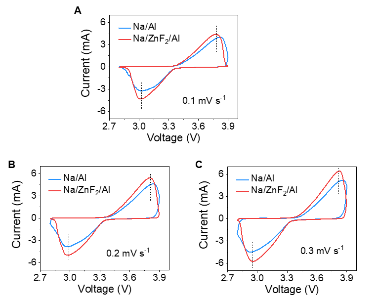

Figure S17. CV curves of the Na/Al║NVP and Na/ZnF2/Al║NVP lean-Na cells. Comparison of CV curves under scan rates of (A) 0.1, (B) 0.2, and (C) 0.3 mV s−1.

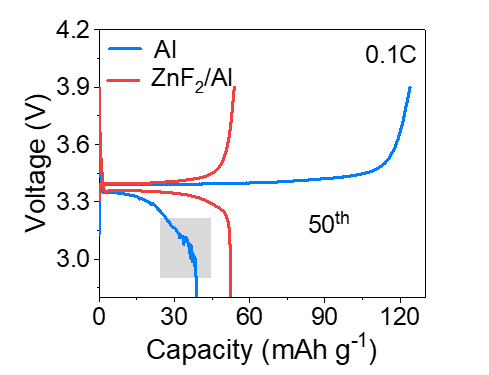

Figure S18. Charge–discharge profiles of AFSB cells with the NVP cathode at 0.1C at the 50th cycle. The grey region highlights irregular voltage fluctuations of the Al║NVP cell.

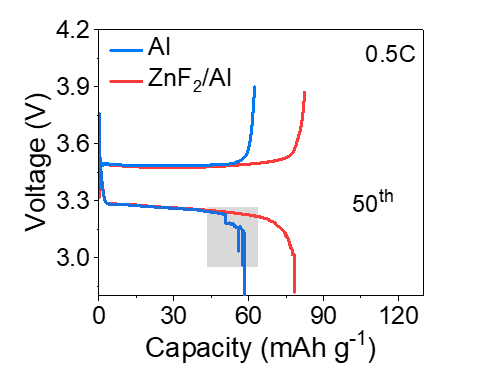

Figure S19. Charge–discharge profiles of AFSB cells with the NVP cathode at 0.5C at the 50th cycle. The grey region highlights irregular voltage fluctuations of the Al║NVP cell.

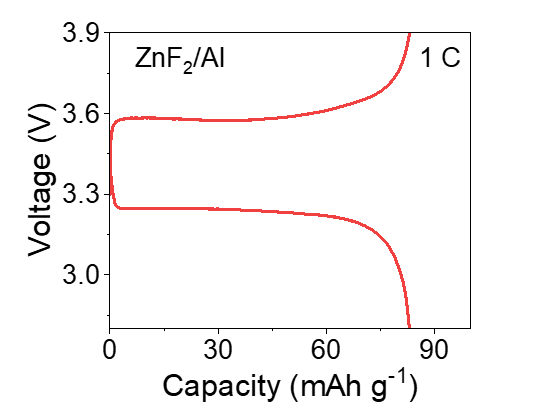

Figure S20. Representative charge–discharge voltage profile of ZnF2/Al║NVP cells under 1C.

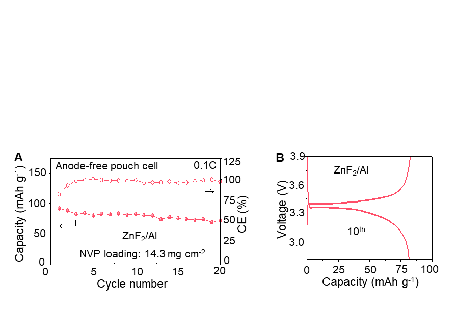

Figure S21. Full-cell performance of ZnF2/Al current collectors in the pouch cell. A) Cycling performance. B) Charge–discharge voltage profile at the 10th cycle.

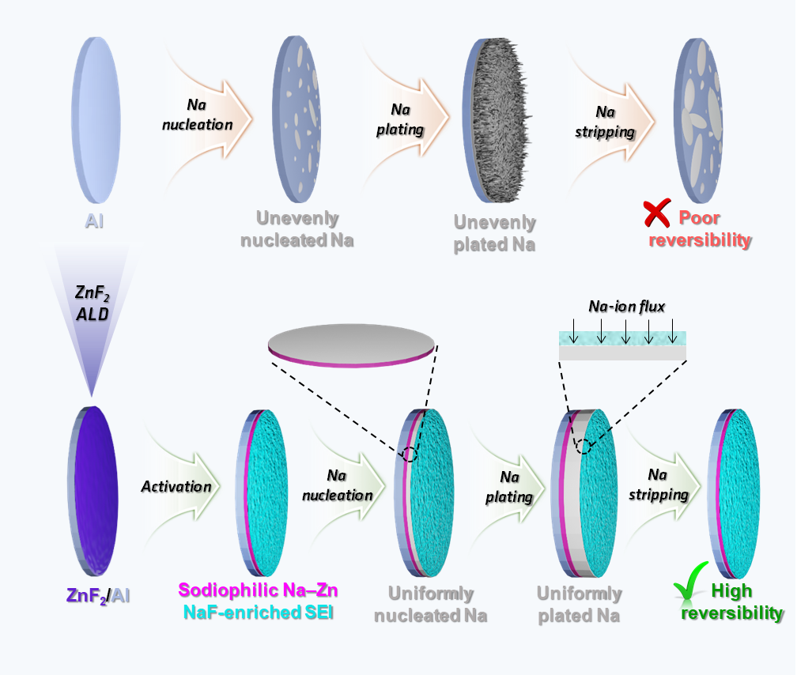

Figure S22. Schematic illustration of the mechanism underlying the enhanced reversibility of Na plating/stripping on the ZnF2/Al CC.
3. Supporting Table
Table 1: XPS binding energies of the Zn, F, and Na elements

| No. | Element | Binding energy (eV) | Ref. |
| --- | --- | --- | --- |
| 1 | Zn2+ 2p3/2 | 1022.5 | S5 |
| 2 | Zn2+ 2p1/2 | 1045.6 | S5 |
| 3 | Zn0 2p3/2 | 1021.2 | S6 |
| 4 | Zn0 2p1/2 | 1044.3 | S6 |
| 5 | F–Zn | 685.2 | S7 |
| 6 | F–Na | 684.1 | S8 |
| 7 | Na+ 1s | 1072.2 | S9 |
| 8 | Na0 1s | 1071.5 | S10 |

Table 2: Comparison of the cycling performance of anode-free full cells with previously reported studies

| No. | Anode | Cathode | Cathode mass loading (mg cm–2) | Current density | Cycling number | Capacity retention (%) | Ref. |
| --- | --- | --- | --- | --- | --- | --- | --- |
| 1 | F-A-Al | NVP | 11.3 | 0.3 C | 50 | 46.1 | S11 |
| 2 | Cu@Au | FeS2 | 2 | 1.0 A g–1 | 50 | 55 | S12 |
| 3 | AuPC | NVP | 3.5 | 3.0 mA cm–2 | 100 | 31 | S13 |
| 4 | Al-Cu | NVP/C | 3.5–4.0 | 1.0 C | 50 | 72 | S14 |
| 5 | FCTD | NVP | 7.4 | 2.0 | 100 | 74.7 | S15 |
| 6 | Sn/Al | NVP | 18.32 | 1.0 C | 88 | ~32 | S16 |
| 7 | Cu | NVP | 4.0 | 0.5 mA cm–2 | 100 | ~55 | S17 |
| 8 | ZnF2/Al | NVP | 12.2 | 0.1 C | 60 | 55 | This work |
| 8 | ZnF2/Al | NVP | 14.3 | 1.0 C | 100 | 62 | This work |

4. References
(S1)	Byeon, Y. W.; Ahn, J. P.; Lee, J. C. Diffusion Along Dislocations Mitigates Self-Limiting Na Diffusion in Crystalline Sn. Small 2020, 16, 2004868.
(S2)	Secchiaroli, M.; Giuli, G.; Fuchs, B.; Marassi, R.; Wohlfahrt-Mehrens, M.; Dsoke, S. High Rate Capability Li3V2-xNix(PO4)3/C (x = 0, 0.05, and 0.1) Cathodes for Li-Ion Asymmetric Supercapacitors. J. Mater. Chem. A 2015, 3, 11807–11816.
(S3)	Kresse, G.; Hafner, J. Ab Initio Molecular Dynamics for Liquid Metals. Phys. Rev. B 1993, 47, 558–561.
(S4) 	Wang, M.; Yang, J.; Ji, H.; Li, Z.; Wang, F.; Fang, F.; Ruan, J.; Sun, D.; Wang, F. Fluorinated Sodiophilic Interphase for High-Rate and Low-Temperature Initially Anode-Free Sodium Battery. Nat. Commun.  2026, 17, 264.
(S5) 	Perdew, J. P.; Burke, K.; Ernzerhof, M. Generalized Gradient Approximation Made Simple. Phys. Rev. Lett. 1996, 77, 3865–3868.
(S6) 	Henderson, J. D.; Buchanan, S. D. C.; Grey, L. H.; Biesinger, M. C. Zinc and Cadmium: XPS Chemical State Determination and Auger Peak Curve-Fitting Procedures. Appl. Surf. Sci. 2026, 730, 166284.
(S7) 	Azaceta, E.; Marcilla, R.; Mecerreyes, D.; Ungureanu, M.; Dev, A.; Voss, T.; Fantini, S.; Grande, H. J.; Cabañero, G.; Tena-Zaera, R. Electrochemical Reduction of O2 in 1-Butyl-1-Methylpyrrolidinium Bis(Trifluoromethanesulfonyl)Imide Ionic Liquid Containing Zn2+ Cations: Deposition of Non-Polar Oriented ZnO Nanocrystalline Films. Phys. Chem. Chem. Phys. 2011, 13, 13433–13440.
(S8) 	Morgan, W. E.; Wazer, J. R. Van; Stec, W. J. Inner-Orbital Photoelectron Spectroscopy of the Alkali. J. Am. Chem. Soc. 1972, 25, 751–755.
(S9) 	Kowalczyk, S. P.; Ley, L.; McFeely, F. R.; Pollak, R. A.; Shirley, D. A. X-Ray Photoemission from Sodium and Lithium. Phys. Rev. B 1973, 8, 3583–3585.
(S10) 	Sodium. HarwellXPS Guru.  https://www.harwellxps.guru/xpskb/sodium/#1755794317174-e9df6303-1cf1
(S11) 	Wu, S.; Hwang, J.; Matsumoto, K.; Hagiwara, R. The Rational Design of Low‐Barrier Fluorinated Aluminum Substrates for Anode-Free Sodium Metal Battery. Adv. Energy Mater. 2023, 13, 2302468.
(12) 	Tang, S.; Qiu, Z.; Wang, X. Y.; Gu, Y.; Zhang, X. G.; Wang, W. W.; Yan, J. W.; Zheng, M. Sen; Dong, Q. F.; Mao, B. W. A Room-Temperature Sodium Metal Anode Enabled by a Sodiophilic Layer. Nano Energy 2018, 48, 101–106.
(13) 	Kim, S.; Ryoo, G.; Lee, J. H.; Kim, J.; Park, J. H.; Cho, K. Horizontal Sodium Growth via the Sodiophilicity-Driven Structural Design of Current Collectors for Anode-Free Sodium Metal Batteries. ACS Nano 2025, 19, 25455–25465.
(14) 	Li, H.; Zhang, H.; Wu, F.; Zarrabeitia, M.; Geiger, D.; Kaiser, U.; Varzi, A.; Passerini, S. Sodiophilic Current Collectors Based on MOF-Derived Nanocomposites for Anode-Less Na-Metal Batteries. Adv. Energy Mater. 2022, 12, 2202293.
(15) 	Zhuang, R.; Zhang, X.; Qu, C.; Xu, X.; Yang, J.; Ye, Q.; Liu, Z.; Kaskel, S.; Xu, F.; Wang, H. Fluorinated Porous Frameworks Enable Robust Anodeless Sodium Metal Batteries. Sci. Adv. 2023, 9, eadh8060.
(16) 	Ma, P.; Zhang, Y.; Li, W.; Luo, J.; Wen, L.; Tang, G.; Gai, J.; Wang, Q.; Zhao, L.; Ge, J.; Chen, W. Tailoring Alloy-Reaction-Induced Semi-Coherent Interface to Guide Sodium Nucleation and Growth for Long-Term Anode-Less Sodium-Metal Batteries. Sci. China Mater. 2024, 67, 3648–3657.
(17) 	Panchal, R. A.; Datta, J.; Varude, V.; Bhimani, K.; Mahajani, V.; Kamble, M.; Anjan, A.; Manoj, R. M.; Zha, R. H.; Datta, D.; Koratkar, N. Nano-Silica Electrolyte Additive Enables Dendrite Suppression in an Anode-Free Sodium Metal Battery. Nano Energy 2024, 129, 110010.