

**Methane-Derived Graphitic–Defect Hybrid Carbon for Solar Vapor Generation**

Uyen Nhat Trieu Nguyena,b, Dao Thi Dung a,b, Ali Zulfiqara,b, Moonwon Leec,d, Kanghoon Yimc, Dae Hoon Leea, and Seung-Mo Leea,b,\*

> a Korea Institute of Machinery and Materials (KIMM), 156 Gajeongbuk-ro, Yuseong-gu, Daejeon 34103, South Korea
>
> b University of Science and Technology (UST), 217 Gajeong-ro, Yuseong-gu, Daejeon 34113, South Korea
>
> c Korea Institute of Energy Research, 152 Gajeong-ro, Yuseong-gu, Daejeon 34129, South Korea
>
> d Graduate School of Energy Science and Technology (GEST), Chungnam National University, 99 Daehak-ro, Yuseong-gu, Daejeon 34134, Republic of Korea
>
> \* Corresponding author: Seung-Mo Lee (<sm.lee@kimm.re.kr>)

**\**

**TOC Graphic and Summary**

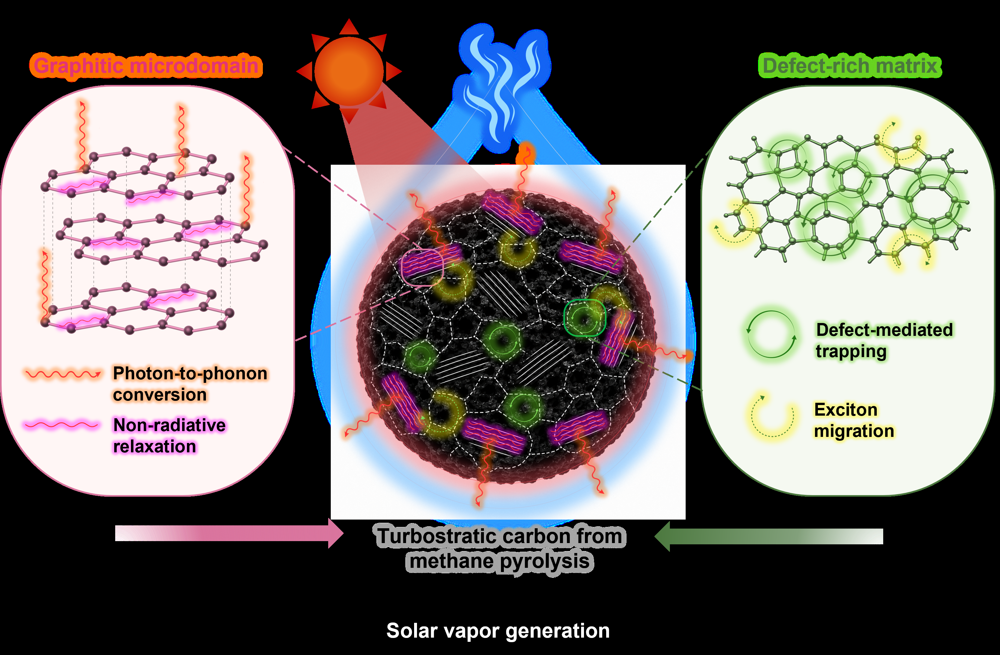

“Intrinsic graphitic–defect hybrid architecture synergistically couples broadband solar absorption with efficient photothermal conversion for high-performance solar vapor generation.”

**\**

**ABSTRACT**

Developing intrinsically efficient photothermal materials with broadband solar absorption and rapid light-to-heat conversion remains a fundamental challenge for high-performance solar vapor generation (SVG). Herein, we demonstrate that methane-pyrolysis-derived solid carbon intrinsically addresses these requirements through a unique turbostratic hybrid architecture. High-resolution structural characterization reveals graphitic microdomains embedded within a defect-rich carbon matrix, forming a short-range ordered carbon framework with complementary photothermal functionalities. The graphitic microdomains facilitate efficient photon-to-phonon conversion through non-radiative relaxation, while the defect-rich matrix introduces localized electronic states that broaden solar light absorption across the ultraviolet–visible–near-infrared region. The synergistic integration of these structural motifs enables near-unity broadband solar absorption and efficient interfacial heat generation without complex nanostructuring or chemical functionalization. When integrated into a hydrophilic melamine foam scaffold, the resulting evaporator exhibits rapid interfacial heating and achieves a high solar vapor generation rate of 2.0 kg m⁻² h⁻¹ under one-sun illumination. This work establishes a direct structure–property–function relationship linking the intrinsic hybrid architecture of methane-derived turbostratic carbon to efficient photothermal conversion and solar vapor generation, providing a scalable strategy for transforming methane pyrolysis by-products into high-value solar-driven water purification materials.

**\**

**1. Introduction**

Function emerges from structural synergy. Efficient solar vapor generation (SVG) has emerged as a promising strategy for sustainable freshwater production by localizing solar energy at the water–air interface rather than heating the entire water body, thereby significantly improving solar-to-vapor conversion efficiency \[1\], \[2\], \[3\]. The performance of SVG systems is therefore fundamentally governed by the intrinsic photothermal properties of the absorber \[2\], \[3\]. An ideal photothermal material should simultaneously exhibit broadband solar absorption, efficient photon-to-thermal energy conversion, and effective interfacial heat localization under solar irradiation \[4\], \[5\], \[6\]. However, simultaneously achieving these characteristics remains challenging because photothermal performance is intrinsically linked to the interplay between carbon microstructure and electronic structure \[6\], \[7\].

Carbon-based materials (e.g., carbon nanotube \[8\], graphene \[9\], graphene oxide \[10\], carbon black \[11\], carbon foam \[12\], carbon cloth \[13\] and carbon sponge \[14\]) have attracted considerable attention as photothermal absorbers owing to their intrinsically broadband solar absorption, excellent chemical stability, structural diversity, low cost, and facile tunability \[15\], \[16\]. Nevertheless, their photothermal performance is highly dependent on the degree of structural ordering \[6\], \[16\]. Highly graphitized carbons possess extended sp²-conjugated networks that favor efficient non-radiative relaxation and photothermal energy conversion \[17\]. Conversely, amorphous carbons contain abundant structural disorder and fragmented sp² domains, resulting in distinct optical and electronic characteristics from highly graphitized counterparts \[18\]. These observations suggest that neither highly crystalline nor fully amorphous carbon represents the optimal photothermal architecture.

Hybrid amorphous/graphitic carbon architectures have recently attracted increasing attention because they combine the complementary advantages of graphitic ordering and structural disorder for energy conversion applications \[19\]. Within such architectures, graphitic microdomains serve as efficient centers for photon-to-phonon conversion through non-radiative relaxation, whereas defect-rich regions introduce localized electronic states that broaden optical transition pathways and enhance broadband solar absorption. Rather than acting independently, these complementary structural motifs synergistically improve light harvesting and heat generation, highlighting graphitic–defect hybrid architectures as an effective structural principle for photothermal materials.

Despite this emerging understanding, most high-performance carbon absorbers reported for SVG are produced through elaborate post-synthetic engineering strategies, including chemical activation, heteroatom doping, template-assisted synthesis, reduction treatments, or hierarchical nanostructuring to manipulate their optical and electronic properties \[20\], \[22\], \[23\], \[23\]. Although these approaches can improve photothermal performance, they often rely on complex processing to artificially construct the desired balance between graphitic ordering and structural disorder. Developing carbon materials that intrinsically possess such a graphitic–defect hybrid architecture without extensive structural engineering remains largely unexplored.

Methane-pyrolysis-derived solid carbon offers a unique opportunity to address this challenge \[24\]. During high-temperature methane decomposition followed by rapid quenching, carbon spontaneously evolves into a turbostratic structure consisting of short-range graphitic microdomains embedded within a defect-rich carbon matrix. Unlike conventional carbon black or highly amorphous soot, this intrinsically formed graphitic–defect hybrid architecture simultaneously preserves local graphitic ordering and abundant structural disorder, thereby providing complementary functionalities for efficient photothermal conversion. However, the relationship between this unique carbon microstructure and its photothermal behavior for SVG has not yet been systematically established.

Herein, we demonstrate that methane-pyrolysis-derived turbostratic carbon intrinsically functions as an efficient photothermal material through its graphitic–defect hybrid architecture. By correlating structural characteristics with optical absorption, photothermal conversion, and solar vapor generation, we establish a direct structure–property–function relationship governing photothermal performance. The resulting evaporator achieves a solar vapor generation rate of 2.0 kg m⁻² h⁻¹ under one-sun illumination without complex post-synthetic modification, providing a scalable strategy for converting methane pyrolysis by-products into high-value solar-driven water purification materials.

**\**

**2. Experimental**

**2.1. Synthesis of methane-derived turbostratic carbon**

Methane-derived turbostratic carbon (TC) was synthesized by a custom-built rotating gliding arc (RGA) plasma reactor operated under atmospheric pressure (Figure S1). The reactor consisted of a conical high-voltage copper electrode (height: 50 mm) and a coaxial cylindrical stainless-steel ground electrode (inner diameter: 40 mm) separated by a 1 mm discharge gap. The plasma discharge was generated thank to an alternating-current (AC) power supply (maximum power: 10 kW, operating frequency: 20 kHz) with a discharge power of 1.8 kW. A CH₄/H₂ gas mixture (volume ratio = 3:1) was introduced tangentially into the reactor at a total flow rate of 20 L min⁻¹ to generate a swirling flow that stabilized the plasma discharge. The high-voltage electrode was continuously cooled using a closed-loop water circulation system (flow rate: 2 L min⁻¹; inlet temperature: 20 °C). The solid carbon product was continuously collected downstream using a stainless-steel mesh filter (50 μm). Detailed operating conditions and electrical discharge characteristics are summarized in Table S1.

**2.2. Fabrication of the TC-coated melamine foam (TC/MF)**

The TC-coated melamine foam (TC/MF) was fabricated by depositing methane-derived turbostratic carbon onto commercial melamine foam (MF, Supplier, Country). XX mg of turbostratic carbon was dispersed in XX mL of deionized water containing XX mg of poly(vinyl alcohol) (PVA, Mw = XX, XX% hydrolyzed, Supplier, Country) as a binder under magnetic stirring for XX min to obtain a homogeneous suspension. The MF substrate (10 × 10 × 10 mm³) was immersed in the suspension for XX min, followed by gentle compression to remove excess slurry and ensure uniform coating throughout the porous framework. The coated foam was subsequently dried at 60 °C for 12 h to obtain the final photothermal evaporator, denoted as TC/MF.

**2.3. Solar vapor generation measurements**

The solar vapor generation performance was evaluated under simulated one-sun illumination (1000 W m⁻²) using a solar simulator (K201 LAB 55 equipped with a K401 CW150 Lamp Controller, McScience). The illumination area was controlled using an aperture slightly larger than the evaporator to ensure uniform irradiation. The incident solar intensity was calibrated using a data-logging solar power meter (TES-132, TES). The surface temperature of the evaporator was monitored using an infrared thermal imaging camera (A325sc, FLIR), while the bulk water temperature was recorded using a data-logging thermometer (Center309, CENTER). The mass change during water evaporation was continuously measured using an analytical balance with a resolution of 0.1 mg (ADB 200-4, KERN), which was connected to a personal computer for real-time data acquisition using 232key® software. Unless otherwise specified, all experiments were conducted at an ambient temperature of approximately 25 °C and a relative humidity of approximately 60%.

The net evaporation rate m0 was calculated by subtracting the evaporation rate measured in the dark from that obtained under one-sun illumination (Equation 1).

$$m_{0} = \ m_{1\ sun} - \ m_{dark} \tag{1}$$

The solar-to-vapor conversion efficiency (η) was calculated according to Equation 2.

$$\eta = \ \frac{m_{0}(h_{v} + Q)}{P_{in}} \tag{2}$$

where ​m0 is the net evaporation rate, hv is the latent heat of vaporization of water, Q is the sensible heat required to raise the water temperature, and Pin is the incident solar energy density (3600 kJ m⁻² h⁻¹ under one-sun illumination). Since the temperature rise during evaporation was negligible, Q was assumed to be zero. The latent heat of vaporization was calculated by Equation 3.

$$h_{v} = 1.91846 \times 10^{6}(\frac{T}{T - 33.91}\ )^{2} \tag{3}$$

where T is the absolute temperature (K). At 293 K, hv was calculated to be 2.49 kJ g⁻¹.

**2.4. Solar desalination**

Artificial seawater was prepared by dissolving 25 g of natural Korean sea salt (Chungjungone, Korea) in 1 L of deionized water. Solar desalination experiments were performed in a closed transparent polycarbonate (PC) chamber to collect the condensed water generated during solar vapor evaporation. The concentrations of the major salt ions (Na⁺, K⁺, Mg²⁺, and Ca²⁺) in the feed solution and condensed water were quantified by inductively coupled plasma atomic emission spectroscopy (ICP-AES, Model, Company).

**2.5. Materials characterization**

The morphology and microstructure of the samples were characterized using field-emission scanning electron microscopy (FE-SEM; JSM-700F, JEOL) equipped with an energy-dispersive X-ray spectroscopy (EDS; Aztec® X-Max, Oxford Instruments), and high-resolution transmission electron microscopy (HR-TEM; JEM-2100, JEOL, operated at 200 kV) combined with selected-area electron diffraction (SAED). The crystal structure was analyzed using X-ray diffraction (XRD; Empyrean, PANalytical) with Cu Kα radiation (λ = 1.5406 Å). Raman spectra were collected using a Raman microscope (inVia, Renishaw) with a 514 nm excitation laser. The surface chemical composition and bonding states were analyzed by X-ray photoelectron spectroscopy (XPS; K-Alpha+, Thermo Scientific) using an Al Kα X-ray source, and the binding energies were calibrated against the C 1s peak at 284.8 eV. Nitrogen adsorption–desorption isotherms were measured using a BET surface area analyzer (BELSORP-max, BEL Japan Inc.) after degassing under vacuum, and the specific surface area and pore-size distribution were determined using the Brunauer–Emmett–Teller (BET) and Barrett–Joyner–Halenda (BJH) methods, respectively. Optical absorption spectra were measured using a UV–Vis–NIR spectrophotometer (LAMBDA 1050, PerkinElmer) equipped with an integrating sphere. The thermal conductivity of the samples was measured using a thermal constants analyzer (TPS 2500S, Hot Disk).

**2.6. Density functional theory (DFT) calculations**

임박사님, 여기에 DFT관련 내용을 적어 주세요..

**3. Results and discussion**

**3.1. Formation of methane-derived turbostratic carbon**

Figure 1 illustrates the formation of methane-derived graphitic–defect hybrid carbon and its subsequent integration into a photothermal evaporator. During high-temperature methane pyrolysis, methane molecules thermally decompose into hydrogen gas and solid carbon according to Reaction (1). Unlike conventional carbonization processes that rely on solid carbon precursors, methane pyrolysis directly generates carbon from gaseous carbon species, enabling continuous carbon nucleation and growth under high-temperature conditions \[25\]. The subsequent rapid quenching kinetically suppresses complete graphitization while preserving structural disorder, resulting in a turbostratic carbon framework \[26\]. The competition between graphitic crystallization and defect retention during rapid quenching intrinsically gives rise to a graphitic–defect hybrid architecture, in which graphitic microdomains are embedded within a defect-rich carbon matrix (Figure 1a). This unique architecture is formed directly during methane pyrolysis without the need for chemical activation, heteroatom doping, template-assisted synthesis, or other post-synthetic structural engineering strategies.

CH₄ → C + 2H₂ (Reaction 1)

The unique graphitic–defect hybrid architecture formed during methane pyrolysis is hypothesized to intrinsically couple broadband solar absorption with efficient photothermal conversion, making it particularly attractive for interfacial solar vapor generation. To validate this hypothesis, the methane-derived carbon was integrated onto a hydrophilic three-dimensional melamine foam (MF) via a simple dip-coating process using poly(vinyl alcohol) (PVA) as a binder (Figure 1b). The highly porous MF serves as a water-transport scaffold that continuously supplies water to the evaporation interface while suppressing heat dissipation into the bulk water, thereby enabling direct evaluation of the intrinsic photothermal characteristics of the methane-derived carbon \[27\].

**3.2. Revealing the intrinsic graphitic–defect hybrid architecture**

To directly visualize the microstructure of the methane-derived carbon, SEM, HRTEM, and HAADF-STEM analyses were systematically performed, as shown in Figure 2a–c. The SEM images (Figure 2a) reveal that the carbon consists of interconnected spherical nanoparticles forming a three-dimensional porous network with hierarchical surface roughness. Such an interconnected morphology is expected to promote multiple light scattering while providing continuous pathways for water transport and vapor diffusion during solar evaporation \[30\]. Higher-magnification HRTEM observations (Figure 2b) further reveal that the carbon is neither fully graphitized nor completely amorphous. Instead, well-defined graphitic lattice fringes are locally distributed within a surrounding disordered carbon matrix, indicating the coexistence of ordered and disordered carbon domains at the nanoscale. The measured interlayer spacing of approximately 0.34 nm agrees well with the (002) plane of graphitic carbon, confirming the presence of locally graphitized domains \[26\]. Meanwhile, the corresponding fast Fourier transform (FFT) pattern exhibits diffuse diffraction rings rather than discrete diffraction spots, indicating short-range graphitic ordering with limited long-range crystallinity, which is characteristic of turbostratic carbon \[30\]. Together, these observations provide direct microscopic evidence that methane-derived carbon consists of localized graphitic microdomains embedded within a continuous defect-rich carbon matrix, establishing an intrinsic graphitic–defect hybrid architecture. The HAADF-STEM image together with the corresponding elemental mapping (Figure 2c) further demonstrates a homogeneous distribution of carbon throughout the particles, while oxygen is only sparsely and uniformly distributed over the surface without detectable impurity-rich regions. This observation is consistent with the XPS survey spectrum (Figure 2d), confirming that the detected oxygen mainly originates from slight surface oxidation after exposure to ambient air rather than phase segregation or compositional heterogeneity. High-resolution XPS spectra further reveal that the C 1s peak is dominated by sp² C=C/C–C bonding centered at approximately 284.8 eV, accompanied by only weak oxygen-containing functional groups, while the O 1s spectrum is mainly attributed to carbon–oxygen bonding arising from surface oxidation (Figure S2a, b). The FTIR spectrum (Figure S3) further supports this interpretation by showing only weak C=O and C–O vibrational bands, indicating limited surface oxidation without altering the graphitic carbon framework. These results indicate that the methane-derived carbon largely preserves its graphitic carbon framework with only limited surface oxygen functionalities, suggesting that the observed structural heterogeneity originates from variations in carbon ordering rather than elemental composition.

The graphitic ordering was further evaluated by X-ray diffraction (Figure S4a, b). A broad diffraction peak centered at 25.8° corresponding to the (002) plane confirms the presence of graphitic stacking with limited long-range crystallinity, while the broad feature around 43–45°, assigned to the (100) and (101) reflections, further supports the turbostratic nature of the carbon framework \[26\]. The broad diffraction features, instead of sharp graphite reflections, indicate that graphitic domains are spatially confined and remain surrounded by structurally disordered carbon. Consistent with the XRD results, the Raman spectrum (Figure 2e) exhibits the characteristic D (~1350 cm⁻¹) and G (~1580 cm⁻¹) bands associated with defect-activated vibrations and the in-plane stretching of graphitic sp² carbon, respectively \[31\]. The measured ID/IG ratio of 0.48 reflects an intermediate degree of graphitic ordering, indicating that the carbon contains sufficiently developed sp² domains while retaining abundant edge defects and structural disorder. Rather than representing either highly crystalline graphite or fully amorphous carbon, the methane-derived carbon therefore occupies an intermediate turbostratic regime in which localized graphitic ordering coexists with a continuous defect-rich matrix \[32\]. The excellent agreement among the HRTEM, XRD, Raman, and XPS analyses consistently confirms the formation of an intrinsic graphitic–defect hybrid architecture, which is expected to simultaneously provide efficient photon-to-phonon conversion and broadband solar absorption. Nitrogen adsorption–desorption measurements (Figure S5) further reveal a type-IV adsorption isotherm with a moderate specific surface area of 40.37 m² g⁻¹ and an average pore diameter of approximately 5 nm, indicating the presence of mesoporous carbon aggregates. Since the specific surface area is relatively modest, the superior photothermal performance demonstrated below cannot be attributed simply to a large surface area, but rather to the unique graphitic–defect hybrid architecture established above. The thermal conductivity of the methane-derived carbon was further evaluated to assess its heat management capability for interfacial solar vapor generation. As shown in Figure 2f, the carbon exhibits a relatively low thermal conductivity of 0.44 W m⁻¹ K⁻¹, indicating limited heat conduction through the carbon framework. Such suppressed thermal transport is attributed to the abundant structural disorder and numerous interfaces between graphitic microdomains and the surrounding defect-rich matrix, which effectively scatter phonons and impede heat propagation \[33\], \[34\]. Together, the graphitic–defect hybrid architecture and intrinsically low thermal conductivity provide the structural basis for efficient photothermal conversion. The optical absorption and photothermal behavior of the methane-derived carbon were subsequently investigated.

**3.3. Construction and interfacial characteristics of the TC/MF evaporator**

Following structural characterization of the methane-derived carbon, its integration into a practical solar vapor generation (SVG) platform was investigated using commercial melamine foam (MF) as the supporting scaffold. Owing to its highly porous three-dimensional framework, low density, and excellent hydrophilicity, MF provides continuous water transport pathways while serving as a lightweight substrate for photothermal materials \[35\]. The methane-derived turbostratic carbon (TC) was uniformly deposited onto the MF skeleton through a simple dip-coating process to obtain the TC/MF evaporator.

The successful integration of TC onto the MF substrate was first confirmed by X-ray diffraction (Figure 3a). The characteristic diffraction peaks of TC centered at approximately 25.8° and 43°, corresponding to the graphitic (002) and (100) planes, remain clearly observable after coating, while the broad diffraction feature originating from the amorphous MF framework is simultaneously retained. The coexistence of diffraction features from both TC and MF indicates that the dip-coating process preserves the intrinsic crystal structures of the two components without generating additional crystalline phases or inducing structural degradation.

The coating morphology was subsequently examined by SEM and HAADF-STEM elemental mapping (Figure 3b, c). As shown in Figure 3b, the interconnected porous skeleton of MF is uniformly covered by a continuous layer of carbon nanoparticles while maintaining its open-cell architecture. Higher-magnification images further reveal conformal deposition of TC over the foam framework without noticeable pore blockage. Elemental mapping (Figure 3c) confirms a homogeneous distribution of carbon throughout the coated skeleton, whereas nitrogen originates from the melamine framework and oxygen remains uniformly dispersed over the surface. The absence of carbon-rich agglomerates or compositional segregation demonstrates that the dip-coating process enables intimate integration of the methane-derived carbon with the porous substrate while preserving the interconnected transport network.

The wettability characteristics before and after coating are presented in Figure 3d. Pristine TC powder exhibits strong hydrophobicity and remains floating on the water surface, whereas pristine MF rapidly absorbs water owing to its intrinsically hydrophilic porous structure. Importantly, after carbon deposition, the resulting TC/MF retains the excellent hydrophilicity of the MF substrate despite being completely covered by the carbon layer. Time-resolved wetting images further demonstrate that water droplets completely infiltrate the TC/MF surface within approximately 1 s, indicating that the thin carbon coating does not impede water transport through the porous framework. Such a combination of a uniformly distributed photothermal carbon layer and rapid water transport is highly desirable for sustaining continuous water supply during interfacial solar vapor generation while maximizing the utilization of the active photothermal surface.

**3.4. Optical and photothermal properties of TC/MF**

The photothermal response of the TC/MF evaporator was first evaluated under one-sun illumination under both dry-state and wet-state conditions (Figure 4a). In the absence of water, the surface temperature of TC/MF rapidly increased from room temperature to approximately 75 °C within the first minute before reaching a stable equilibrium, whereas pristine MF exhibited only a slight temperature increase to approximately 26 °C. Under continuous water supply (wet state), the equilibrium surface temperature of TC/MF decreased to approximately 35 °C as part of the absorbed solar energy was consumed for water evaporation, while remaining consistently higher than that of pristine MF (~25 °C). The corresponding infrared thermal images clearly visualize the efficient conversion of incident solar energy into localized heat over the TC/MF surface under both operating conditions, demonstrating the excellent photothermal conversion capability imparted by the methane-derived turbostratic carbon.

The optical absorption behavior of the evaporator was subsequently evaluated over the ultraviolet–visible–near infrared (UV–Vis–NIR) region (Figure 4b). Pristine MF exhibits negligible light absorption throughout the measured wavelength range, whereas methane-derived TC displays nearly wavelength-independent absorption exceeding 95% across the entire solar spectrum. After deposition onto the MF scaffold, TC/MF fully retains this broadband absorption characteristic, demonstrating that the conformal carbon coating effectively transforms the originally transparent porous substrate into an efficient solar absorber. Such near-unity solar absorption is consistent with the graphitic–defect hybrid architecture established in Figure 2, while its atomistic origin is further elucidated by the DFT calculations presented in the following section. To further benchmark the optical and photothermal characteristics, the broadband solar absorption and dry-state equilibrium surface temperature of TC/MF were compared with representative carbon-based photothermal materials reported for interfacial solar vapor generation (Table 1). Despite being synthesized directly from methane pyrolysis without chemical activation, heteroatom doping, or hierarchical structural engineering, TC/MF exhibits optical absorption and photothermal heating performance comparable to those of state-of-the-art carbon-based absorbers, highlighting the intrinsic effectiveness of its graphitic–defect hybrid architecture.

To further evaluate the practical photothermal evaporation behavior, the cumulative water mass loss was monitored under one-sun illumination (Figure 4c). The TC/MF evaporator achieves a cumulative water loss of approximately 2.00 kg m⁻² during the irradiation period, demonstrating efficient utilization of the absorbed solar energy for interfacial water evaporation. The nearly linear mass-loss profile indicates stable evaporation throughout the measurement without noticeable performance degradation. Notably, the evaporation behavior of TC/MF is comparable to those reported for representative carbon-based photothermal evaporators (Table 2), despite being fabricated directly from methane-derived turbostratic carbon without chemical activation or heteroatom doping. Although these experimental results clearly demonstrate the excellent optical and photothermal properties of TC/MF, the microscopic origin of the graphitic–defect synergy remains unclear. Therefore, DFT calculations were performed to elucidate the respective roles of graphitic domains and structural defects in governing photothermal conversion and interfacial water interaction.

**3.5.** **DFT calculations**

The central hypothesis of this work is that the methane-derived turbostratic carbon consists of graphitic microdomains embedded within a defect-rich carbon matrix, and that the synergy between these two structural motifs is responsible for the excellent photothermal conversion and solar vapor generation performance.

To support this mechanism, we hope the DFT calculations can address the following questions:

- Electronic structure (DOS/PDOS): Compare pristine graphene and defective graphene (vacancy and/or edge defects) to understand how defects modify the electronic states.

- Water adsorption: Compare the adsorption energy of H₂O on graphitic and defect sites to identify the preferred adsorption locations.

- Charge density difference: Visualize the interaction between water molecules and the carbon surface.

- (Optional, if feasible) Optical properties or dielectric function to support the broadband absorption behavior.

The goal is to provide atomistic evidence that the graphitic–defect hybrid architecture intrinsically enables efficient photothermal conversion and interfacial water interaction, rather than relying on activation or heteroatom doping.

Raman spectroscopy of water in contact with TC was further performed to probe the interfacial water structure (Figure S6). Compared with pure water, the O–H stretching envelope exhibits only subtle spectral variations, including a slight increase in the free-water (FW) contribution accompanied by a corresponding decrease in the intermediate-water (IW) component. The overall spectral profile, however, remains largely unchanged, indicating that the methane-derived turbostratic carbon perturbs only the local hydrogen-bonding environment at the solid–liquid interface without significantly modifying the structure of bulk water. This observation is consistent with the DFT calculations, which predict preferential adsorption of water molecules at localized defect sites rather than extensive restructuring of the hydrogen-bond network.

**3.6. Practical outdoor solar desalination performance**

To demonstrate the practical applicability of the developed evaporator, outdoor solar desalination experiments were conducted using simulated seawater (3.5 wt% NaCl) under natural sunlight (Figure 6). A common challenge encountered in long-term solar desalination is the accumulation of salt crystals on the evaporation surface, which blocks water transport pathways and reduces evaporation efficiency. Owing to the continuous capillary water supply provided by the hydrophilic melamine foam, together with the efficient interfacial evaporation enabled by the graphitic–defect hybrid carbon coating, the TC/MF evaporator exhibited excellent salt-rejection capability.

As shown in Figure 6b, NaCl crystals initially deposited on the evaporator surface gradually dissolved and completely disappeared within 135 min under continuous solar irradiation. The spontaneous dissolution of surface salt indicates that the inward diffusion of dissolved salt driven by continuous water replenishment effectively exceeds the outward salt transport caused by evaporation, thereby preventing long-term salt accumulation and maintaining unobstructed evaporation channels. Such self-regenerating behavior is highly desirable for continuous solar desalination under high-salinity conditions.

The outdoor desalination performance was further evaluated under natural sunlight from 10:30 to 16:30 (Figure 6c). The incident solar intensity gradually increased to approximately 1.0 kW m⁻² around noon before decreasing in the afternoon, while the cumulative water mass continuously increased throughout the entire testing period, demonstrating stable operation under fluctuating outdoor irradiation. Despite variations in solar intensity during the day, the TC/MF evaporator maintained consistent freshwater production, confirming its excellent operational stability under realistic environmental conditions.

The desalination capability was subsequently assessed by measuring the salinity and ionic concentrations of the collected condensate. As shown in Figure 6d, the salinity decreased dramatically after solar desalination to a level well below the drinking-water guideline established by the World Health Organization (WHO). ICP analysis (Figure 6d) further reveals that the concentrations of the major seawater ions, including Na⁺, Mg²⁺, K⁺, and Ca²⁺, were reduced by several orders of magnitude after desalination, and all ion concentrations satisfied the WHO drinking-water standards. These results demonstrate that the methane-derived TC/MF evaporator not only achieves efficient solar vapor generation but also enables effective production of potable water under practical outdoor operating conditions.

**4. Conclusions**

Methane-pyrolysis-derived turbostratic carbon was demonstrated as an intrinsically efficient photothermal material for solar vapor generation through its unique graphitic–defect hybrid architecture, without requiring chemical activation, heteroatom doping, or complex post-synthetic structural engineering. Structural characterization revealed the coexistence of short-range graphitic microdomains and a defect-rich carbon matrix, which together endow the material with broadband solar absorption, low thermal conductivity, efficient photothermal conversion, and effective interfacial heat localization. When integrated into a hydrophilic melamine foam scaffold, the resulting evaporator achieved a high evaporation rate of 2.0 kg m⁻² h⁻¹ under one-sun illumination, together with excellent salt rejection and practical freshwater production under outdoor conditions. More importantly, this work establishes a clear structure–property–function relationship, demonstrating that the synergistic coexistence of graphitic ordering and structural disorder, rather than either feature alone, underpins the outstanding photothermal performance. These findings not only provide mechanistic insight into the design of high-performance carbon photothermal materials but also offer a sustainable strategy for upgrading methane pyrolysis by-products into value-added materials for solar-driven water purification and broader solar energy conversion applications.

**\**

**Conflict of interest**

The authors declare no conflict of interest.

**Acknowledgments**

We would like to acknowledge the financial support from the

**\**

**References**

\[1\] Gao, M., Zhu, L., Peh, C. K., & Ho, G. W. (2019). Solar absorber material and system designs for photothermal water vaporization towards clean water and energy production. *Energy & Environmental Science*, *12*, 841-864.

\[2\] Tao, P., Ni, G., Song, C., Shang, W., Wu, J., Zhu, J., Chen, G., & Deng, T. (2018). Solar-driven interfacial evaporation. *Nature energy*, *3*, 1031-1041.

\[3\] Ghasemi, H., Ni, G., Marconnet, A. M., Loomis, J., Yerci, S., Miljkovic, N., & Chen, G. (2014). Solar steam generation by heat localization. *Nature communications*, *5*(1), 4449.

\[4\] Zhao, F., Guo, Y., Zhou, X., Shi, W., & Yu, G. (2020). Materials for solar-powered water evaporation. *Nature Reviews Materials*, *5*, 388-401.

\[5\] Zhou, L., Li, X., Ni, G. W., Zhu, S., & Zhu, J. (2019). The revival of thermal utilization from the Sun: interfacial solar vapor generation. *National Science Review*, *6*(3), 562-578.

\[6\] Xiao, Y., Guo, H., Li, M., He, J., Xu, X., Liu, S., Wang, L., & James, T. D. (2025). Strategies for enhancing the photothermal conversion efficiency of solar-driven interfacial evaporation. *Coordination Chemistry Reviews*, *527*, 216378.

\[7\] Fan, Y., Tian, Z., Wang, F., He, J., Ye, X., Zhu, Z., Sun, H., Liang, W., & Li, A. (2021). Enhanced solar-to-heat efficiency of photothermal materials containing an additional light-reflection layer for solar-driven interfacial water evaporation. *ACS Applied Energy Materials*, *4*, 2932-2943.

\[8\] Yin, Z., Wang, H., Jian, M., Li, Y., Xia, K., Zhang, M., ... & Zhang, Y. (2017). Extremely black vertically aligned carbon nanotube arrays for solar steam generation. *ACS Applied Materials & Interfaces*, *9*, 28596-28603.

\[9\] Ito, Y., Tanabe, Y., Han, J., Fujita, T., Tanigaki, K., & Chen, M. (2015). Multifunctional Porous Graphene for High-Efficiency Steam Generation by Heat Localization. *Advanced materials (Deerfield Beach, Fla.)*, *27*, 4302-4307.

\[10\] Li, X., Xu, W., Tang, M., Zhou, L., Zhu, B., Zhu, S., & Zhu, J. (2016). Graphene oxide-based efficient and scalable solar desalination under one sun with a confined 2D water path. *Proceedings of the National Academy of Sciences*, *113*, 13953-13958.

\[11\] Xu, W., Hu, X., Zhuang, S., Wang, Y., Li, X., Zhou, L., Zhu, S., & Zhu, J. (2018). Flexible and salt resistant Janus absorbers by electrospinning for stable and efficient solar desalination. *Advanced Energy Materials*, *8*, 1702884.

\[12\] Hu, G., Liu, H., Liu, K., Wang, H., Wen, X., Liu, L., She, Y., Feng, L., Niu, R., & Gong, J. (2025). All‐in‐one carbon foam evaporators for efficient co‐generation of freshwater and electricity. *Advanced Functional Materials*, *35*, 2423781.

\[13\] Lam, D. V, Nguyen, U. N. T., Dung, D. T., Kim, C., Lim, M., Kim, J. H., & Lee, S. M. (2024). Shape-transformable long-lasting superhydrophilic carbon cloth for sustainable solar vapor generation. *Chemical Engineering Journal*, *481*, 148475.

\[14\] Zhu, L., Gao, M., Peh, C. K. N., Wang, X., & Ho, G. W. (2018). Self‐contained monolithic carbon sponges for solar‐driven interfacial water evaporation distillation and electricity generation. *Advanced Energy Materials*, *8*, 1702149.

\[15\] Li, Y., Shi, Y., Wang, H., Liu, T., Zheng, X., Gao, S., & Lu, J. (2023). Recent advances in carbon‐based materials for solar‐driven interfacial photothermal conversion water evaporation: assemblies, structures, applications, and prospective. *Carbon Energy*, *5*, e331.

\[16\] Dao, V. D., & Choi, H. S. (2018). Carbon‐based sunlight absorbers in solar‐driven steam generation devices. *Global Challenges*, *2*, 1700094.

\[17\] Lee, J. U., Aguiar, R., Su, T. Y. T., Kim, K. W., Zhao, J., Kim, J., Ma, Y. W., Kylm, K., Choi, D., Shin, B. S., & Lee, P. C. (2026). Bio-inspired laser micro/nanostructuring of highly graphitic carbon enabling structural coloration and high-performance all-weather solar evaporator. *Chemical Engineering Journal*, 174935.

\[18\] Guan, W., Guo, Y., & Yu, G. (2021). Carbon materials for solar water evaporation and desalination. *Small*, *17*, 2007176.

\[19\] Herold, F., Prosch, S., Oefner, N., Brunnengräber, K., Leubner, O., Hermans, Y., Hofmann, K., Drochner, A.,Qi, W., & Etzold, B. J. (2021). Nanoscale hybrid amorphous/graphitic carbon as key towards next‐generation carbon‐based oxidative dehydrogenation catalysts. *Angewandte Chemie International Edition*, *60*, 5898-5906.

\[20\] Chen, S., Sun, Z., Xiang, W., Shen, C., Wang, Z., Jia, X.,Sun, J., & Liu, C. J. (2020). Plasmonic wooden flower for highly efficient solar vapor generation. *Nano Energy*, *76*, 104998.

\[21\] Zhao, F., Zhou, X., Shi, Y., Qian, X., Alexander, M., Zhao, X.,Mendez, S., Yang, R., Qu, L., & Yu, G. (2018). Highly efficient solar vapour generation via hierarchically nanostructured gels. *Nature nanotechnology*, *13*, 489-495.

\[22\] Fang, Q., Li, T., Lin, H., Jiang, R., & Liu, F. (2019). Highly efficient solar steam generation from activated carbon fiber cloth with matching water supply and durable fouling resistance. *ACS Applied Energy Materials*, *2*, 4354-4361.

\[23\] Liu, F., Zhao, B., Wu, W., Yang, H., Ning, Y., Lai, Y., & Bradley, R. (2018). Low cost, robust, environmentally friendly geopolymer–mesoporous carbon composites for efficient solar powered steam generation. *Advanced Functional Materials*, *28*, 1803266.

\[24\] Ali, Z., Song, H., Nguyen, U. N. T., Shim, H. C., Lee, S. M., Majeed, M., & Lee, D. H. (2025). Hydrogen and solid carbon production via methane pyrolysis in a rotating gliding arc plasma reactor. *ChemSusChem*, *18*, e202401602.

\[25\] Moghaddam, A. L., Hejazi, S., Fattahi, M., Kibria, M. G., Thomson, M. J., AlEisa, R., & Khan, M. A. (2025). Methane pyrolysis for hydrogen production: navigating the path to a net zero future. *Energy & Environmental Science*, *18*, 2747-2790.

\[26\] Harris, P. J. (2005). New perspectives on the structure of graphitic carbons. *Critical reviews in solid state and materials sciences*, *30*, 235-253.

\[27\] Chang, C., Liu, M., Li, L., Chen, G., Pei, L., Wang, Z., & Ji, Y. (2022). Salt-rejecting rGO-coated melamine foams for high-efficiency solar desalination. *Journal of Materials Research*, *37*, 294-303.

\[28\] Zhu, L., Gao, M., Peh, C. K. N., & Ho, G. W. (2018). Solar-driven photothermal nanostructured materials designs and prerequisites for evaporation and catalysis applications. *Materials Horizons*, *5*, 323-343.

\[29\] Oberlin, A. G. N. E. S. (1984). Carbonization and graphitization. *Carbon*, *22*, 521-541.

\[30\] Ferrari, A. C., & Robertson, J. (2000). Interpretation of Raman spectra of disordered and amorphous carbon. *Physical review B*, *61*, 14095.

\[31\] Balandin, A. A. (2011). Thermal properties of graphene and nanostructured carbon materials. *Nature materials*, *10*, 569-581.

\[32\] Ferrari, A. C., & Robertson, J. (2004). Raman spectroscopy of amorphous, nanostructured, diamond–like carbon, and nanodiamond. *Philosophical Transactions of the Royal Society of London. Series A: Mathematical, Physical and Engineering Sciences*, *362*, 2477-2512.

\[33\] Pop, E., Varshney, V., & Roy, A. K. (2012). Thermal properties of graphene: Fundamentals and applications. *MRS bulletin*, *37*, 1273-1281.

\[35\] Zhu, L., Gao, M., Peh, C. K. N., & Ho, G. W. (2018). Solar-driven photothermal nanostructured materials designs and prerequisites for evaporation and catalysis applications. *Materials Horizons*, *5*, 323-343.

**Figures**

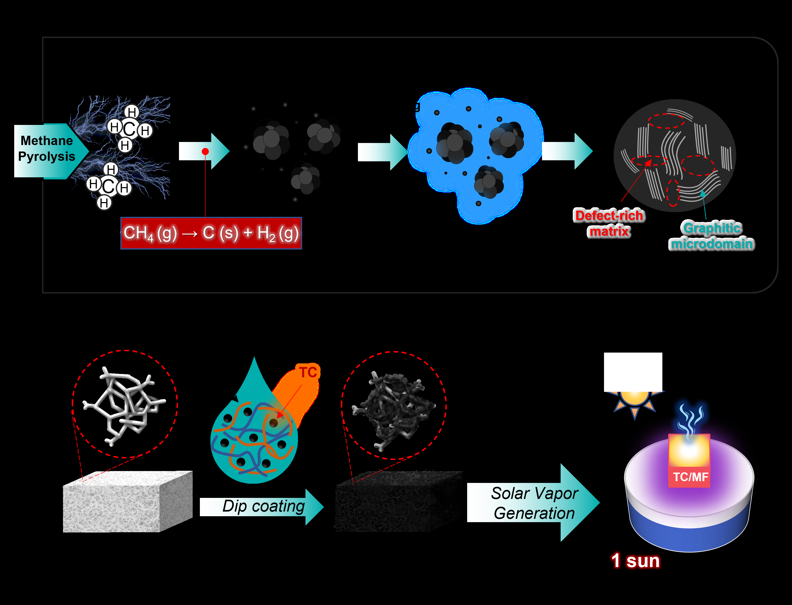

**Figure 1. a)** Formation and intrinsic graphitic–defect hybrid architecture of methane-pyrolysis-derived turbostratic carbon; **b)** Fabrication of turbostratic carbon-coated melamine foam for solar vapor generation.

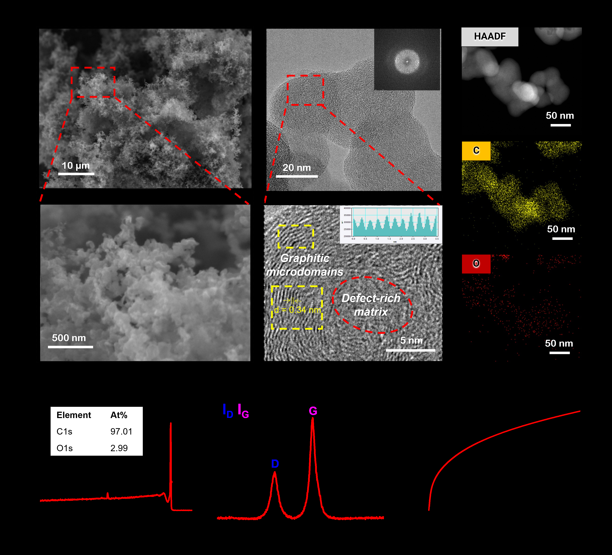

**Figure 2.** Morphology and structural characterization of turbostratic carbon. **a)** SEM images of aggregated solid carbon morphology; **b)** HRTEM and FFT analyses revealing graphitic microdomains embedded within a defect-rich turbostratic carbon framework; **c)** HAADF-STEM and elemental mapping results of C and O distributions; **d)** XPS survey spectrum; **e)** Raman spectrum; **f)** Thermal conductivity behavior.

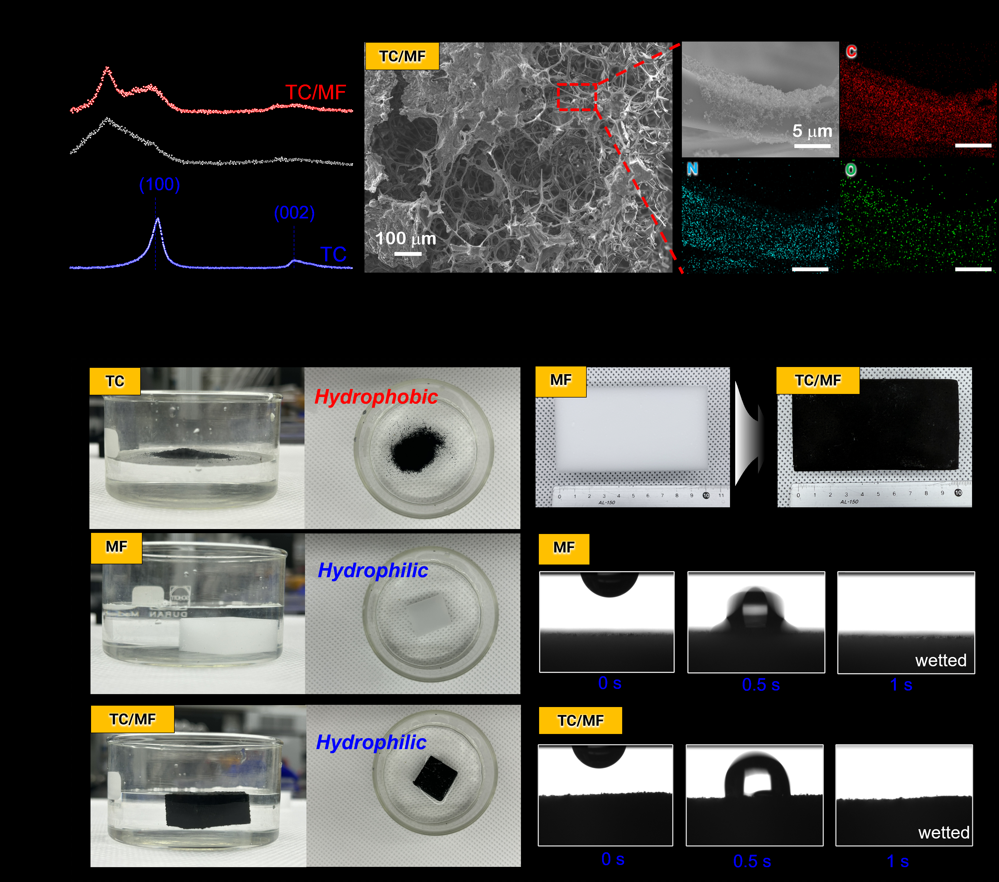

**Figure 3.** Construction and interfacial characterization of TC/MF. **a)** XRD patterns of TC, pristine MF, and TC/MF; **b)** SEM images showing uniform coating of TC on the porous MF skeleton; **c)** HAADF-STEM image and corresponding elemental mapping of C, N, and O for TC/MF; **d)** Wettability comparison of pristine TC, pristine MF, and TC/MF, together with time-resolved water droplet absorption images.

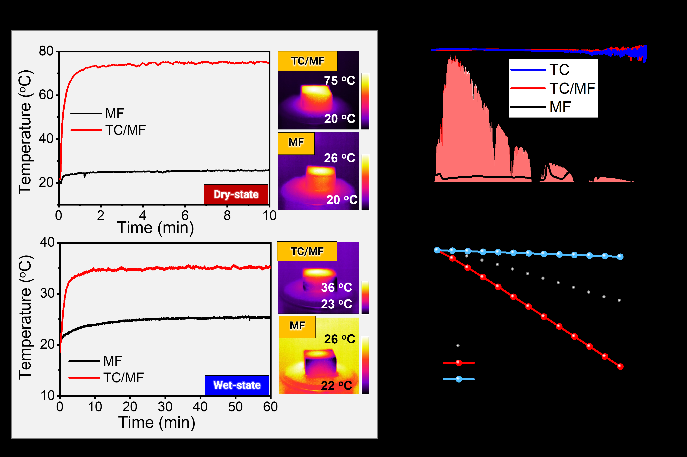

**Figure 4.** Photothermal conversion and SVG performance of turbostratic carbon under one sun irradiation. **a)** Surface temperature profiles and corresponding infrared thermal images under dry-state and wet-state; **b)** UV–Vis–NIR absorption spectra of MF, TC, and TC/MF; **c)** Mass change of water as a function of time for bulk water, MF, and TC/MF.

| **DFT results..** |
|-------------------|

**Figure 5.**

**\**

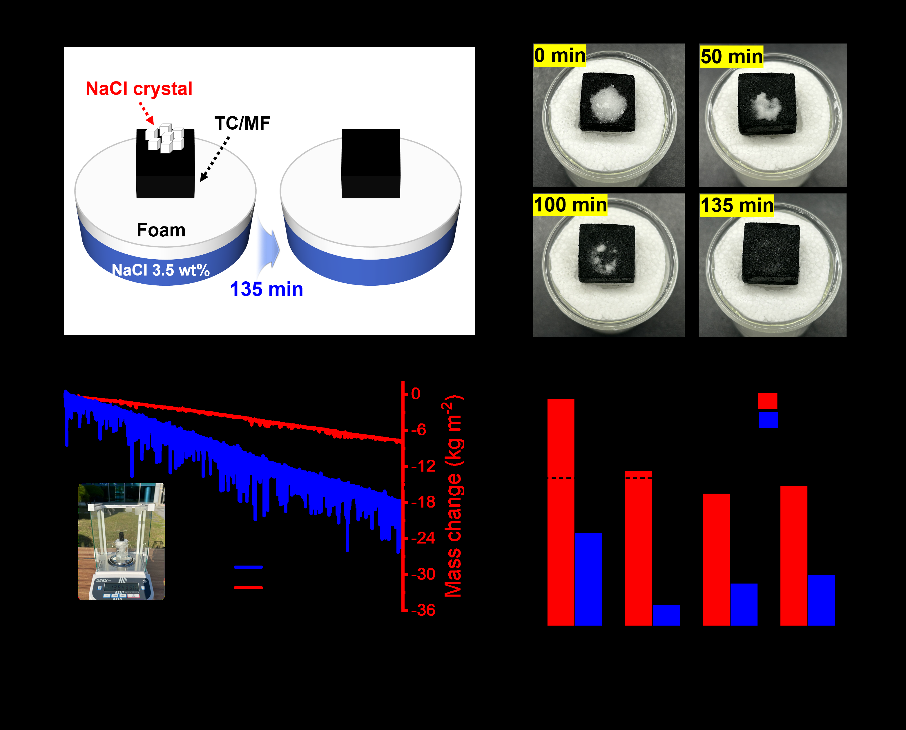

**Figure 6.** Practical outdoor solar desalination performance of the TC/MF evaporator. **a)** Schematic illustration and **b)** photographs of the salt-rejection behavior during continuous desalination; **c)** Outdoor solar desalination performance under natural sunlight showing solar irradiance and cumulative water mass change; **d)** Concentrations of major ions (Na⁺, Mg²⁺, K⁺, and Ca²⁺) before and after desalination determined by ICP-AES.

**\**

**Table 1.** Comparison of the optical absorption, dry-state photothermal heating, and solar-driven water evaporation performance of representative carbon-based photothermal materials, with evaporation rates measured under one-sun illumination at a water transport height of 1 cm.

| **Photothermal material** | **Preparation strategy** | **Solar absorption (%)** | **Dry-state surface temperature (°C)** | **Evaporation rate (kg m⁻² h⁻¹)** | **Ref.** |
|:--:|:--:|:--:|:--:|:--:|:--:|
|  |  |  |  |  |  |
|  |  |  |  |  |  |
|  |  |  |  |  |  |
|  |  |  |  |  |  |
|  |  |  |  |  |  |
|  |  |  |  |  |  |
| Turbostatic Carbon | Methane pyrolysis | \>95 | 75.4 | 2.00 | This work |

**\**

**SUPPORTING INFORMATION For**

**Methane-Derived Graphitic–Defect Hybrid Carbon for Solar Vapor Generation**

Uyen Nhat Trieu Nguyena,b, Dao Thi Dung a,b, Ali Zulfiqara,b, Moonwon Leec,d, Kanghoon Yimc, Dae Hoon Leea, and Seung-Mo Leea,b,\*

> a Korea Institute of Machinery and Materials (KIMM), 156 Gajeongbuk-ro, Yuseong-gu, Daejeon 34103, South Korea
>
> b University of Science and Technology (UST), 217 Gajeong-ro, Yuseong-gu, Daejeon 34113, South Korea
>
> c Korea Institute of Energy Research, 152 Gajeong-ro, Yuseong-gu, Daejeon 34129, South Korea
>
> d Graduate School of Energy Science and Technology (GEST), Chungnam National University, 99 Daehak-ro, Yuseong-gu, Daejeon 34134, Republic of Korea
>
> \* Corresponding author: Seung-Mo Lee (<sm.lee@kimm.re.kr>)

**\**
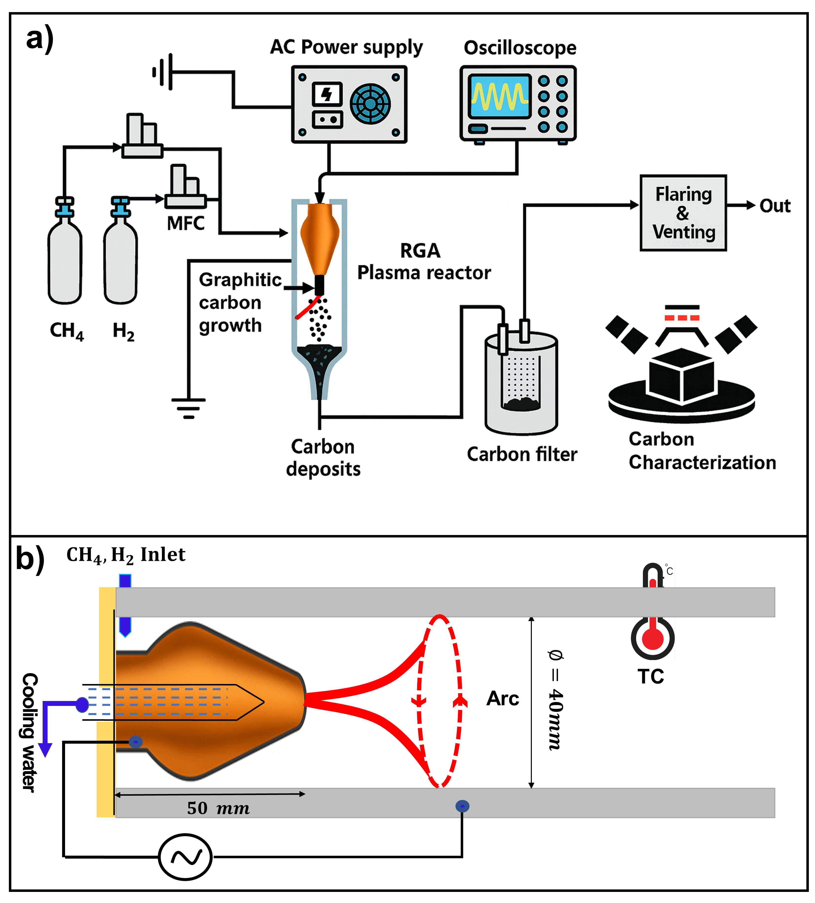

**Figure S1.** Schematic illustration of the rotating gliding arc (RGA) plasma system for methane pyrolysis and turbostratic carbon synthesis. **a)** Experimental setup of the atmospheric-pressure RGA plasma reactor, including the CH₄/H₂ gas supply, AC power source, oscilloscope, plasma reactor, carbon collection filter, and downstream characterization process; **b)** Schematic illustration of the RGA plasma reactor showing the water-cooled high-voltage electrode, gliding arc discharge, methane decomposition region, and continuous formation of turbostratic carbon (TC) during methane pyrolysis.

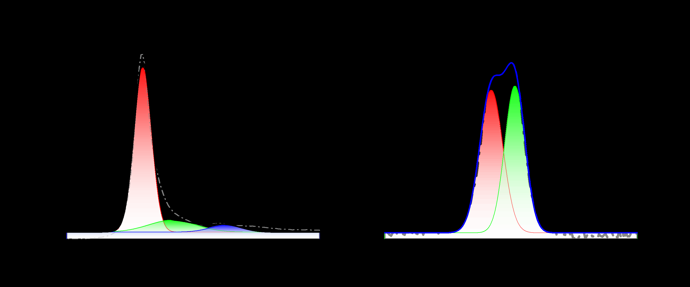

**Figure S2.** High-resolution XPS spectra of methane-derived turbostratic carbon. **a)** C 1s spectrum deconvoluted into sp² C=C/C–C and oxygen-containing carbon species. **b)** O 1s spectrum showing oxygen species originating from slight surface oxidation.

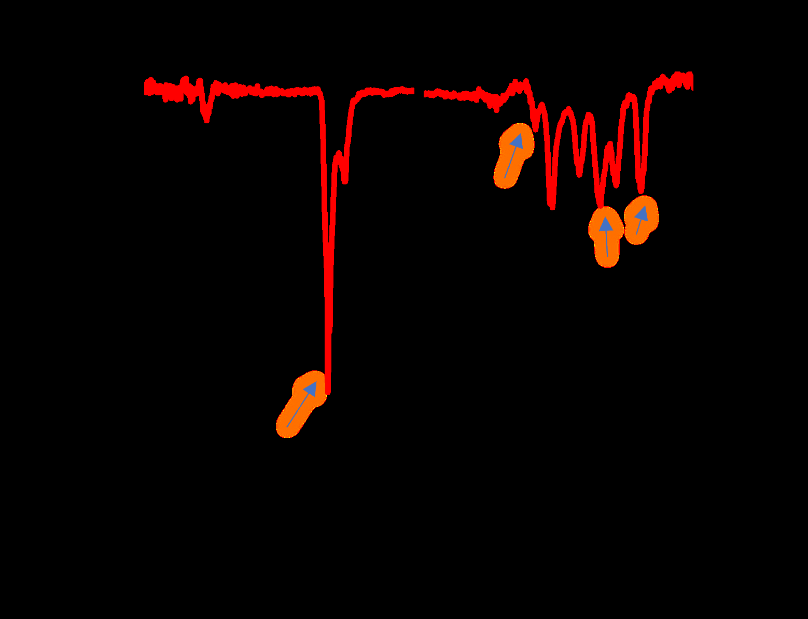

**Figure S3.** FTIR spectrum of methane-derived turbostratic carbon. FTIR spectrum showing characteristic C–H, C=O, and C–O vibrational bands, indicating limited surface oxygen functionalities.

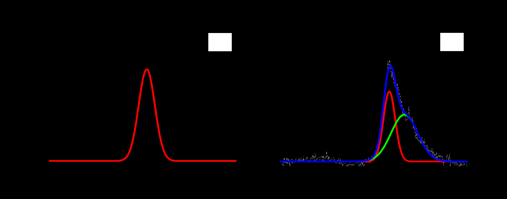

**Figure S4.** XRD characterization of methane-derived turbostratic carbon. **a)** Deconvolution of the broad diffraction peak centered at approximately 25.8°, corresponding to the graphitic (002) plane; **b)** Deconvolution of the broad diffraction feature around 43–45°, assigned to the (100) and (101) reflections of turbostratic carbon.

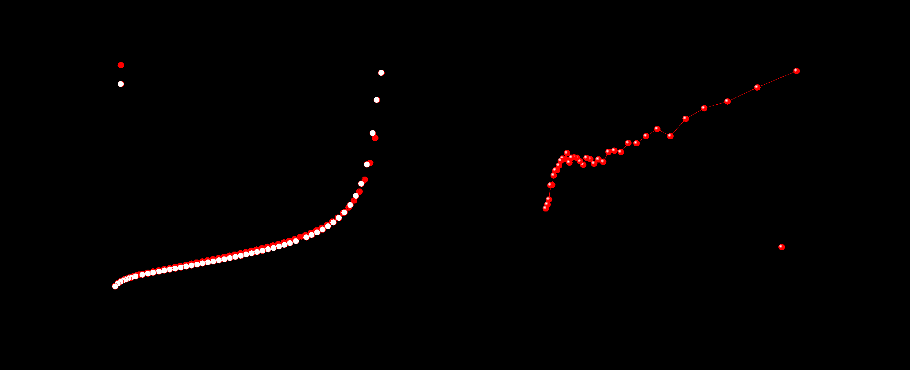

**Figure S5.** Textural properties of methane-derived turbostratic carbon. **a)** N₂ adsorption–desorption isotherms; **b)** BJH pore-size distribution curve.

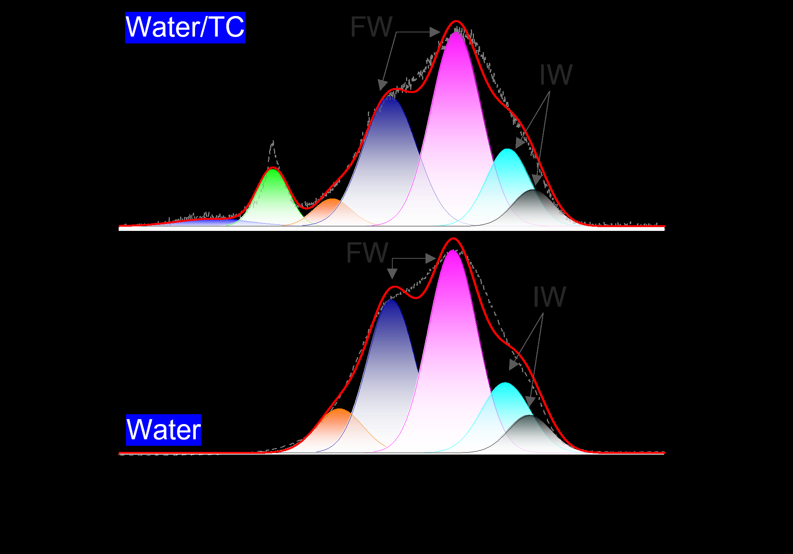

**Figure S6.** Raman analysis of interfacial water structure. Deconvoluted O–H stretching Raman spectra of pure water and water in contact with methane-derived turbostratic carbon (Water/TC), showing the free-water (FW), intermediate-water (IW), and other hydrogen-bonded water components.

**\**

**Table S1.** Experimental and electrical parameters during plasma discharge

| **Operating Parameter** |      **Value**       |
|:-----------------------:|:--------------------:|
|      Voltage (RMS)      |        308 V         |
|      Current (RMS)      |        9.9 A         |
|      Power (Mean)       |        1.8 kW        |
|     Experiment Time     |        60 min        |
|        Flow Rate        | 20 SLPM (CH4:H2=3:1) |
|        Pressure         |        1 atm         |

