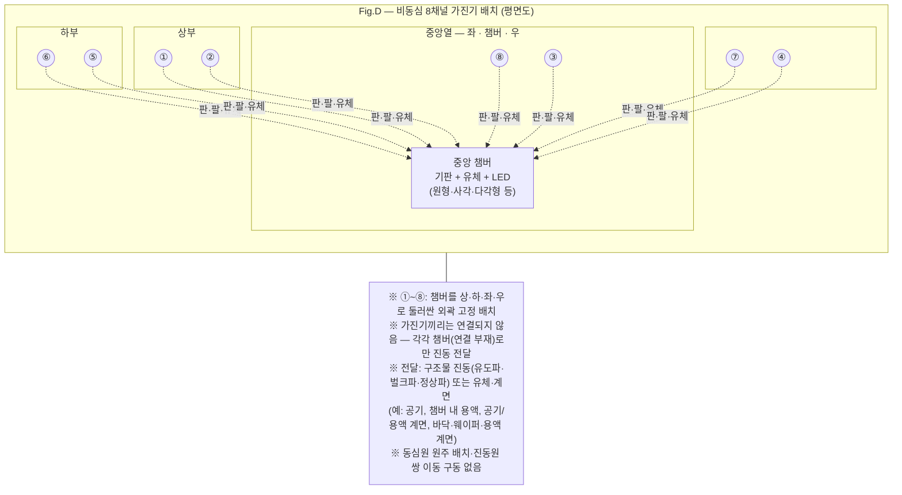
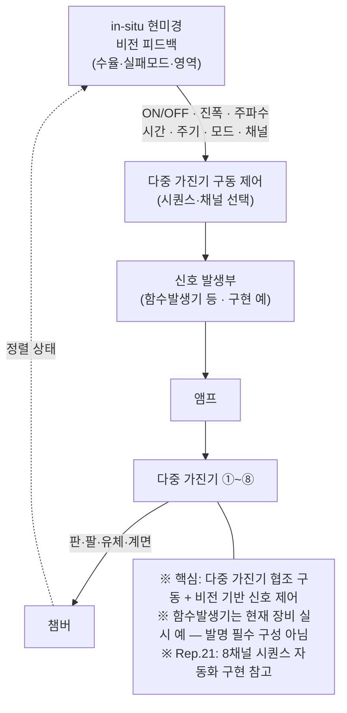
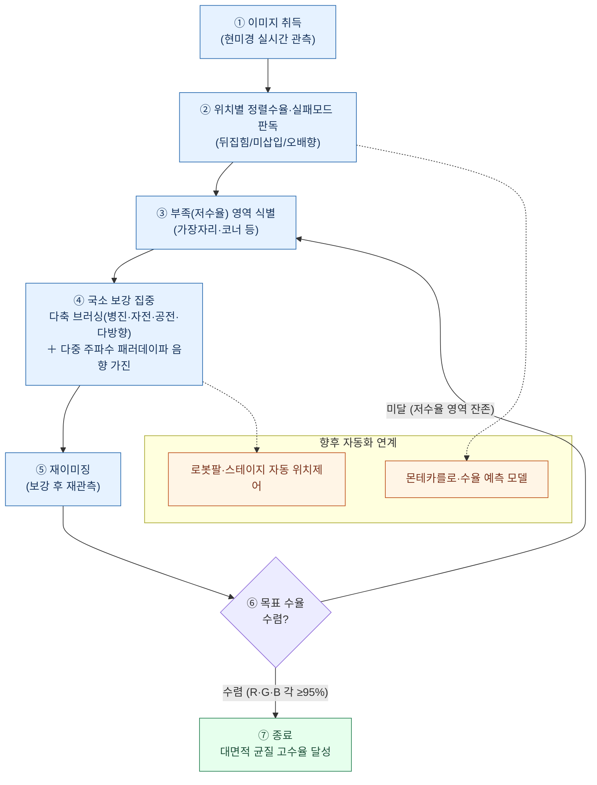
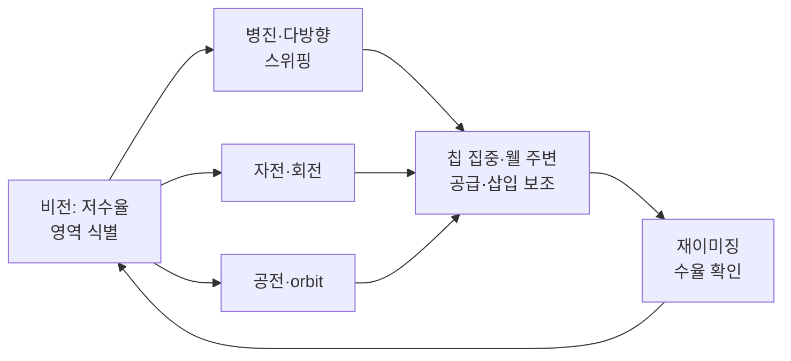
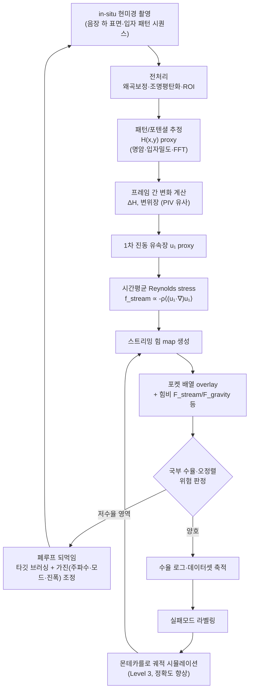
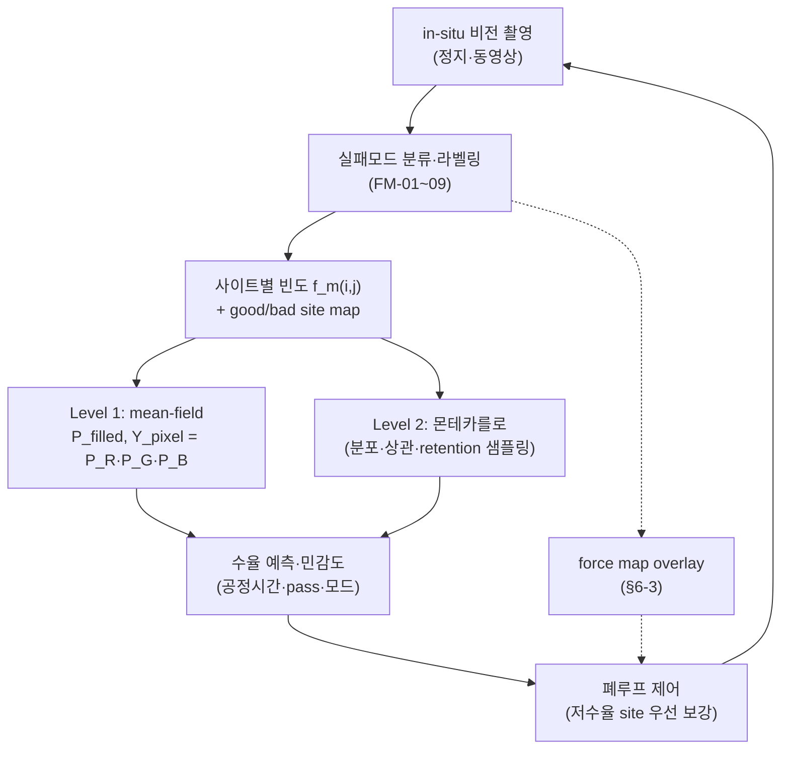

# 직무발명(고안)내용 설명서

**발명 ID**: FSA-CTRL-001 · **버전**: 0.08 · **작성일**: 2026-07-13

---

## 1. 발명(고안)의 명칭

**국문**: 비동심 음향진동 공급, 비전 피드백 및 이미지 기반 스트리밍 힘 분석을 결합한 마이크로/미니 LED 자가정렬 제어 시스템 및 방법

**영문**: Micro/Mini LED Self-Alignment Control System and Method Combining Non-Concentric Acoustic Vibration Supply, Vision Feedback, and Image-Based Streaming Force Analysis

> [Rep.22, Rep.34, Rep.30] — ※최종 명칭은 open_questions 참조

---

## 2. 논문 발표

- 해당사항 없음

> ※논문 발표·예정 여부 확인 필요 — open_questions

---

## 3. 발명(고안)의 배경

본 발명은 마이크로/미니 LED(Micro/Mini LED) 디스플레이 제조 분야, 특히 **유체 자기 조립(Fluidic Self-Assembly, FSA)** 기반 전사·자가정렬 공정에 활용될 수 있는 기술이다.

FSA는 유체 내에 분산된 마이크로 LED 칩을 기판의 **수용홈(웰)**에 자가정렬·삽입하는 공정으로, 대면적 어레이(4인치~8인치 웨이퍼)에서 RGB 서브픽셀을 동시에 정렬해야 하는 micro-LED 디스플레이 양산에 핵심 공정이다.

종래에는 (i) 음향/진동을 이용한 유체 내 칩 분산·공급, (ii) 브러싱을 이용한 칩 삽입·정렬, (iii) 형상 매칭 웰을 이용한 방향·위치 고정 등의 수단이 각각 독립적으로 연구·특허화되어 왔다. 특히 40 µm급 마이크로 LED는 브라운 운동이 아닌 **중력·침강·유동·접촉**이 운동을 지배하며, **패러데이파(Faraday wave)** 등 음장 하 표면파가 칩 분산에 기여할 수 있다 [Rep.23].

그러나 대면적(8인치) 어레이에서 위치별 수율 편차(외곽 11%~41%), RGB 1픽셀 동시 완성 수율 급감(평균 5.3%), 수동 브러싱의 재현성 한계 등이 양산 적용의 장애물로 남아 있다 [Rep.30].

---

## 4. 종래기술의 설명과 그것의 문제점

### 4-1. 중앙대 진동 기반 선행기술 (KR 10-2024-0039206 계열)

복수 진동원을 이용한 소자 전사 장치로, **중심점 기준 동심원 원주상**에 진동원 그룹을 배치하고 **진동원 쌍을 선택·이동 구동**하여 유체 내 소자를 정렬·전사한다.

**문제점**:
1. 동심원·방사형 수렴 구조에 종속
2. 진동원 쌍 이동 구동 필요
3. 최종 삽입·전극 방향·잔류 제거에 별도 수단 필요

### 4-2. 기계연/KIMM 브러싱 선행기술 (KR 10-2024-0011238 / WO2025159404A1)

**친수성 제1 영역·소수성 제2 영역**, **직사각형 웰/LED**, **장변 평행 브러싱**으로 수직·수평 정렬을 수행한다. 선행은 **브러싱을 공정의 핵심·주된 수단**으로 두고, **브러싱 단독(또는 브러싱 중심)** 으로 공급·정렬·삽입을 수행하는 구조에 가깝다.

**문제점**:
1. 표면에너지 패턴·직사각형 형상에 종속
2. **브러싱 접촉**에 의존 → 대면적(8인치) **균일 공급·경로 제어** 한계, LED 손상·기판 스크래치 위험
3. 브러싱 방향·모션이 **정렬 결정**의 중심 — 단일 방향·일방향 모션 한계
4. **비접촉 대면적 수단(음향 등)** 과의 역할 분담·폐루프 통합 부재

### 4-3. 공정·물리적 문제 (실험 근거, Rep.30)

| 문제 | 지표 |
| --- | --- |
| 대면적 수율 편차 (8인치 RGB 혼합) | 외곽 11%~41%, Inner 35% |
| RGB 1픽셀 동시 완성 수율 | 평균 **5.3%**, 최고 12% |
| 8인치 음향 미작동 | 주파수 조합 재설계 필요 |
| 디트래핑·재현성 (Rep.23) | 피펫 방향·잔류칩 |
| 챔버 의존 패턴 (Rep.34) | 시뮬만으로 실측 패턴 재현 어려움 |

### 4-4. 선행기술 조합의 한계 [Rep.22]

| 수단 | 강점 | 약점 |
| --- | --- | --- |
| 음향진동만 | 대면적 공급·분산 | 최종 삽입·전극 방향·잔류 제거 |
| 브러싱만 | 단시간 국부 삽입 | 대면적 균일 공급·손상 위험·**단일 방향·일방향 모션** 한계 |
| 형상 매칭만 | 방향성·오삽입 방지 | 공급·삽입 속도 |

**→ 기능 분담형 하이브리드 + 폐루프 제어 + 실측 힘 모니터링이 필요**

---

## 5. 본 발명의 목적

1. **대면적 어레이**에서 마이크로/미니 LED를 균일하게 분산·공급하고, 위치별 수율 편차를 줄이는 자가정렬 **제어 시스템**을 제공한다.
2. **하이브리드 공정**: **비접촉 음향/패러데이파**로 대면적 균일 공급 + **비전 연동 다축 브러싱**으로 국소·중간 면적 보강. 브러싱은 기계연 선행처럼 공정 전체의 유일 수단이 아니라, **짧은 구동 시간**으로 저수율 영역에 **병진·자전·공전** 등 다양한 모션을 직접 부여하는 보강 수단 [Rep.30, 진도점검 2026-07].
3. **비직사각형 형상 매칭 수용홈**에 의해 최종 위치·전극 방향을 결정하여 오삽입을 방지한다.
4. **in-situ 현미경 비전**으로 정렬 상태·실패모드를 실시간 판독하고, 저수율 영역에 **국소 다축 브러싱·가진 조건**을 자동 보강하는 **폐루프(closed-loop)** 공정을 구현한다 [Rep.30].
5. **현미경 이미지에서 음장 패턴·스트리밍 힘을 역산**하여, 시뮬레이션 없이 챔버 의존 패턴을 다루고 힘 map 기반 공정 모니터링·제어를 가능하게 한다 [Rep.34].
6. **비전으로 실패모드를 촬영·분류**하고 LED **사이트(웰)별 실패 빈도**를 산출하여, **단순 확률(mean-field) 계산 또는 몬테카를로 시뮬레이션**으로 RGB 개별·1픽셀 수율을 예측·최적화한다 [Rep.30, 진도점검 2026-07, RGB유닛_수율향상_전략_2026-07-02].

---

## 6. 본 발명의 구성

> **도면 구분**: Fig.A~C·G는 **제어·분석 흐름도**(mermaid), Fig.D~E는 **장치·공정 배치/동작 개념도**(mermaid), **Fig.F는 진도점검 수율 예측 그래프(임베드 PNG)**. 실측 force map·현미경 사진 등은 §9 추가자료 및 향후 `acoustic_force_map` 분석 결과로 보강 예정.

### 6-0. 비동심 음향진동 공급 장치 (평면도) [Rep.22, Rep.23]

중앙대 선행(동심원 원주상 복수 진동원)과 달리, 본 발명은 **챔버 중앙에 기판·유체·LED가 위치**하고, **챔버를 좌·우·상·하로 둘러싼 외곽(변·모서리 등)에 8개 내외(예시)의 가진기(트랜스듀서)가 비동심·비원주로 고정 배치**된다. **각 가진기는 서로 기계적으로 연결되지 않으며**, 챔버(또는 챔버에 접하는 판·팔 등 연결 부재)와만 결합한다. 챔버 단면 형상은 **원형·사각·다각형 등으로 제한하지 않는다**.

- 각 가진기는 **공통 중심을 기준으로 한 동심원 원주상에 놓이지 않음** (회피).
- 진동원 쌍의 **이동·스캔 구동 없음** — 위치 고정, 주파수·위상·진폭·모드(M1/M2 등)만 변경.
- **챔버로의 진동 전달**: 각 가진기 → **판·팔·지지 구조물**을 통한 구조 진동(유도파·벌크파·정상파 등) 및/또는 **유체·계면 매질**을 통한 전달. 유체·계면의 **예**로는 **공기**, **챔버 내 용액**, **공기/용액 계면**, **챔버 바닥·웨이퍼·용액 계면**을 통한 전파 등이 있으나 이에 제한되지 않는다. 가진기 간 직접 연결·결합 없음.
- 형성 유동: 중심 수렴 방사형이 아닌 **다방향 공급·국부 분산** 유동 → 웰 어레이 행·열 방향 공급.
- 다중 가진기 **협조 구동·신호 제어**(§6-1)와 연동.

#### Fig.D — 비동심 8채널 가진기 배치 (평면도, 개념)



> 중앙대식 **동심원 이중 원주** 구조가 아니라, **중앙 챔버 + 사방 외곽 분산 가진기** 배치임을 Fig.D로 명시한다. 점선은 **가진기→챔버** 방향의 진동 전달 경로(판·팔·구조물, 또는 공기·용액·각종 계면 등)만 나타내며, **가진기 간 연결은 없다**.

**Fig.D 보조 — 평면도 (텍스트)**

```
      ①    ②        ← 상부
  ⑧  [챔버]  ③      ← 중앙열 (좌 · 챔버 · 우)
  ⑦          ④      ← 좌 · 우
      ⑥    ⑤        ← 하부
```

> ①~⑧: 챔버를 **상·하·좌·우로 둘러싼** 외곽 고정 배치. 각 가진기→챔버만 진동 전달(가진기 간 연결 없음).

---

### 6-1. 다중 가진기 구동 및 신호 제어부 [Rep.21, Rep.30]

본 발명의 핵심은 **다중 가진기(트랜스듀서)의 협조 구동**과, **비전 피드백에 따른 구동 조건 조정**이다. 신호를 발생·증폭하는 하드웨어는 구현 수단일 뿐, 특정 상품명(함수발생기)에 종속되지 않는다.

**하드웨어 예 (실시)** — 채널당 1계열, 복수 채널 병렬:

```
신호 발생부 (함수발생기 등) → 앰프(프리앰프) → 가진기 → [판·팔·유체·계면] → 챔버
```

- **신호 발생부**: 구동 ON/OFF, **주파수·진폭·위상·구동 시간·주기(버스트)·모드(M1/M2 등)** 를 출력. 실험 장비 예로 함수발생기 8대+ 통합 시퀀스가 사용되었으나 [Rep.21], 임의의 **신호원·DAC·임베디드 구동기**로 대체 가능.
- **앰프**: 신호 증폭 후 각 가진기에 공급.
- **다중 가진기**: Fig.D 배치대로 **비동심·고정** 위치에서 **선택 채널 동시 구동·동시 정지** 또는 시퀀스 교번.
- **비전 피드백 → 신호 제어**: in-situ 현미경 판독 결과(저수율·실패모드·영역)에 따라 신호 발생부 출력을 조정 — ON/OFF, 진폭, 주파수, 구동 시간, 주기, 작동 채널, M1/M2 모드 등 (§6-2, Fig.B와 폐루프).

#### Fig.A — 다중 가진기 구동 및 비전 연동 신호 제어 (개념)



> **함수발생기·USB 시퀀스**는 Rep.21의 **현장 구현 예**이며, 청구범위의 본질은 **「복수 가진기 구동 + 비전에 의한 구동 파라미터 폐루프 제어」** 이다.

---

### 6-2. 비전 피드백 폐루프 및 다축 브러싱 제어부 [Rep.30, 진도점검 2026-07]

in-situ 현미경으로 정렬 상태를 **공정 중 실시간** 관측하고, 저수율·실패모드 영역에 **국소 다축 브러싱 + 다중 주파수 패러데이파 음향 가진**을 집중하여 목표 수율(R·G·B 각 ≥95%) 수렴까지 반복한다.

**브러싱의 역할 — 하이브리드 vs 기계연 선행 [Rep.22, Rep.30, 진도점검 2026-07]**

| | 기계연/KIMM 브러싱 선행 (§4-2) | 본 발명 (하이브리드) |
| --- | --- | --- |
| 공정 구조 | **브러싱 단독·중심** — 공급·정렬·삽입을 브러싱 접촉으로 수행 | **음향(비접촉) + 브러싱(접촉) + 형상 매칭** 역할 분담 |
| 대면적 | 브러싱 접촉·경로로 전면 처리 → 균일성·손상 한계 | **음향/패러데이파**가 8인치급 **비접촉 균일 공급** 담당 |
| 국소·중간 면적 | (선행) 전면적 브러싱 스와핑 | **비전 식별 저수율 영역**에 **다축 모션** 집중 |
| 공정 시간 | 브러싱 구동이 공정의 상당 부분 | **브러싱 구동 시간은 상대적으로 짧음**(음향·대기 대비); 필요 시에만 투입 |
| 방향 정렬 | 브러싱 방향·장변 평행 | **비직사각형 형상 매칭 웰** (브러싱은 방향 결정 안 함) |

- 기계연 선행과의 차별은 「finishing 여부」가 아니라 **「브러싱-only 공정 vs 음향·비전 하이브리드」** 이다.
- 비전이 **수율이 낮은 위치·코너·가장자리**를 식별하면, 해당 **국소·중간 면적**에 **병진·자전·공전·다방향 스위핑** 등으로 칩을 **직접 이동·집중(pushing)** 하거나 웰 주변·웰 내 **삽입을 보조**한다.
- 공정 **초기·중간·후반** 어느 단계에서도 개입 — 음향으로 대면적 공급이 진행되는 동안, 비전이 저조 영역을 감지하면 **즉시 국소 브러싱 보강**을 병행한다.

**브러싱 부재·소재 (진도점검·현장, 예 — 특정 소재에 제한되지 않음)**

| 구분 | 예시 |
| --- | --- |
| **형상·구동** | 납작 원형 브러시, **광폭** 브러시, **2브러시 동시** 구동, **원형 회전** 브러시(대면적 국부 스위핑), 8방향·다방향 스위핑; 향후 **로봇팔·스테이지** 연동 |
| **소재 (털·매体)** | 현장 **천연 돼지털** → **PBT/Taklon·나일론(Nylon 6.12 등)·실리콘·UHMWPE·PEEK/PPS**; **PVA 스펀지·swab·클린룸·산업용** 브러시/와이퍼 계열 |
| **코팅·표면** | 팁 **파릴렌(Parylene C)·DLC·카본** 등 (조건부); **접촉 하중 저감**, 팁·코너 **라운딩** |
| **내구·오염** | 저마모 소재 전환, **마모·탈락·부착 소자 회수** 정량 평가; 기성품·주문제작 **벤더** 병행 검토 [진도점검 2026-07, RGB유닛_수율향상_전략_2026-07-02 §3-A-1] |

- 브러싱은 LED **방향·전극 정렬을 직접 결정하지 않음** — 최종 배향은 **비직사각형 형상 매칭 웰**이 담당 (Rep.22 회피).

**브러싱 모션 예** (진도점검·Rep.30):
| 모션 | 목적 |
| --- | --- |
| 병진·다방향 스위핑 (8방향 등) | 저수율 영역으로 칩 이동·분산 |
| 자전·회전력 | 비대칭 칩 배향 유도 보조 |
| 공전(orbit)·원형 회전 브러싱 | 8인치 대면적 국부 균일 보강 |
| 2브러시 동시 구동 | 단시간 분산·집중 |

향후 **로봇팔·스테이지** 연동으로 저수율 좌표에 자동 이동·다축 모션 실행 [Rep.30, Rep.31].

#### Fig.B — 비전 폐루프(vision closed-loop) 흐름도



#### Fig.E — 비전 연동 다축 브러싱 개념 (저수율 영역 집중)



> Fig.E: **하이브리드** — 음향이 대면적 공급, 브러싱은 비전이 지정한 **국소·중간 면적**에 **다축 모션**을 **단시간** 투입. 기계연 선행의 **브러싱-only** 공정과 구별.

---

### 6-3. 이미지 기반 스트리밍 힘 분석부 [Rep.34]

in-situ 현미경으로 촬영한 **음장·입자 패턴 이미지 시퀀스**에서 패턴 포텐셜 $H(x,y)$를 추정하고, 프레임 간 변화로 **스트리밍 힘 map**을 산출하여 포켓 배열과 overlay한다. 저수율·오정렬 위험 영역에 **타깃 브러싱·가진 조정**을 되먹임한다.

#### Fig.C — 이미지 기반 스트리밍 힘 분석 시스템 흐름도



#### 선행기술 조사 (1차) [Rep.35, Rep.34 §6-3]

2026-07-13 웹 검색 기준 **1차 조사** 결과(완전 FTO 아님 — 변리사·키프리스 추가 검색 필요).

| 구분 | 대표 선행 | 본 발명과의 관계 |
| --- | --- | --- |
| **μPIV / MRμPIV** | Phys. Rev. Applied **11**, 044031 (2019) — ARF·스트리밍 2D map 분리 | 동일 **계측·물리** 선행. micro-LED FSA·포켓 overlay·브러싱 폐루프 **없음** |
| **Faraday + PIV** | J. Fluid Mech. **819** (2017) — streaming pattern 계측 | 패러데이 스트리밍 **계측** 선행. FSA 공정 연계 **없음** |
| **영상→음장 potential→폐루프** | Adv. Intelligent Systems (2023) — Gor'kov potential + vision closed-loop | **진보성 리스크** — 본 발명은 **Reynolds stress streaming map** + **포켓 FSA**로 구분 |
| **광학 트위저 force map** | Lab Chip **16**, 2682 (2016) | 프로브 **직접 측정**. 대면적 **역산** 경로와 상이 |
| **FSA vision closed-loop** | 중앙대 KR 10-2024-0039206 등 (Rep. No. 24 (FSA, 공정 특허 분석)) | 촬영→수율→진동 조정 선행. **streaming force map 산출 단계 없음** |
| **ARF + imaging** | US8134705B2 | 방사압 집중·이미징. streaming 역산·FSA 폐루프 **없음** |

**판단 (조건부)**: 「이미지→streaming force map→포켓 overlay→하이브리드 FSA 폐루프」**일괄 청구**의 직접 선행은 **미발견**. 구성요소별 선행은 **다수** → CL-4/5는 **「Reynolds stress·Faraday·포켓 overlay·브러싱 하이브리드」** 로 **좁게** 기재 권고. 상세: Rep. No. 35 (이미지 기반 음장 스트리밍 힘 추정 — 선행특허·논문 조사).

---

### 6-4. 패러데이파 물리 기반 [Rep.23, Rep.34]

66 kHz급 구동에서 **서브하모닉(≈33 Hz) 패러데이파**가 표면장력 영향으로 5~6 mm 파장 패턴을 형성한다.

- 패턴: $\eta(x,y,t)=\mathrm{Re}[H(x,y)\,e^{-i\Omega t}]$
- 스트리밍 힘 프록시: $\mathbf{f}_\mathrm{stream} \propto -\rho\,\big\langle(\mathbf{u}_1\!\cdot\!\nabla)\,\mathbf{u}_1\big\rangle_t$
- 칩 Stokes 항력: $\mathbf{F}_\mathrm{chip} \approx \gamma\,\mathbf{u}_\mathrm{stream}$, $\gamma \approx 6\pi\mu\,a_\mathrm{eq}$
- 스케일링: $U_\mathrm{stream} \propto A^2$ (진폭 제곱)

자가정렬 관점에서는 절대 force보다 **힘비** $\frac{F_\mathrm{stream}}{F_\mathrm{gravity}}$, $\frac{F_\mathrm{stream}}{F_\mathrm{brush}}$, $\frac{F_\mathrm{stream}}{F_\mathrm{pocket}}$ 가 중요하다.

---

### 6-5. 회피·차별 구성 [Rep.22, Rep.25]

본 발명은 중앙대·기계연 선행특허의 **필수 구성요소를 포함하지 않도록** 설계되었다 (avoidance_map 참조).

| 구분 | 선행 (피함) | 본 발명 |
| --- | --- | --- |
| 진동원 배치 | 동심원 원주상 | **비동심·비원주** 고정 위치 |
| 진동원 구동 | 쌍 이동·스캔 | **고정**, 위상·진폭·주파수만 변경 |
| 웰·LED 형상 | 직사각형 | **비대칭 키-락** (사다리꼴·키홀·L자·노치) |
| 표면 | 친수/소수 패턴 | **형상 매칭** (표면에너지 패턴 비의존) |
| 브러싱 역할 | **브러싱 단독·중심** 공정 (정렬·삽입 결정) | **하이브리드** 국소·중간면적 **다축 보강**; 방향=**형상 매칭** |
| 공정·접촉 | 전면적 **접촉** 브러싱 | **음향=비접촉 대면적**, **브러싱=접촉·단시간·국소** |
| 기능 분담 | — | **대면적=음향, 국소·중간=비전+다축브러싱, 방향=형상, 모니터=비전+힘** |

**권장 명세 문구** [Rep.22]:
> 상기 진동원은 공통 중심점을 기준으로 하는 복수의 동심원 원주상에 배치되지 않는다.

> 상기 브러싱은 LED의 수평·수직 방향 정렬을 직접 결정하지 않고, **비전에 의해 식별된 저수율 영역**에 대하여 **병진·자전·공전을 포함하는 다축 모션**으로 LED를 이동·삽입 보조하거나 수용홈 외부 잔류 LED를 제거한다.

---

### 6-6. 비전 기반 실패모드 분석 및 수율 예측부 [Rep.30, Rep.34, 진도점검 2026-07]

비전 폐루프(§6-2)와 연계하여, in-situ 현미경·정지/동영상 이미지에서 **실패모드(failure mode)** 를 촬영·분류하고, **LED 사이트(웰) 단위**로 각 모드의 **발생 빈도·확률**을 산출한다. 이를 **단순 확률 계산(mean-field)** 또는 **몬테카를로(Monte Carlo) 시뮬레이션**에 입력하여 공정 조건·시간에 따른 **수율 예측** 및 폐루프 제어 파라미터 최적화에 활용한다.

#### 실패모드 분류 (예시)

| 코드 | 실패모드 | 설명 | 비전 판별 |
| --- | --- | --- | --- |
| FM-01 | **미삽입(empty well)** | 웰이 비어 있음 | 해당 site 무칩 |
| FM-02 | **오배향(wrong orientation)** | 칩이 90°·180° 등 잘못 삽입 | 형상·전극 방향 불일치 |
| FM-03 | **뒤집힘(upside-down)** | 상하 배향 오류 | 전극면·배경 대비 |
| FM-04 | **웰 대비 과대 삽입(oversized well fit)** | **웰(수용홈)이 칩보다 커** 잘못 들어가거나 흔들림·이탈 | 칩-웰 간극 과대, 불안정 안착 |
| FM-05 | **깨진 조각·파편 삽입(fragment/chip debris)** | **깨진 LED 조각**이 웰에 삽입 | 비정형 형상·크기 이상 |
| FM-06 | **잔류·중복(duplicate/residue)** | 웰 외부 또는 동일 site 중복 칩 | 밀도·개수 이상 |
| FM-07 | **색 혼입(RGB cross-fill)** | R/G/B 중 잘못된 색상 | 색상 분류 |
| FM-08 | **탈락(detachment/detrapping)** | 안착 후 이탈 | pass 간 before/after 비교 |
| FM-09 | **응집·엉킴(aggregation)** | 칩 군집으로 웰 진입 실패 | 국부 밀도 과다 |

> 사이트별 빈도: $f_{m}(i,j) = N_m(i,j) / N_\mathrm{sites}$ — 실패모드 $m$이 site $(i,j)$에서 관측된 비율. good/bad site **공간 상관**도 파라미터화.

#### 수율 예측 모델 (2단계)

**Level 1 — 단순 확률 계산 (mean-field, 현재 구현)**

- **개별 색 안착**: 반복 refill(pass) 가정 시  
  $P_\mathrm{filled} \approx 1 - (1 - p_\mathrm{single})^{\mathrm{passes}}$
- **RGB 1픽셀 수율** (3색 곱누적):  
  $Y_\mathrm{pixel} \approx P(R) \times P(G) \times P(B)$
- **retention** $r<1$, **misinsertion** $p_m$, **site별 $p(i,j)$** 분포를 실패모드 빈도에서 추정
- 진도점검 **공정시간–수율 예측 그래프**(Fig.F)는 본 mean-field/refill 모델의 **개념 산출 예시**(가정 기반, 실측 곡선 아님)

**Level 2 — 몬테카를로 시뮬레이션 (고도화)**

- site별 $p(i,j)$, retention, misinsertion, fragment 확률을 **확률분포**로 두고 **무작위 샘플링** → 평균·분산·신뢰구간·실패모드 기여도 산출
- **실패모드 라벨링 이미지**가 추가되면 FM-04(과대 웰)·FM-05(파편) 등 **모드별 확률**을 직접 학습·적합 → 예측 정확도 향상 (Rep.34 §6-2-4, 진도점검)
- force map(§6-3)과 연계: 저수율·FM-04/FM-05 다발 site ↔ 힘 map overlay → **타깃 보강 우선순위**

#### Fig.F — 공정시간–수율 예측 (진도점검, refill 개념 모델)


*그림: RGB 개별 색·1픽셀 수율의 공정시간 예측 곡선 — 반복 refill 가정 mean-field 모델 (RGB유닛_수율향상_전략_2026-07-02 §3-A-5, 진도점검 2026-07). **가정 기반 개념 모델이며 실측 곡선이 아님.** P_max≈0.98, 40분 시 개별 93~98%·1픽셀 ≈89% 예측(전략 반영 시 상향 여지).*

#### Fig.G — 실패모드 → 수율 예측 파이프라인



> 비전 폐루프(§6-2)의 ②판독 단계가 FM 분류·사이트 빈도 산출과 직결되며, 예측 결과가 ④국소 보강(다축 브러싱·가진) 우선순위를 결정한다.

---

## 7. 본 발명의 효과

1. **대면적 균일 공급**: 비동심 **비접촉** 음향/패러데이파(Fig.D) → 8인치급 웰 어레이 전역 분산 [Rep.22].
2. **하이브리드 국소 브러싱**: 비전→저수율 **국소·중간 면적**에 **병진·자전·공전** 다축 모션 **단시간** 집중 — 기계연 **브러싱-only** 공정과 구별 [Rep.30, 진도점검].
3. **오삽입 방지**: 전극 방향을 **비직사각형 형상 매칭**이 결정 (브러싱 방향 아님).
4. **위치별 편차 보정**: 비전 폐루프(Fig.B, E)로 가장자리·코너 저수율(11% 등) 자동 보강 [Rep.30].
5. **실측 힘 모니터링**: 시뮬 없이 in-situ 현미경에서 스트리밍 힘 map 산출 [Rep.34].
6. **다중 가진기 협조 구동**: 복수 가진기 채널의 시퀀스·동시 구동·모드(M1/M2) 교번; **비전 피드백**이 신호 발생부(ON/OFF·진폭·주파수·시간·주기 등)를 조정하는 폐루프 [Rep.21 실시 예, Rep.30].
7. **수율 예측·최적화**: 비전으로 **실패모드(FM-01~09) 촬영·사이트별 빈도** 산출 → **mean-field 확률 계산 또는 몬테카를로**로 RGB 개별·1픽셀 수율 예측(Fig.F) → 폐루프 보강 우선순위 결정 [Rep.30/34, RGB유닛_수율향상_전략_2026-07-02].
8. **실패모드 정량 피드백**: 깨진 조각 삽입(FM-05)·웰 과대 삽입(FM-04) 등 **모드별 계수**를 공정·형상·PMS 설계에 되먹임 [Rep.30, 진도점검].

---

## 8. 보호받고 싶은 권리

> avoidance_map §D 자가검증 완료 (CL-1~3 pass, CL-4~5 FTO 미확정)

### CL-1. 방법 (하이브리드 자가정렬) [Rep.22, Rep.30]

> 비직사각형 수용홈을 갖는 어레이 기판을 준비하는 단계; 상기 수용홈과 대응되는 비직사각형 외형을 갖는 마이크로/미니 LED를 공급하는 단계; **공통 중심점을 기준으로 하는 동심원 원주상에 배치되지 않은** 진동원을 구동하여 상기 LED를 상기 수용홈 주변으로 이동 또는 분산시키는 단계; in-situ 현미경으로 정렬 상태를 촬영·판독하는 단계; **비전에 의해 식별된 저수율 영역**에 대하여 브러싱 부재를 **병진·자전·공전을 포함하는 다축 모션**으로 구동하여 상기 LED를 상기 수용홈 주변으로 이동·집중시키거나 수용홈 내로 진입시키거나 수용홈 외부의 잔류 LED를 제거하는 단계; 상기 LED의 전극 방향이 브러싱 방향이 아니라 상기 수용홈과 LED의 **비대칭 형상 매칭**에 의해 결정되는 단계; 를 포함하는 마이크로/미니 LED 자가정렬 방법.

### CL-2. 장치 (통합 제어) [Rep.22, Rep.21, Rep.30]

> 비직사각형 수용홈 어레이를 갖는 기판 지지부; 상기 기판 외곽에 **동심원 원주상에 배치되지 않은** 하나 이상의 **가진기(진동원)**; 상기 가진기에 구동 신호를 공급하는 **신호 발생·증폭부**; **복수 가진기의 구동을 협조 제어하는 다중 가진기 구동부**; 브러싱 부재 및 브러싱 구동부; in-situ 현미경 및 이미지 처리부; 상기 현미경 판독 결과에 기초하여 상기 신호 발생·증폭부 또는 다중 가진기 구동부의 **구동 조건(ON/OFF·진폭·주파수·시간·주기·모드)** 을 조정하는 제어부; 를 포함하되, 상기 브러싱 부재는 LED의 **방향 정렬을 직접 결정하지 않는** 마이크로/미니 LED 자가정렬 장치.

### CL-3. 제어방법 (비전·힘 map 폐루프) [Rep.22, Rep.30, Rep.34]

> in-situ 현미경 이미지 검사부가 미삽입 웰 또는 오삽입 LED를 검출하는 단계; 미삽입 웰이 많은 영역에는 **가진기 구동 조건**(ON/OFF·주파수·진폭·구동 시간·주기·모드·작동 채널)을 변경하여 LED 공급량을 증가시키는 단계; 저수율 또는 잔류 LED가 많은 영역에는 **브러싱 경로·압력·속도·횟수 및 병진·자전·공전 모션**을 변경하여 집중 브러싱하는 단계; 현미경 이미지로부터 **스트리밍 힘 map**을 산출하고 포켓 배열과 overlay하여 저수율·오정렬 위험 영역을 판정하는 단계; 최종 방향 정렬은 **비직사각형 형상 매칭 웰**에 의해 수행되는 단계; 를 포함하는 폐루프 자가정렬 제어방법.

### CL-4. 방법 (이미지 기반 힘 분석) [Rep.34, Rep.35] ※FTO 1차 조사 완료, 변리사 검토 필요

> 음장 하 유체 표면/입자 패턴을 촬영한 이미지 시퀀스로부터 (a) 패턴 포텐셜장 $H(x,y)$ 추정, (b) 프레임 간 포텐셜 변화로 1차 유속장 프록시 산출, (c) 시간평균 Reynolds stress로 **스트리밍 힘 map**을 산출하는 마이크로 소자 자가정렬용 힘 분석 방법.

### CL-5. 시스템 (폐루프 장치) [Rep.34, Rep.35] ※FTO 1차 조사 완료, 변리사 검토 필요

> in-situ 현미경, 연산부(포텐셜·힘 추정), 가진부, 브러싱부, 제어부를 포함하고, **힘 map 기반**으로 국소 저수율 영역에 브러싱·가진을 되먹임하는 자가정렬 폐루프 장치.

### CL-6. 방법 (실패모드 기반 수율 예측) [Rep.34, Rep.30, 진도점검]

> in-situ 현미경으로 LED 정렬 상태를 촬영하여 **실패모드**를 분류하는 단계; **LED 사이트(수용홈)별** 각 실패모드의 **발생 빈도 또는 확률**을 산출하는 단계; 상기 빈도를 **단순 확률 계산(mean-field)** 또는 **몬테카를로 시뮬레이션**에 입력하여 개별 색 및 RGB 1픽셀 **수율을 예측**하는 단계; 예측 결과에 기초하여 저수율 사이트에 **브러싱·가진 조건**을 조정하는 단계; 를 포함하는 마이크로/미니 LED 자가정렬 수율 예측 방법.

> 실패모드는 미삽입, 오배향, 뒤집힘, **수용홈 대비 과대 삽입**, **깨진 조각·파편 삽입**, 잔류·중복, 색 혼입, 탈락, 응집 등을 포함할 수 있다.

---

## 9. 추가자료

### 도면

| Fig | 유형 | 제목 | 소스 |
| --- | --- | --- | --- |
| Fig.A | 흐름도 | **다중 가진기 구동 + 비전 연동 신호 제어** | §6-1, Rep.21(실시 예) |
| Fig.B | 흐름도 | 비전 폐루프 자가정렬 | Rep.30 |
| Fig.C | 흐름도 | 이미지 기반 스트리밍 힘 분석 | Rep.34 |
| **Fig.D** | **배치도** | **비동심 8채널 가진기·중앙 챔버 (mermaid + 텍스트 평면도)** | Rep.22, Rep.23 |
| **Fig.E** | **개념도** | **비전 연동 다축 브러싱 (병진·자전·공전)** | Rep.30, 진도점검 2026-07 |
| **Fig.F** | **그래프** | **공정시간–수율 예측 (refill mean-field, 임베드)** | RGB유닛_수율향상_전략_2026-07-02, 발표파일 |
| **Fig.G** | **흐름도** | **실패모드 → 사이트 빈도 → 수율 예측 파이프라인** | §6-6 |

> v0.01: Fig.A~C(흐름도)만. v0.02: Fig.D(배치도)·Fig.E(브러싱). v0.03: Fig.F(수율 예측 그래프)·Fig.G(실패모드 파이프라인). **v0.08: §6-3 선행기술(Rep.35), Fig.F 영문판 제외**. force map·현미경 실측 그림은 `acoustic_force_map` 분석 후 보강 예정.

### 실험 데이터 [Rep.30]

| 영역 | RGB 개별 평균 | RGB 1픽셀 수율 |
| --- | --- | --- |
| 8인치 외곽 9영역 | R 34% / G 32% / B 20% | 평균 **3.7%** |
| Inner 4영역 | — | 평균 **8.9%**, 최고 **12.0%** |

### 참조 연구노트

- Rep. No. 21 (함수발생기 자동화 수정)
- Rep. No. 22 (중앙대, 기계연 출원 융합 회피 전략)
- Rep. No. 23 (패러데이파 효과)
- Rep. No. 25 (특허 회피 전략)
- Rep. No. 30 (8인치 RGB 혼합 FSA 종합 및 형상·공정 개선 전략)
- Rep. No. 34 (현미경 음장 이미지 기반 스트리밍 힘 분석 시스템 구상·특허성 검토)
- Rep. No. 35 (이미지 기반 음장 스트리밍 힘 추정 — 선행특허·논문 조사)
- RGB유닛_수율향상_전략_2026-07-02 — 수율 예측 모델·Fig.F 그래프 근거

### 양식 참조

- `__Project/자가정렬/특허/양식/20251117_발명설명서_영상복원.hwpx`

---

## 관리 필드

| 항목 | 값 |
| --- | --- |
| 발명자 | ※확인 필요 — open_questions |
| 소속 | 한국기계연구원 (기계연) |
| 지분율 | ※확인 필요 — open_questions |
| 작성일 | 2026-07-12 |
| 버전 | 0.02 |

## Related

- MOC_자가정렬
- invention.yaml
- avoidance_map
- source_map
- open_questions
- changelog
